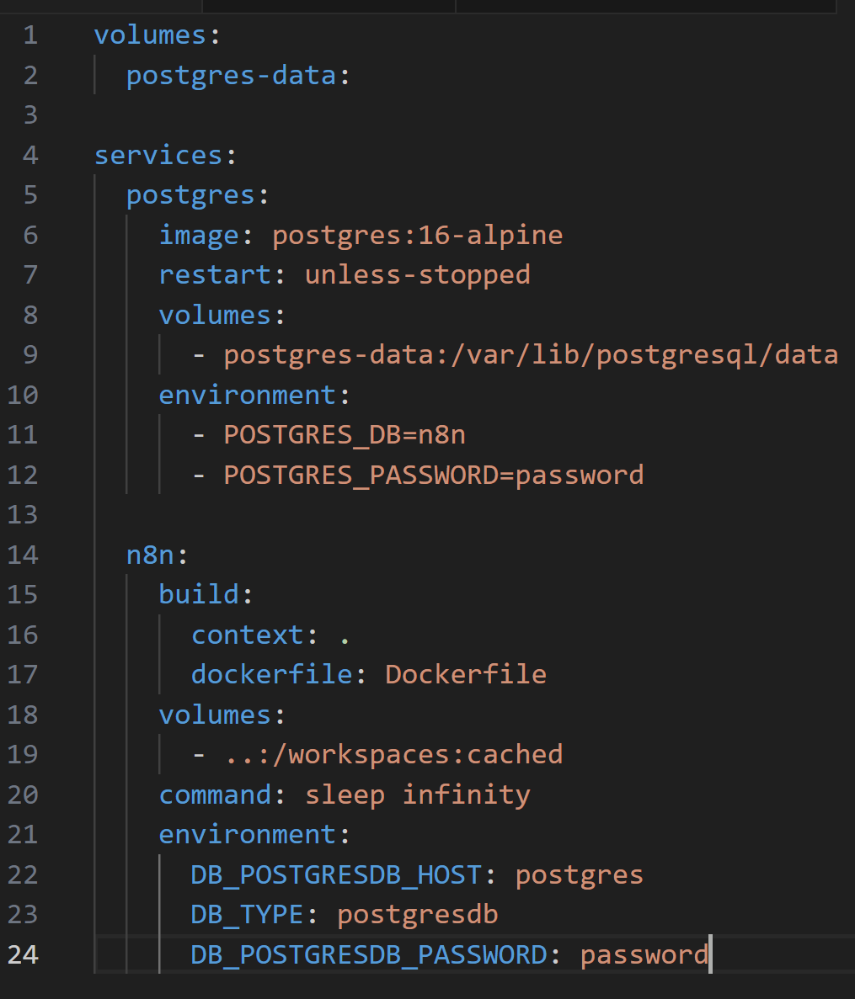
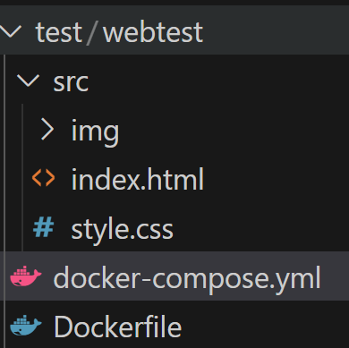

# 前置
ssh 
docker 安裝 (docker compose 內建, since v2.x)


# Docker Compose

## 0. GPT
docker-compose.yml:

services:
  n8n:
    image: n8nio/n8n
    container_name: n8n
    environment:
      - GENERIC_TIMEZONE=Asia/Taipei # 設置時區，可以根據需求修改
      - N8N_BASIC_AUTH_ACTIVE=true  # 開啟基本身份認證
      - N8N_BASIC_AUTH_USER=<your_username> # 設置用戶名
      - N8N_BASIC_AUTH_PASSWORD=<your_password> # 設置密碼
    ports:
      - "5678:5678"  # 映射端口，可以通過 http://localhost:5678 訪問 n8n
    volumes:
      - ~/.n8n:/root/.n8n # 存儲資料持久化
    restart: always

Docker CLI:
2. 持久化數據
為避免數據丟失，建議將 n8n 的數據目錄掛載到主機的volume中。
可以通過以下命令創建一個volume並掛載到容器的 /home/node/.n8n 目錄：

docker volume create n8n_data
docker run -it --rm --name n8n -p 5678:5678 -v n8n_data:/home/node/.n8n docker.n8n.io/n8nio/n8n

3. 使用外部資料庫
默認情況下，n8n 使用 SQLite 資料庫，但在生產環境中建議使用外部資料庫（例如 PostgreSQL）來提高性能和可擴展性。
可通過設定環境變數來配置外部資料庫：

docker volume create n8n_data
docker run -it --rm \
 --name n8n \
 -p 5678:5678 \
 -e DB_TYPE=postgresdb \
 -e DB_POSTGRESDB_DATABASE=<POSTGRES_DATABASE> \
 -e DB_POSTGRESDB_HOST=<POSTGRES_HOST> \
 -e DB_POSTGRESDB_PORT=<POSTGRES_PORT> \
 -e DB_POSTGRESDB_USER=<POSTGRES_USER> \
 -e DB_POSTGRESDB_SCHEMA=<POSTGRES_SCHEMA> \
 -e DB_POSTGRESDB_PASSWORD=<POSTGRES_PASSWORD> \
 -v n8n_data:/home/node/.n8n \
 docker.n8n.io/n8nio/n8n


## github / n8n.io
### 1. github Readme  http://localhost:5678 開n8n ok
docker volume create n8n_data   (volume 用於保存 n8n 的數據（如工作流配置），確保即使容器停止或刪除，數據依然存在。)
docker run -it --rm --name n8n -p 5678:5678 -v n8n_data:/home/node/.n8n docker.n8n.io/n8nio/n8n

### 2. 模板 (方向感覺不太對)  
from: https://docs.n8n.io/hosting/installation/server-setups/docker-compose/

**建volume**
docker volume create traefik_data
docker volume create n8n_data

**docker-compose.yml:**
services:
  traefik:
    image: "traefik"
    restart: always
    command:
      - "--api=true"
      - "--api.insecure=true"
      - "--providers.docker=true"
      - "--providers.docker.exposedbydefault=false"
      - "--entrypoints.web.address=:80"
      - "--entrypoints.web.http.redirections.entryPoint.to=websecure"
      - "--entrypoints.web.http.redirections.entrypoint.scheme=https"
      - "--entrypoints.websecure.address=:443"
      - "--certificatesresolvers.mytlschallenge.acme.tlschallenge=true"
      - "--certificatesresolvers.mytlschallenge.acme.email=${SSL_EMAIL}"
      - "--certificatesresolvers.mytlschallenge.acme.storage=/letsencrypt/acme.json"
    ports:
      - "80:80"
      - "443:443"
    volumes:
      - traefik_data:/letsencrypt
      - /var/run/docker.sock:/var/run/docker.sock:ro

  n8n:
    image: docker.n8n.io/n8nio/n8n
    restart: always
    ports:
      - "127.0.0.1:5678:5678" # 
    labels:
      - traefik.enable=true
      - traefik.http.routers.n8n.rule=Host(`${SUBDOMAIN}.${DOMAIN_NAME}`)
      - traefik.http.routers.n8n.tls=true
      - traefik.http.routers.n8n.entrypoints=web,websecure
      - traefik.http.routers.n8n.tls.certresolver=mytlschallenge
      - traefik.http.middlewares.n8n.headers.SSLRedirect=true
      - traefik.http.middlewares.n8n.headers.STSSeconds=315360000
      - traefik.http.middlewares.n8n.headers.browserXSSFilter=true
      - traefik.http.middlewares.n8n.headers.contentTypeNosniff=true
      - traefik.http.middlewares.n8n.headers.forceSTSHeader=true
      - traefik.http.middlewares.n8n.headers.SSLHost=${DOMAIN_NAME}
      - traefik.http.middlewares.n8n.headers.STSIncludeSubdomains=true
      - traefik.http.middlewares.n8n.headers.STSPreload=true
      - traefik.http.routers.n8n.middlewares=n8n@docker
    environment:
      # - N8N_HOST=${SUBDOMAIN}.${DOMAIN_NAME}
      - N8N_PORT=5678
      # - N8N_PROTOCOL=https
      - NODE_ENV=production
      # - WEBHOOK_URL=https://${SUBDOMAIN}.${DOMAIN_NAME}/
      - GENERIC_TIMEZONE=Asia/Taipei # (${GENERIC_TIMEZONE})
    volumes:
      - n8n_data:/home/node/.n8n

volumes:
  traefik_data:
    external: true
  n8n_data:
    external: true

### 3. (從2. 模板改，但https://n8n.localhost/ (traefik訪問路由管理) 還沒試成功 ) http://localhost:5678 開n8n ok

(ask GPT)
**如果沒有公共域名，可以修改本地的 hosts 文件來模擬域名解析：**
sudo nano /etc/hosts
127.0.0.1 n8n.localhost  #新增此行  (虛擬機IP 模擬域名)
**本地為windows:**
C:\Windows\System32\drivers\etc\hosts
192.168.16.19 n8n.localhost

**yml:(2. 微調)**
services:
  traefik:
    image: "traefik"
    restart: always
    command:
      - "--api=true"
      - "--api.insecure=true"
      - "--providers.docker=true"
      - "--providers.docker.exposedbydefault=false"
      - "--entrypoints.web.address=:80"
      - "--entrypoints.web.http.redirections.entryPoint.to=websecure"
      - "--entrypoints.web.http.redirections.entrypoint.scheme=https"
      - "--entrypoints.websecure.address=:443"
      - "--certificatesresolvers.mytlschallenge.acme.tlschallenge=true"
      - "--certificatesresolvers.mytlschallenge.acme.email=${SSL_EMAIL}"  **(待確認)**
      - "--certificatesresolvers.mytlschallenge.acme.storage=/letsencrypt/acme.json"
    ports:
      - "80:80"
      - "443:443"
    volumes:
      - traefik_data:/letsencrypt
      - /var/run/docker.sock:/var/run/docker.sock:ro
DNS
  n8n:
    image: docker.n8n.io/n8nio/n8n
    restart: always
    ports:
      - "5678:5678" # 127.0.0.1:
    labels:
      - traefik.enable=true
      # - traefik.http.routers.n8n.rule=Host(`${SUBDOMAIN}.${DOMAIN_NAME}`)
      - traefik.http.routers.n8n.rule=Host(`n8n.localhost`)
      # - traefik.http.routers.n8n.tls=true
      - traefik.http.routers.n8n.tls=false/
      - traefik.http.routers.n8n.entrypoints=web,websecure
      - traefik.http.routers.n8n.tls.certresolver=mytlschallenge
      - traefik.http.middlewares.n8n.headers.SSLRedirect=true
      - traefik.http.middlewares.n8n.headers.STSSeconds=315360000
      - traefik.http.middlewares.n8n.headers.browserXSSFilter=true
      - traefik.http.middlewares.n8n.headers.contentTypeNosniff=true
      - traefik.http.middlewares.n8n.headers.forceSTSHeader=true
      # - traefik.http.middlewares.n8n.headers.SSLHost=${DOMAIN_NAME}
      - traefik.http.middlewares.n8n.headers.SSLHost=localhost
      - traefik.http.middlewares.n8n.headers.STSIncludeSubdomains=true
      - traefik.http.middlewares.n8n.headers.STSPreload=true
      - traefik.http.routers.n8n.middlewares=n8n@docker
    environment:
      # - N8N_HOST=${SUBDOMAIN}.${DOMAIN_NAME}
      - N8N_HOST=n8n.localhost
      - N8N_PORT=5678
      - N8N_PROTOCOL=https
      - NODE_ENV=production
      - WEBHOOK_URL=https://n8n.localhost/
      - GENERIC_TIMEZONE=Asia/Taipei
    volumes:
      - n8n_data:/home/node/.n8n

volumes:
  traefik_data:
    external: true
  n8n_data:
    external: true


### 4. 模板2 (這個方向好像才對，但 postgreSQL 保存 n8n 資料還在研究(沒實作)) 
from: https://github.com/n8n-io/n8n/blob/master/.devcontainer/docker-compose.yml


#### Dockerfile:  (待研究)
FROM n8nio/base:20

RUN apk add --no-cache --update openssh sudo shadow bash
RUN echo node ALL=\(root\) NOPASSWD:ALL > /etc/sudoers.d/node && chmod 0440 /etc/sudoers.d/node
RUN mkdir /workspaces && chown node:node /workspaces
USER node
RUN mkdir -p ~/.pnpm-store && pnpm config set store-dir ~/.pnpm-store --global

#### yml: 
volumes:
  postgres-data:

services:
  postgres:
    image: postgres:16-alpine
    restart: unless-stopped
    volumes:
      - postgres-data:/var/lib/postgresql/data
    environment:
      - POSTGRES_DB=n8n
      - POSTGRES_PASSWORD=password

  n8n:
    build:
      context: .
      dockerfile: Dockerfile
    volumes:
      - ..:/workspaces:cached
    command: sleep infinity
    environment:
      DB_POSTGRESDB_HOST: postgres
      DB_TYPE: postgresdb
      DB_POSTGRESDB_PASSWORD: password


# Docker intro
 https://ithelp.ithome.com.tw/articles/10349745
image 映像檔
container 容器 (project)
dcocker-compose.yml config配置
DockerFile 

## 1. Docker Engine

Docker Daemon
Docker CLI
REST API


## 2. Docker 映像檔（Images）分類與範例 (GPT, 待讀)

Docker 映像檔（Images）是用來建立容器的基礎，包含應用程式及其依賴的所有內容。以下是常見的 Docker 映像檔分類與範例：

### 1. 官方映像檔
官方映像檔由開發者或社群管理，經 Docker 團隊驗證，具有高質量。

#### 常見的官方映像檔：
- **作業系統**：
  - `ubuntu`：Ubuntu 作業系統。
  - `debian`：Debian 作業系統。
  - `centos`：CentOS 作業系統。
  - `alpine`：輕量級 Linux 作業系統。
  
- **程式語言運行環境**：
  - `node`：Node.js 運行環境。
  - `python`：Python 解譯器。
  - `java`：Java 開發工具包。
  - `golang`：Go 語言運行環境。

- **資料庫**：
  - `mysql`：MySQL 資料庫。
  - `postgres`：PostgreSQL 資料庫。
  - `mongo`：MongoDB 資料庫。
  - `redis`：Redis 緩存服務。

- **Web 服務**：
  - `nginx`：Nginx 反向代理和 HTTP 伺服器。
  - `httpd`：Apache HTTP Server。

### 2. 應用程式相關映像檔
特定應用程式的映像檔，通常包含預配置的環境。

#### 常見的應用程式映像檔：
- **CMS 和博客平台**：
  - `wordpress`：WordPress 博客平台。
  - `ghost`：Ghost 博客平台。

- **工具和系統**：
  - `n8nio/n8n`：n8n 自動化工作流工具。
  - `gitlab`：GitLab 版本控制平台。
  - `jenkins`：Jenkins 自動化工具。

- **DevOps 工具**：
  - `prom/prometheus`：Prometheus 監控工具。
  - `grafana/grafana`：Grafana 監控和可視化工具。
  - `hashicorp/terraform`：Terraform 基礎架構工具。

### 3. 社群映像檔
由 Docker Hub 使用者或公司貢獻的映像檔，通常提供特別功能或配置。

#### 範例：
- `bitnami/mysql`：Bitnami 提供的 MySQL 映像檔，包含更多工具和安全性優化。
- `linuxserver/plex`：用於運行 Plex 媒體伺服器。

### 4. 自定義映像檔
開發者可以撰寫 `Dockerfile` 建立自定義映像檔，適合需要特定軟體或設定的情況。

#### 自定義映像檔範例：
```Dockerfile
FROM ubuntu:20.04
RUN apt-get update && apt-get install -y curl
CMD ["bash"]
```
執行以下命令建構映像檔：
```bash
docker build -t my-custom-image .
```

### 5. 輕量化映像檔
輕量化映像檔設計為小巧快速，適合需要高效執行的場合。

#### 範例：
- `alpine`：一個小於 5 MB 的 Linux 映像檔。
- `distroless`：Google 提供的無運行時工具的最小化映像檔。

### 6. 特定用途映像檔
- **AI/ML**：
  - `tensorflow/tensorflow`：包含 TensorFlow 的映像檔。
  - `pytorch/pytorch`：包含 PyTorch 的映像檔。

- **前端框架**：
  - `node`：用於 React、Vue、Angular 開發。
  - `nginx`：用於部署靜態網站。

- **CI/CD**：
  - `circleci/node`：CircleCI 提供的 Node.js 架構映像檔。
  - `github/actions`：GitHub Actions 運行器映像檔。

### 如何搜尋映像檔
1. **Docker Hub**：
   - [Docker Hub](https://hub.docker.com) 是最主要的映像檔來源。
   - 使用命令搜尋映像檔：
     ```bash
     docker search <image_name>
     ```

2. **本地檢查可用映像檔**：
   列出已下載的映像檔：
   ```bash
   docker images
   ```

---

希望這些分類和範例能幫助你更好地了解和使用 Docker 映像檔！


# docker 簡單web
http://192.168.16.19:8080

docker compose up --build


Dockerfile: 
# 使用官方 Nginx 映像
FROM nginx:alpine

# 將本地 src 目錄內容拷貝到容器的 Nginx 預設服務目錄
COPY src /usr/share/nginx/html

# 暴露 Nginx 的預設端口
EXPOSE 80


yml: 
services:
  web:
    build: .
    ports:
      - "8080:80"
    volumes:
      - ./src:/usr/share/nginx/html:ro
    deploy:
      x-develop:
        options:
          watch: false

docker compose up
<!-- x-develop:
  options:
    watch: false -->
<!-- --no-wait -->


# container op:

docker: 
run (create & run)
stop
rm 刪除容器
ps (list)  列出運行中容器

run :
-it (i+t) 保持STDIN於打開狀態，允許向容器發送指令。分配 TTY（模擬終端）交互操作。
--rm 容器退出後自動刪除該容器（測試或調試），預設為退出時停止容器。
--name <myName> 命名container

-v: volume mount
-p: port mapping
-e: env, service initialization is usually  done according this


docker compose:
up/down (根據目錄中dockerfile/docker-compose.yml 執行結束)

-d 後台

bash:
cd .. / path / ""~""家目錄
grep {word}
ps gux
