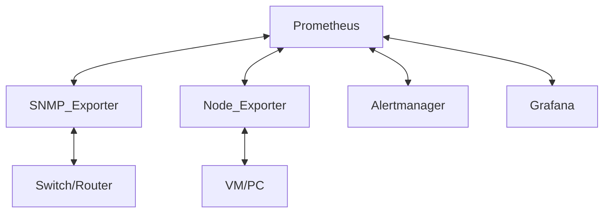

你的 Prometheus + SNMP Exporter 手冊內容已經很完整，結構清楚、涵蓋了背景、架構、設定、部署、常見問題與解決方案。不過，為了讓手冊更易讀、專業且方便新手快速上手，我建議從以下幾個面向優化：

---

## 1. 目錄（Table of Contents）

建議在開頭加上目錄，方便快速跳轉。

## 2. 段落標題與層級優化

- 使用更明確的標題層級（如 `##`、`###`），讓結構一目了然。
- 每個步驟前加上簡短說明，讓讀者知道該步驟的目的。

## 3. 關鍵步驟加上「重點提示」與「常見錯誤」

- 用 `> 注意` 或 `> 小技巧` 標註重要事項。
- 常見錯誤加上解法，讓新手不容易卡關。

## 4. 範例配置區塊格式統一

- YAML、指令、查詢語法等都用 code block 標註，方便複製。

## 5. 圖片與流程圖

- 若有流程圖（如架構圖），可用 mermaid 或簡單圖示輔助說明。

## 6. FAQ/疑難排解專區

- 把常見問題集中在一區，方便查找。

---

### 範例優化（部分章節示意）

---

# Prometheus + Grafana + SNMP Exporter 監控網路設備手冊

## 目錄

1. [專案背景與目標](#專案背景與目標)
2. [架構說明](#架構說明)
3. [安裝與環境準備](#安裝與環境準備)
4. [SNMP Exporter 設定與產生 snmp.yml](#snmp-exporter-設定與產生-snmpyml)
5. [docker-compose 配置](#docker-compose-配置)
6. [Prometheus 設定](#prometheus-設定)
7. [部署與驗證](#部署與驗證)
8. [常見問題與解決方案](#常見問題與解決方案)
9. [結論與展望](#結論與展望)

---

## 專案背景與目標

- **監控需求**：確保網路設備（如 Switch、Router）可用性、頻寬利用率、健康狀態。
- **選擇 SNMP Exporter**：因為 Prometheus 生態整合佳、標準 SNMP 支援、易於擴展與部署。

---

## 架構說明



---

## 安裝與環境準備

1. **安裝 Docker 與 Docker Compose**
2. **安裝 Go（如需本地產生 snmp.yml）**
3. **安裝必要工具**：如 `unzip`、`build-essential`、`libsnmp-dev`

---

## SNMP Exporter 設定與產生 snmp.yml

### 1. 下載 SNMP Exporter 原始碼

```bash
git clone https://github.com/prometheus/snmp_exporter.git
cd snmp_exporter/generator
```

### 2. 編輯 `generator.yml`

- 設定 `lookups` 以豐富指標標籤：

```yaml
lookups:
  - source_indexes: [ifIndex]
    lookup: "IF-MIB::ifAlias"
    fallback_if_missing: true
  - source_indexes: [ifIndex]
    lookup: "IF-MIB::ifDescr"
    fallback_if_missing: true
  - source_indexes: [ifIndex]
    lookup: "IF-MIB::ifName"
    fallback_if_missing: true
```

> **注意**：`lookups` 會增加 SNMP 查詢流量，但能換來更好的人性化標籤，建議保留。

### 3. 產生 snmp.yml

```bash
make generate
# 或用 docker
make docker-generate
```

---

## docker-compose 配置

- 範例 `docker-compose.yml` 片段：

```yaml
services:
  prometheus:
    image: prom/prometheus
    volumes:
      - ./prometheus.yml:/etc/prometheus/prometheus.yml
      - prometheus_data:/prometheus
    ports:
      - "9090:9090"
    command:
      - '--web.enable-lifecycle'

  snmp-exporter:
    image: prom/snmp-exporter
    volumes:
      - ./snmp.yml:/etc/snmp_exporter/snmp.yml
    ports:
      - "9116:9116"
```

---

## Prometheus 設定

- 範例 `prometheus.yml` 片段：

```yaml
scrape_configs:
  - job_name: 'snmp'
    metrics_path: /snmp
    params:
      module: [if_mib]
      auth: [snmp_zyxel]
    static_configs:
      - targets: ['192.168.1.1', '192.168.1.2']
    relabel_configs:
      - source_labels: [__address__]
        target_label: __param_target
      - source_labels: [__param_target]
        target_label: instance
      - target_label: __address__
        replacement: snmp-exporter:9116
```

> **重點**：`relabel_configs` 用於將 target IP 傳遞給 snmp-exporter。

---

## 部署與驗證

1. 啟動服務

```bash
docker-compose up -d
```

2. 檢查日誌

```bash
docker-compose logs prometheus
docker-compose logs snmp-exporter
```

3. 驗證 Prometheus UI

- 確認 Status > Targets 全部 UP
- 查詢指標（如 `ifHCInOctets`）

4. Grafana 匯入儀表板

---

## 常見問題與解決方案

### SNMP MIB 實作差異

- 某些設備（如 Zyxel）`ipAdEntIfIndex` 不準確，建議用 `ifDescr` 當識別標籤。

### 配置格式不相容

- 新版 snmp_exporter (`v0.25.0+`) 需分開定義 `auths` 與 `modules`。

### 權限問題

- 若遇到資料夾權限錯誤，請確認目錄權限或用 root 啟動。

---

## 結論與展望

- 成功建置 SNMP 監控平台。
- 可擴充更多設備、加入 Alertmanager 告警、監控更多 MIBs。

---

### 進階建議

- 可將「我的問題」與「觀念」整理到 FAQ 或附錄，讓主流程更精簡。
- 若有自動化腳本或常用查詢語法，可集中於「附錄」或「小抄」區。

---

如果你需要我直接幫你修改/重構 `prometheus.md` 檔案，請告訴我你希望的語言（中文/英文）、風格（簡明/詳細/教學式），或有沒有特別想保留或刪除的內容！