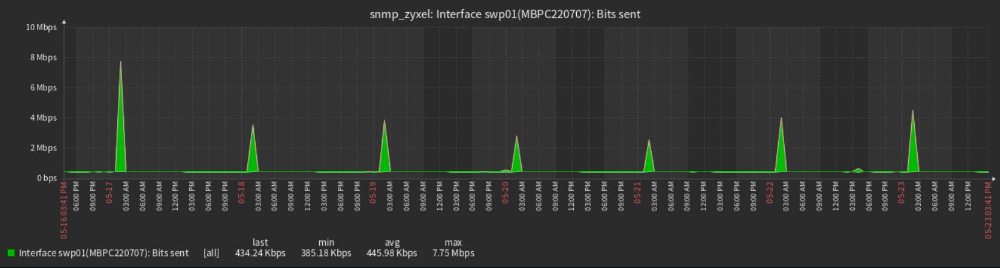
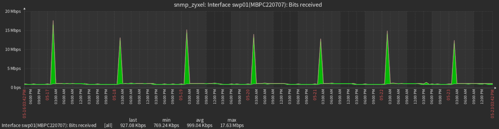
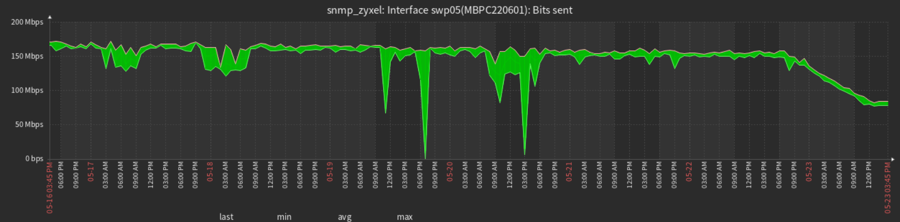
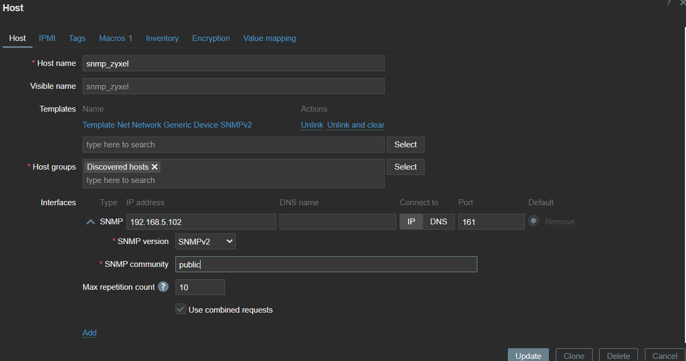
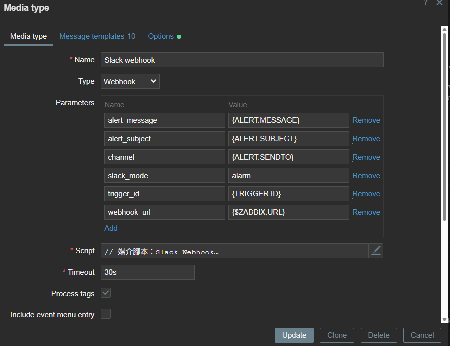
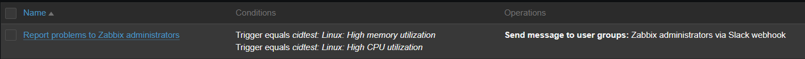
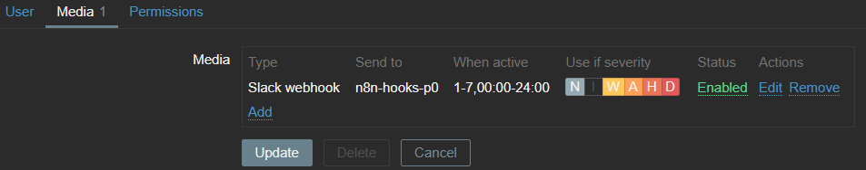
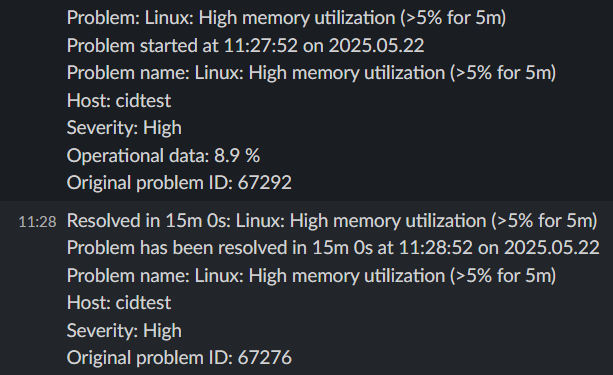

# alert comparism

  zabbix + grafana
  | 比較項目                   |  **Grafana alert**              | **Zabbix alert**    |
  | ---------------------- | ----------------------------------- | -------------------------- |
  | 支援 `time shift` 比較     | ⚠️ **很有限**（UI 支援不佳）                 | ✅ **原生支援，OK**          |
  | 支援 `trend` 計算（如 7 天 max） | ✅ query + trend | ✅ `max_over_time()` 等超方便   |
  | 支援 `timestamp` 操作        | 基本運算沒問題                           | ✅ 可做 time shift |
  | 適合做動態異常檢測           |  ⚠️ 受限於 Zabbix API 模型              |  🚫 受限所提供 function    |
  | Alert 表達式彈性            | 🚫 受限   time shift                     | ???🚫 受限所提供 function 的精細度    |
  | trend 精細度                | ✅ 超細(目前5m還不到下限)                       | ⚠️1h                     |
  | batch                       | ⚠️⚠️⚠️UI無法對host批次處理 (or yaml provitioning 寫死)|  可綁定 LLD Discovery           |


  | 比較項目                   | **Zabbix + Grafana**                | **Prometheus + Grafana**   |
  | ---------------------- | ----------------------------------- | -------------------------- |
  | 支援 `time shift` 比較     | ⚠️ **很有限**（UI 支援不佳）                 | ✅ **原生支援，超強**              |
  | 支援 `trend` 計算（如 7 天 max） | ✅ query(TS) + trend(function) | ✅ `max_over_time()` 等超方便   |
  | 支援 `topk` 計算（找多峰值） | ⚠️ 好像OK 研究中             | ✅ `topk()` 等超方便   |
  | 支援 timestamp 操作        | ❌ 幾乎不行                              | ✅ 可做 time alignment、offset |
  | 適合做動態異常檢測              | ⚠️ 受限於 Zabbix API 模型                | ✅ 非常靈活強大                   |
  | Alert 表達式彈性            | 🚫 受限                               | ✅ 完全自訂 PromQL              |
  | Expression bug 少嗎？     | ⚠️ 偶爾錯誤（你剛遇到）                       | ✅ 很穩定                      |

  !!!

# Zabbix 

  * template 套件 : https://github.com/Udeus/Zabbix-Update-All-Templates
  * zabbix api


## 範例(7d)

  swp 01 整點啟動 單一時段高流量
  O: 
  I: 

  swp 05 穩定高流量
  O: 
  穩定中流量
  Swp 09 


  https://grafana.com/grafana/dashboards/11953-network-dashboard/


## zabbix docker 建置

## 初始化 

  ``` bash
  git clone zabbix/zabbix-docker

  docker compose -f 'docker-compose_v3_ubuntu_pgsql_latest.yaml' up

  ```
  * 預設帳密:
  Admin / zabbix

## 啟用 SNMP

  * ./zabbix-docker/env_vars/.env_srv 修改
  ZBX_ENABLE_SNMP_TRAPS=true
  ZBX_STARTSNMPPOLLERS=5 # 視管理機器數量修改

      | SNMP 監控設備數量 | 建議 poller 數量 (`ZBX_STARTSNMPPOLLERS`) |
      | ----------- | ------------------------------------- |
      | 少量（<10 台）   | 1～2                                   |
      | 中等（10～50 台） | 3～5                                   |
      | 大量（50 台以上）  | 5～10 甚至更多                             |

  * 註解掉 compose_zabbix_components.yaml 裡 snmptraps: 的
  profiles:
    - full
    - all
  (改為預設啟動並重新 docker compose up)

  * 或手動單獨啟用

  1. 從 docker-compose_v3_ubuntu_pgsql_latest.yaml 啟動 zabbix-snmptraps: 服務

  2. 指令
  ``` bash
  docker compose -f 'docker-compose_v3_ubuntu_pgsql_latest.yaml' up -d --build 'test' 
  ```

## 監控設定

  * 匯入模板 (first time)

  * 設定監控設備
  

## 🔔 Zabbix: Trigger to Alert 流程設定說明

---

### 📊 資料處理階段

#### 🧱 Items

  * 位置：`Monitoring → Hosts → <your_host> → Items`
  * 功能：基於設備 OID 週期性收集監控資料。

#### ⚡ Trigger

  * 位置：`Monitoring → Hosts → <your_host> → Triggers`
  * 功能：根據資料內容定義觸發條件。
  * 說明：觸發器評估頻率與資料更新頻率相同。

  ---

### 🚨 Alert 通知階段

#### 📡 Media types (通知方式設定, 參考預設的 Slack 設定範本)

  * 位置：`Alerts → Media types`
  * 設定範例（Slack Webhook）：

  | 欄位       | 值             |
  | -------- | ------------- |
  | **Name** | Slack webhook |
  | **Type** | Webhook       |

  **🔧 Parameters (傳給 Script 的值)**：

  | Name            | Value             | Variable src      |
  | --------------- | ----------------- | ----------------- |
  | `alert_message` | `{ALERT.MESSAGE}` | Message templates |
  | `alert_subject` | `{ALERT.SUBJECT}` | Message templates
  | `channel`       | `{ALERT.SENDTO}`  | Users             |
  | `trigger_id`    | `{TRIGGER.ID}`    |
  | `webhook_url`   | `{$ZABBIX.URL}`   | 

  **🧠 Script（由 GPT 提供 Slack Webhook Script）**:

  ```javascript
  try {
    // 1. 解析並驗證參數
    const params = JSON.parse(value);
    if (typeof params.webhook_url !== 'string' || !/^https:\/\/hooks\.slack\.com\/services\//.test(params.webhook_url)) {
      throw 'Invalid webhook_url';
    }
    if (typeof params.channel !== 'string' || params.channel.trim() === '') {
      throw 'Invalid channel';
    }

    // 2. 組 message payload
    const data = {
      channel: params.channel,
      text: params.alert_subject + '\n' + params.alert_message
    };

    // 3. 發送 HTTP POST
    const req = new HttpRequest();
    req.addHeader('Content-Type: application/json');
    const resp = req.post(params.webhook_url, JSON.stringify(data));

    if (req.getStatus() !== 200) {
      throw 'HTTP ' + req.getStatus() + ': ' + resp;
    }

    return '';
  } catch (e) {
    Zabbix.log(3, '[Slack Webhook] Notification failed: ' + e);
    throw 'Sending failed: ' + e;
  }
  ```

  ---

  **📝 Message templates**

  > 可使用預設模板或依需求自訂內容。

  ---

  


#### 🎯 Actions（通知觸發設定）

  * 位置：`Alerts → Actions → Trigger actions`

  | 欄位             | 範例內容                                                                                                                    |
  | -------------- | ----------------------------------------------------------------------------------------------------------------------- |
  | **Name**       | Linux: High memory or CPU utilization                                                                                   |
  | **Conditions** | A: Trigger equals `cidtest: Linux: High memory utilization`<br>B: Trigger equals `cidtest: Linux: High CPU utilization` |
  | **Enabled**    | ✅ 開啟通知動作                                                                                                                |

  ---

  


#### 👤 Users（使用者接收設定）

  * 位置：`Users → Users`

  | 欄位                  | 設定內容                                                          |
  | ------------------- | ------------------------------------------------------------- |
  | **Media Type**      | Slack webhook                                                 |
  | **Send to**         | n8n-hooks-p0                                                  |
  | **When active**     | 1-7, 00:00–24:00                                              |
  | **Use if severity** | Not classified, Information, Warning, Average, High, Disaster |
  | **Enabled**         | ✅ 啟用通知                                                        |

  ---

  

  如果你想要轉成 `.md` 檔案或加入圖片、連結說明，我也可以幫你補上。是否需要？


### example
  


# snmp docker


Home > Alerting > Contact points > notification template

mrkdwn for slack message:
https://api.slack.com/reference/surfaces/formatting
