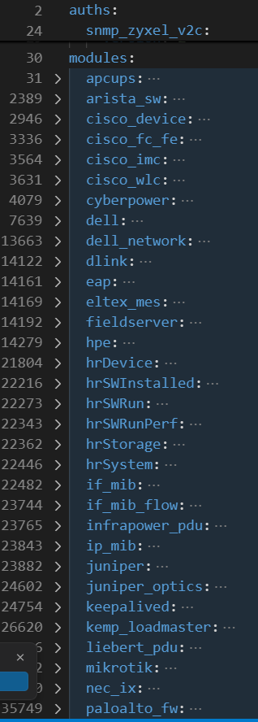
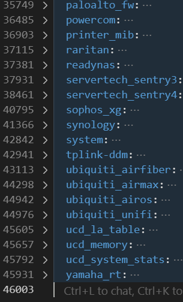
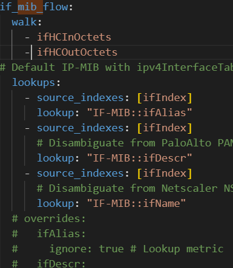
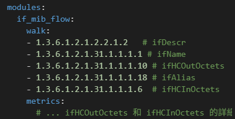

# prometheus + grafana docker-compose

## ref

  * [prometheus + grafana basic](https://www.youtube.com/watch?v=pGSkPutCKtQ) (類似hello-world)
  * [snmp_exporter](https://github.com/prometheus/snmp_exporter/tree/main) (目前只用 generator)
    [snmp_exporter demo](https://www.youtube.com/watch?v=P9p2MmAT3PA)(官方hello-world)
  * 
  * [prmetheus docker 推薦參考](https://github.com/vegasbrianc) (準備看看，)

## code
  * [github](https://github.com/martinyeh0121/network-monitoring_prometheus.git)

## intro

  **一、專案背景與目標**

  *   **1.1 監控需求：** 描述為何需要監控網路設備 (例如：確保網路可用性、頻寬利用率、設備健康狀態)。
  *   **1.2 選擇 SNMP Exporter：** 說明選擇 Prometheus SNMP Exporter 的原因 (例如：Prometheus 生態整合、標準 SNMP 支援、高擴展性、易於部署)。

  **二、docker 核心 service 架構**

  *   **2.1 prometheus (Server)：** 監控系統的核心，負責抓取、儲存指標數據。
  *   **2.2 snmp_exporter：** 擔任 SNMP 數據轉換代理，將 SNMP 數據轉化為 Prometheus metrics，安裝於 server 端。
  *   **2.3 node_exporter：** 擔任 node 數據轉換代理，將 電腦(VM/PC) 數據轉化為 Prometheus metrics，安裝於 client 端。
  *   **2.4 alertmanager：** 
  *   **2.5 grafana (可選)：** 視覺化工具，用於展示監控數據和儀表板 (前端優化)。

## prometheus + grafana

### my questions

* 觀念
  #### 1. prometheus staleness 機制 (5min) 導致 grafana query 異常

    https://chatgpt.com/share/685267ec-82c8-800c-bb10-b75b27475bdc

  #### 2. 多 job 管理


## snmp_exporter


### requirement

  *   **網路設備 (Target)：** 被監控的 SNMP 設備 (例如：Switch、Router、VM...)。

  *   **snmp_exporter 配置：** [snmp_exporter](https://github.com/prometheus/snmp_exporter.git)

  *   **snmp_exporter service** (docker-compose.yml) 


### 流程
  * 


### ref tutorial
  * basic demo
  [snmp_exporter demo](https://www.youtube.com/watch?v=P9p2MmAT3PA)
  * document

### default mibs in generator.yml

   


### snmp generator added
* (input: generator.yml, Output: snmp.yml)

   

### my questions (觀念，感覺小有難度)

#### 1. snmp mib 概念
  https://chatgpt.com/s/t_68526783680481918dc6ce2878853088


#### 2. snmp_exporter 中使用 lookups 是否會影響效能或儲存空間？

* **結論：**

  * 使用 `lookups` 是在性能與可讀性之間做平衡。
  * 多查詢幾個描述 OID，雖然會造成額外的 SNMP 流量，但這種負載在現代網管環境中是可以接受的。
  * 相較於能夠取得更完整、具識別性的監控指標，這樣的代價是值得的。


* **我的設定（generator.yml）**：

  ```yaml
  lookups:
    - source_indexes: [ifIndex]
      lookup: "IF-MIB::ifAlias"
    - source_indexes: [ifIndex]
      lookup: "IF-MIB::ifDescr"
    - source_indexes: [ifIndex]
      lookup: "IF-MIB::ifName"
  ```

* **觀察與說明：**

  * 上述設定將額外進行 3 個 OID 的 SNMP walk。
  * 這些查詢是為了取得每個介面的 `ifAlias`、`ifDescr` 與 `ifName`，以豐富指標的標籤資訊。
  * 所有這些查詢會與主 OID（如 `ifHCInOctets`, `ifHCOutOctets`）一樣以相同的頻率進行，因為 `snmp_exporter` 模組設計上無法區分不同 OID 的抓取頻率。

* **總結觀點：**

  * **不建議刻意移除這些 lookup 查詢**，即便它們會增加 SNMP 負載，因為：

    * 它們查詢的資訊屬於靜態資訊（不常變動）。
    * 負載極小，幾乎不影響效能。
    * 換來的是更具可讀性的指標標籤，有助於管理與告警。

  **lookup 的運作邏輯（類比資料表關聯）：**

  * `ifIndex` 是唯一索引（類似資料表主鍵），對應一組完整的介面資訊。
  * `ifAlias`、`ifDescr`、`ifName` 是該主鍵對應的欄位值（屬性）。
  * snmp\_exporter 會以 `ifIndex` 建立映射，把每個流量指標對應到相關描述欄位。

  這種方式就像資料庫中的 `JOIN` 操作，只不過這裡是以 `ifIndex` 為基礎，在內部映射關聯欄位值。

* **複合索引的進階範例（較進階應用）：**

  ```yaml
  lookups:
    - source_indexes: [cpuIndex, coreID]
      lookup: "CUSTOM-CPU-MIB::cpuSerialNumber"
  ```

  這代表某些查詢需要兩個索引值才能定位正確的資訊（類似複合主鍵）。


### other questions


#### lookup d4 三個都有才建立 ifindex

* **我的設定（generator.yml）：**

  ```yaml
  lookups:
    - source_indexes: [ifIndex]
      lookup: "IF-MIB::ifAlias"
    - source_indexes: [ifIndex]
      lookup: "IF-MIB::ifDescr"
    - source_indexes: [ifIndex]
      lookup: "IF-MIB::ifName"
  ```

* **answer:**  
```yaml
  lookups:
    - source_indexes: [ifIndex]
      lookup: "IF-MIB::ifAlias"
      fallback_if_missing: true
    - source_indexes: [ifIndex]
      lookup: "IF-MIB::ifDescr"
      fallback_if_missing: true
    - source_indexes: [ifIndex]
      lookup: "IF-MIB::ifName"
      fallback_if_missing: true
  ```


### **三、實作步驟詳述**

*   **3.1 環境準備：**
    *   **Docker 與 Docker Compose 安裝：** 說明部署所需的基本環境。
    *   **Go 語言安裝 (若手動生成 snmp.yml)：** 說明 Go 是 generator 的必要條件。
    *   **必要系統工具安裝：** 例如 `unzip`、`build-essential`、`libsnmp-dev` 等。
*   **3.2 SNMP Exporter `snmp.yml` 設定檔生成：**
    *   **下載 SNMP Exporter 原始碼：** 說明 `git clone` 並進入 `generator` 目錄。
    *   **`generator.yml` 配置：**
        *   定義 `auths`：配置不同 SNMP Community (例如：`snmp_zyxel`、`cid1`、`cid2`) 或 SNMPv3 認證。
        *   定義 `modules`：選擇要抓取的 MIBs 和 OID。
            *   強調使用 **`if_mib`** (用於通用介面流量、狀態) 作為主要模組，其已內建 `ifHCInOctets`、`ifHCOutOctets` 及相關 `lookups` (如 `ifAlias`、`ifDescr`、`ifName`)。
            *   討論 `IP-MIB` (例如 `ipv4InterfaceTable`) 的作用 (識別 IP) 及其實作可能遇到的挑戰 (例如 `ipAdEntIfIndex` 不可靠的問題)。
            *   討論 `IPv6-MIB` 的必要性判斷 (依據網路環境)。
    *   **生成 `snmp.yml`：** 說明使用 `make generate` (本機) 或 `make docker-generate` (Docker) 指令來產生最終的 `snmp.yml`。
    *   **`snmp.yml` 格式確認：** 強調新版 `snmp_exporter` (`v0.25.0+`) 需要 `auths` 和 `modules` 分開定義的格式。
*   **3.3 `docker-compose.yml` 配置：**
    *   **服務定義：** 配置 `prometheus` 和 `snmp-exporter` 服務。
    *   **Volumes 掛載：**
        *   `prometheus`：掛載 `prometheus.yml` 和數據目錄 (例如 `prometheus_data`)。討論具名卷與綁定掛載的選擇。
        *   `snmp-exporter`：掛載生成的 `snmp.yml` 到容器內 `/etc/snmp_exporter/snmp.yml`。
    *   **Ports 開放：** 開放 Prometheus (9090) 和 SNMP Exporter (9116) 的端口。
    *   **Network 設定：** 配置服務間的網路連通性 (例如 `default` 網路或自定義網路)。
*   **3.4 Prometheus `prometheus.yml` 配置：**
    *   **Global 設定：** 定義全局抓取間隔等。
    *   **SNMP Exporter Job：**
        *   定義 `job_name`。
        *   `metrics_path: /snmp`。
        *   `params`：指定 `auth` 和 `module` (例如 `module: [if_mib]`)。
        *   `static_configs`：列出所有要監控的設備 IP。
        *   **`relabel_configs`：** 強調其重要性，用於將被監控設備的 IP 傳遞給 `snmp_exporter` (`__param_target`)，並將 `__address__` 重寫為 `snmp-exporter` 的地址。
    *   **配置熱重載：** 說明在 `docker-compose.yml` 中為 Prometheus 添加 `--web.enable-lifecycle` 參數，以及如何使用 `curl -X POST .../-/reload` 觸發設定重載。

### **四、部署與驗證**

*   **4.1 啟動服務：** `docker-compose up -d` 啟動所有服務。
*   **4.2 檢查日誌：** 檢查 Prometheus 和 SNMP Exporter 容器的日誌，確認無配置錯誤。
*   **4.3 Prometheus UI 驗證：**
    *   檢查 "Status -> Targets" 頁面，確認所有目標都 UP 且 `scrape_interval` 正確。
    *   使用 Prometheus Query 語法查詢介面流量、狀態等指標，確認數據是否正確收集 (例如 `ifHCOutOctets`, `ifOperStatus`)。
*   **4.4 Grafana 儀表板：** 導入或創建儀表板來視覺化網路設備數據。

### **五、挑戰與解決方案 (可選)**

*   **權限問題：** 解決綁定掛載時的資料夾權限問題。
*   **Go 版本衝突：** 解決 generator 運行時 Go 版本過舊或 `go.mod` 格式錯誤的問題。
*   **SNMP Exporter 配置格式：** 處理新舊版本 `snmp.yml` 格式不相容的問題。
*   **SNMP MIB 實作差異：** 討論特定設備 (`Zyxel`) 的 `ipAdEntIfIndex` 可能不准確，需調整策略 (例如優先使用 `ifDescr` 作為識別標籤)。

### **六、結論**

*   總結實作成果。
*   未來展望 (例如：加入 Alertmanager 告警、監控更多 MIBs、擴展到更多設備)。

---

## alertmanager

* ref
douc
https://prometheus.io/docs/alerting/latest/configuration/#slack_config

# snmp docker


Home > Alerting > Contact points > notification template

mrkdwn for slack message:
https://api.slack.com/reference/surfaces/formatting
