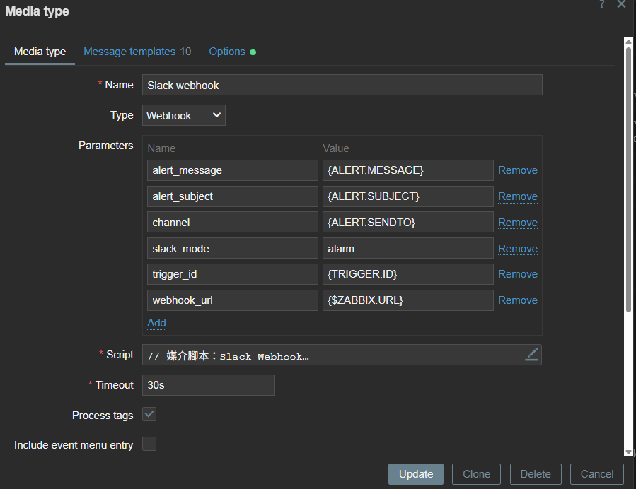
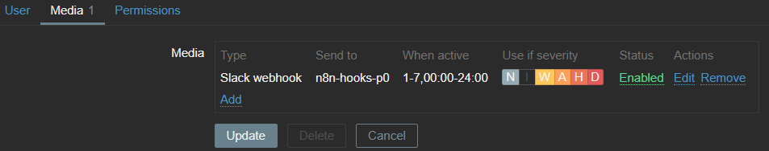
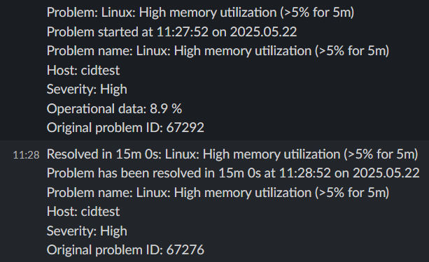

會議記錄
    說明要做的項目
    網路流量監控及後續告警通知
    每週review 一次進度

待辦事項
    4/22 研究哪些網路流量監控軟體，提供相關分析比較後進行討論


# 網路管理

(?: 不很熟)

## zabbix

docker compose frame (official): https://github.com/zabbix/zabbix-docker

### snmptrap:

*  mibs **?1-1**
      def: OID column_name 對應檔案
      imprt failed (dependancy)
      ? mib browser

### template: 
   目前找到的模板很少 基本上都是官方維護的模板
   community: https://github.com/zeus911/Zabbix-Templates-1 (7 years ago)
https://www.reddit.com/r/zabbix/comments/1g2ongk/zabbix_update_all_templates/
https://github.com/Udeus/Zabbix-Update-All-Templates
   

### !! dependancy (template, mibs)
* template discovery?
* mibs ?

### how template work **?1-2**
* item setting (COLUMN)
* value mapping (VAR)
* discovery !!!

### douc


**?2** : https://www.reddit.com/r/networking/comments/168x7mn/zabbix_vs_librenms/

## prometheus

* snmp-exporter **?2-1**

## LibreNMS

* 易用 開源 擴充性低(?fromGpt) **?2-2**


拉時間 告警


zabbix 欄位


---

## 🔔 Zabbix: Trigger to Alert 流程設定說明

---

### 📊 資料處理階段

#### 🧱 Items

* 位置：`Monitoring → Hosts → <your_host> → Items`
* 功能：基於設備 OID 週期性收集監控資料。

#### ⚡ Trigger

* 位置：`Monitoring → Hosts → <your_host> → Triggers`
* 功能：根據資料內容定義觸發條件。
* 說明：觸發器評估頻率與資料更新頻率相同。

---

### 🚨 Alert 通知階段

#### 📡 Media types (通知方式設定, 參考預設的 Slack 設定範本)

* 位置：`Alerts → Media types`
* 設定範例（Slack Webhook）：

| 欄位       | 值             |
| -------- | ------------- |
| **Name** | Slack webhook |
| **Type** | Webhook       |

**🔧 Parameters (傳給 Script 的值)**：

| Name            | Value             | Variable src      |
| --------------- | ----------------- | ----------------- |
| `alert_message` | `{ALERT.MESSAGE}` | Message templates |
| `alert_subject` | `{ALERT.SUBJECT}` | Message templates
| `channel`       | `{ALERT.SENDTO}`  | Users             |
| `trigger_id`    | `{TRIGGER.ID}`    |
| `webhook_url`   | `{$ZABBIX.URL}`   | 

**🧠 Script（由 GPT 提供 Slack Webhook Script）**:

```javascript
try {
  // 1. 解析並驗證參數
  const params = JSON.parse(value);
  if (typeof params.webhook_url !== 'string' || !/^https:\/\/hooks\.slack\.com\/services\//.test(params.webhook_url)) {
    throw 'Invalid webhook_url';
  }
  if (typeof params.channel !== 'string' || params.channel.trim() === '') {
    throw 'Invalid channel';
  }

  // 2. 組 message payload
  const data = {
    channel: params.channel,
    text: params.alert_subject + '\n' + params.alert_message
  };

  // 3. 發送 HTTP POST
  const req = new HttpRequest();
  req.addHeader('Content-Type: application/json');
  const resp = req.post(params.webhook_url, JSON.stringify(data));

  if (req.getStatus() !== 200) {
    throw 'HTTP ' + req.getStatus() + ': ' + resp;
  }

  return '';
} catch (e) {
  Zabbix.log(3, '[Slack Webhook] Notification failed: ' + e);
  throw 'Sending failed: ' + e;
}
```

---

**📝 Message templates**

> 可使用預設模板或依需求自訂內容。

---




#### 🎯 Actions（通知觸發設定）

* 位置：`Alerts → Actions → Trigger actions`

| 欄位             | 範例內容                                                                                                                    |
| -------------- | ----------------------------------------------------------------------------------------------------------------------- |
| **Name**       | Linux: High memory or CPU utilization                                                                                   |
| **Conditions** | A: Trigger equals `cidtest: Linux: High memory utilization`<br>B: Trigger equals `cidtest: Linux: High CPU utilization` |
| **Enabled**    | ✅ 開啟通知動作                                                                                                                |

---


#### 👤 Users（使用者接收設定）

* 位置：`Users → Users`

| 欄位                  | 設定內容                                                          |
| ------------------- | ------------------------------------------------------------- |
| **Media Type**      | Slack webhook                                                 |
| **Send to**         | n8n-hooks-p0                                                  |
| **When active**     | 1-7, 00:00–24:00                                              |
| **Use if severity** | Not classified, Information, Warning, Average, High, Disaster |
| **Enabled**         | ✅ 啟用通知                                                        |

---



如果你想要轉成 `.md` 檔案或加入圖片、連結說明，我也可以幫你補上。是否需要？


### example



