# n8n setup on docker
## def 
n8n: workflow automation platform, 
基於node輕鬆建立workflow，node包含
Core, Triggers, Cluster nodes, Actions(App), Credentials(App Api key設定)等種類，
App提供API key就能使用app-node(Actions node)， node 透過直觀設定 parameters 決定App Actions、trigger條件、brench、code processing(data processing)等，建立workflow就像在畫流程圖，只需要把**設定好的node**串起來即可實現。

docker: 基於容器技術Container的虛擬機
    Image 映像檔
    Container 容器: project
    Repository 倉庫: 管理映像檔

<!-- hyperV: -->

API: Application Programming Interface
各種軟體組件之間一套明確定義的溝通方法。 (Application對外接口，可查閱對應App的API相關文件)

# n8n deploy on docker

## 
sudo systemctl restart/start/stop docker 管理docker服務

## container op:

### prefit: docker (前綴 docker 表示為 docker 指令): 
example: docker run -it --rm --name n8n -p 5678:5678 -v n8n_data:/home/node/.n8n docker.n8n.io/n8nio/n8n

run: (create & run container)
    -d : 後台執行
    -e {$EnvName}={Setting value/boolean...} : 環境變數調整
    -it : (i+t) 保持STDIN於打開狀態(i)，並分配 TTY（模擬終端）交互操作(t)，允許向容器發送指令。
    -v {$MountPath}:{$n8n} : mount volume 
        說明: /home/node/.n8n 是容器內 n8n 應用程式用來保存設定、工作流程和資料的預設路徑，不宜修改。
    --rm : container 退出後自動刪除（用來測試或調試）。
    --name {$name} : 命名container
stop/rm: stop/remove container

exec -it n8n_premission bash

## ref:
https://github.com/n8n-io/n8n-hosting/tree/main/docker-compose/withPostgres : 未成功版本
https://docs.n8n.io/hosting/configuration/environment-variables/database/1l5u4zq*_gcl_au*MjAwMjAwMzI0NC4xNzM2NzM2NzE2*_ga*MTY5MjA2NDE3Ni4xNzM2NzU5MjEy*_ga_0SC4FF2FH9*MTczNjc2MTIxMy4yLjEuMTczNjc2Mjc3NC42MC4wLjA.#docker_1 : DB 環境變數
https://docs.n8n.io/hosting/configuration/environment-variables/ 環境變數介紹

## quick open on shell(bash) (不建議)

docker volume create n8n_data   (volume 用於保存 n8n 的數據（如 workflow 配置, 預設用 sqlite），確保即使container停止或刪除，數據依然存在。)
docker run -it --rm --name n8n -p 5678:5678 -v n8n_data:/home/node/.n8n docker.n8n.io/n8nio/n8n

**Image diff**
docker.n8n.io/n8nio/n8n 是 N8N 的私有鏡像庫的地址。
n8nio/n8n 是官方在 Docker Hub 上的公共鏡像，功能相同，且更易於訪問。

### 遇到問題紀錄
1. 找不到Mountpoint (資料庫位置)
使用找原指令未置docker run... -v {$VolumeName}:{$MountPath} (container op定義)
使用指令: docker volume inspect {$volumeName}
找到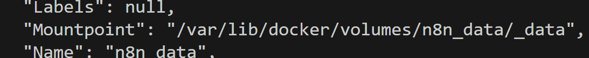

ps: -a 列出運行中container  -q 只列id

#### prefit2-1: volume (volume管理)
 ls, create, rm

#### prefit2-2: compose (docker compose 從 v2.x 起已於安裝 docker 時內建)
 up/down (根據目錄中dockerfile/docker-compose.yml 執行/結束container)

## volume (sqlite 實作)

**此版本根據 quick open on shell(bash) 進行環境變數調整**

services:
  n8n:
    image: n8nio/n8n
    container_name: n8n
    environment:
      # ref: https://docs.n8n.io/hosting/configuration/environment-variables/deployment/ 修改deployment
      # - N8N_HOST=localhost #(default localhost )
      # - N8N_PORT=5678  (default)

      # ref: https://docs.n8n.io/hosting/configuration/environment-variables/security/
      - N8N_SECURE_COOKIE=false #關閉SECURE_COOKIE (允許 http://serverip:5678 訪問，詳見 ### 網址調整) 

      # ref: https://docs.n8n.io/hosting/configuration/environment-variables/timezone-localization/
      - GENERIC_TIMEZONE=Asia/Taipei # 設置時區，可以根據需求修改

      # (可選, from example code == **-p 5678:5678**)
      # ports:
      # - "5678:5678" # 映射端口，可以通過 http://localhost:5678 訪問 n8n

    volumes:
      - ./n8n-data:/home/node/.n8n   主機位置 / container位置
    restart: always

    user: "1000:1000" #權限 (嘗試處理權限問題(## 遇到問題: 1)，未實際測試)

## 遇到問題: 
1. 第一次compose up 發現 ./n8n-data為root所有:
**描述: 發現owner為ROOT**
指令: ls -ld ./n8n-data
 drwxr-xr-x 2 root root 4096 Jan 14 10:32 ./n8n-data
**owner修正**
 sudo chown -R 1000:1000 ./n8n-data
**修正後**
指令: ls -ld ./n8n-data
drwxr-xr-x 2 mobagel mobagel 4096 Jan 14 13:13 ./n8n-data

drwxr-xr-x: file type, premission of <user, group, other>

**better solution**: 用bash腳本創建dir確保owner為user(mobagel)
<!-- 
#!/bin/bash
# mkdir (own by user)
mkdir -p ./n8n_data

# 確認 dir owner 是 user
chown -R 1000:1000 ./n8n_data

# Docker Compose up
docker-compose up -->

##  

2. 網址調整
http://localhost:8080/ -> http://192.168.16.19:8080/

**法一**
yml 中 n8n - environment
- N8N_SECURE_COOKIE=false
會有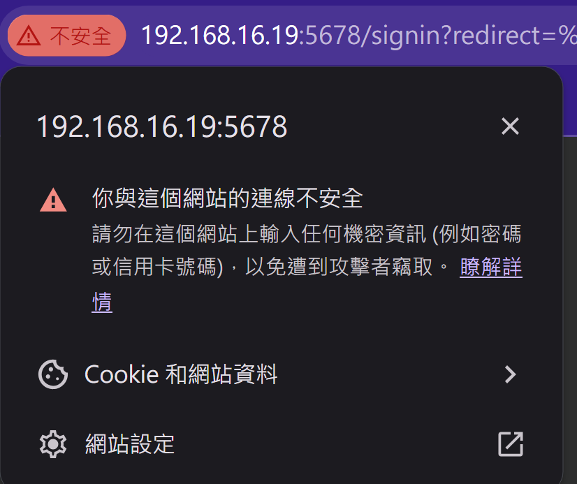，但可以打開

**法二**
待研究
ngrox traefik

**bash note**:
~ 是家目錄 ~ 是家目錄 ~ 是家目錄
grep {word} 
ps gux
<!-- mkdir -p ./n8n-data
sudo chown -R 1000:1000 ./n8n-data
sudo chmod -R 755 ./n8n-data -->

# n8n 實作範例:
### https://docs.n8n.io/try-it-out/longer-introduction/
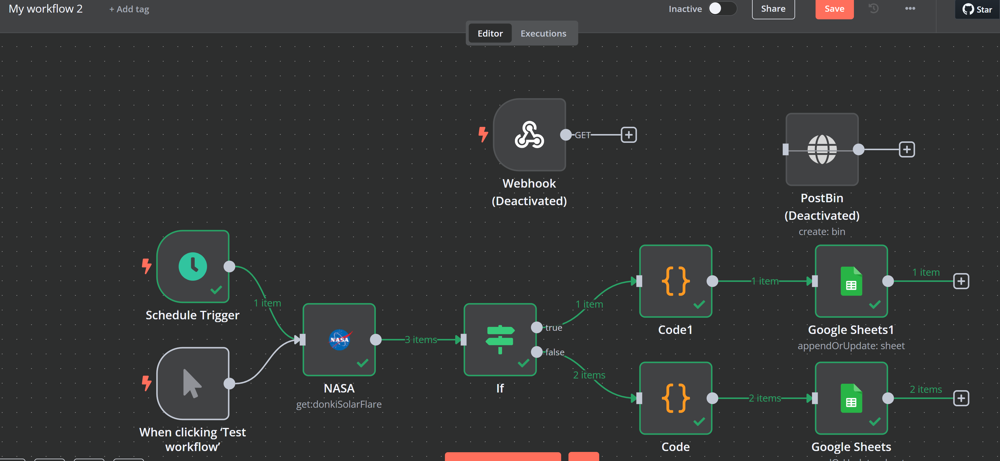
output postbin 改 gooogle sheet
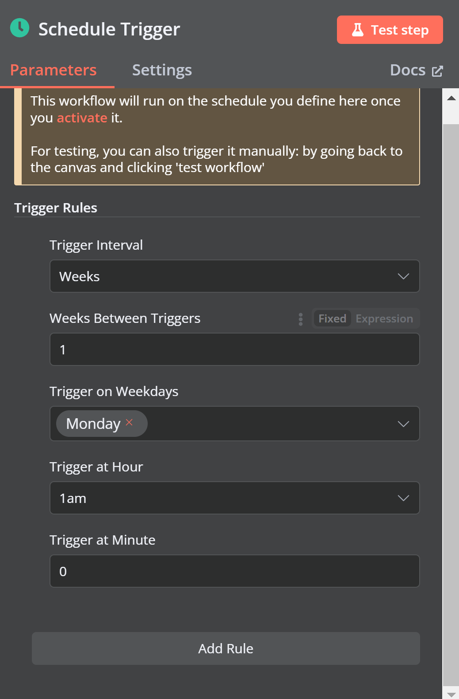

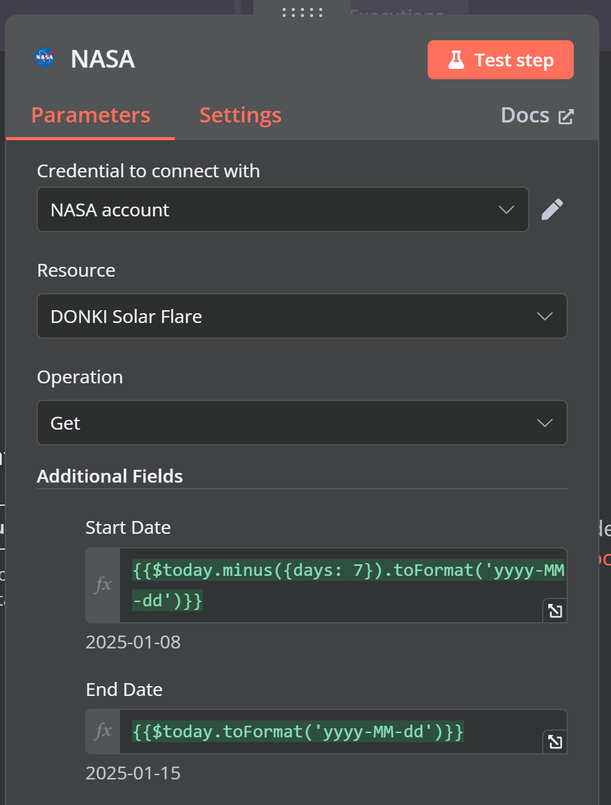 or 

Expressions  (js) 
{{$today.minus({days: 7}).toFormat('yyyy-MM-dd')}}
https://github.com/n8n-io/tournament (n8n supports *two* libraries: **Luxon**, for working with data and time.  **JMESPath**, for querying JSON.)

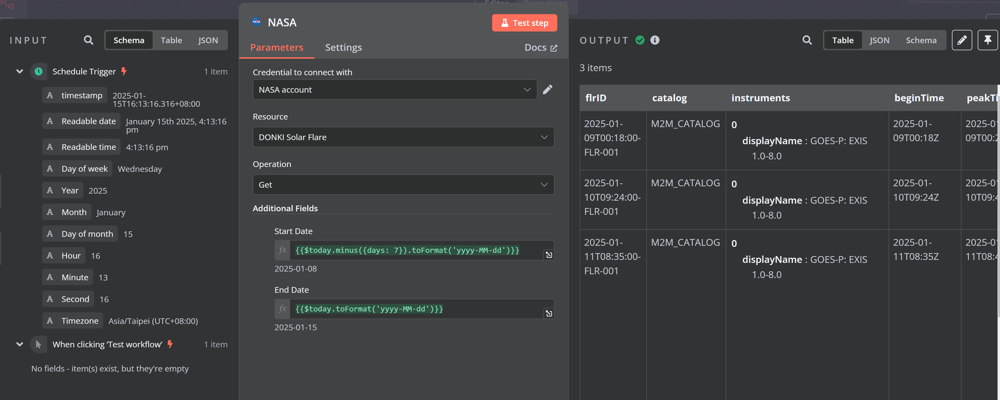 左邊input可拖曳{{$today.minus({days: 7}).toFormat('yyyy-MM-dd')}}

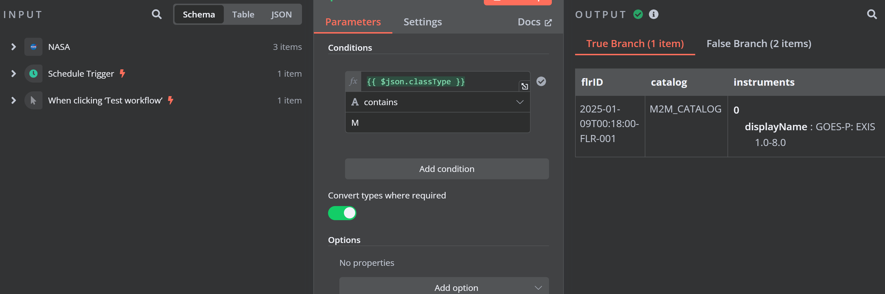

 brench through true false

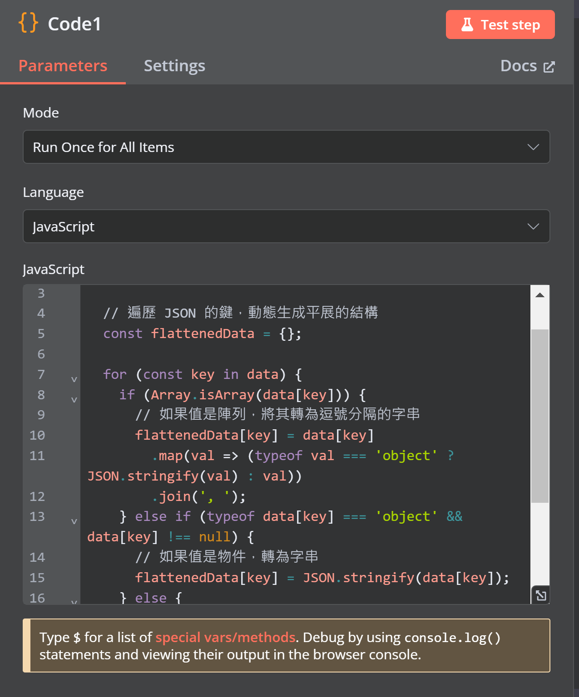 展平 json input

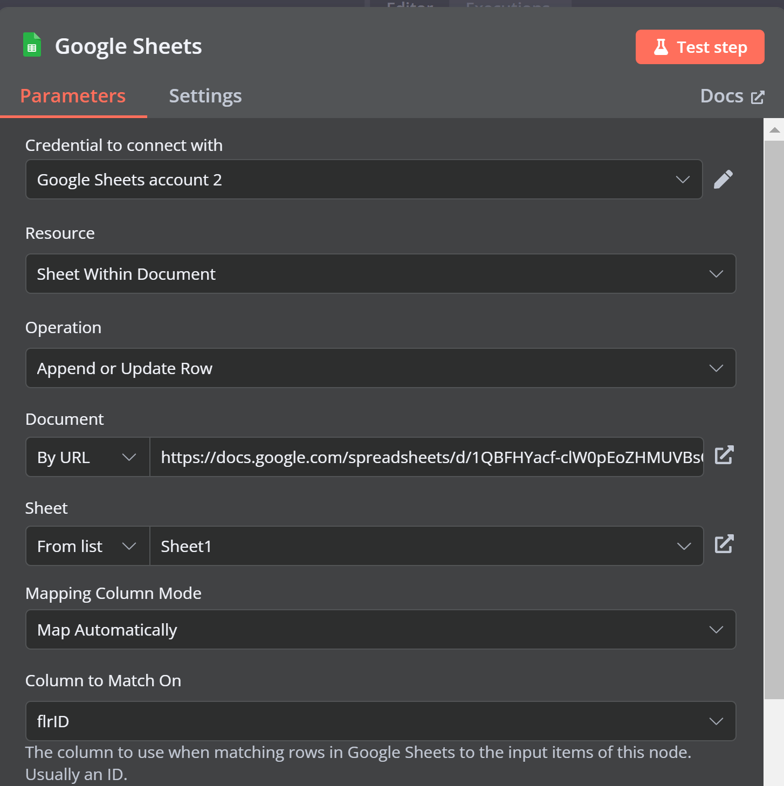
https://docs.n8n.io/integrations/builtin/credentials/google/ : 申請google api

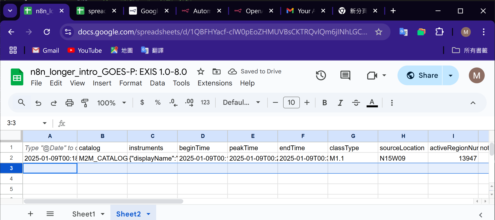
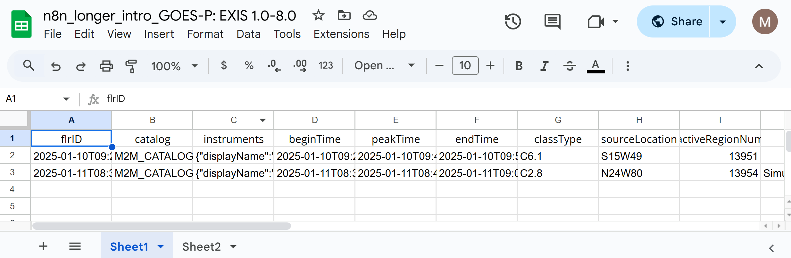

### google sheet node手冊範例(template)
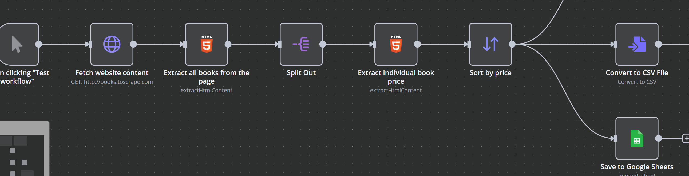
https://n8n.io/workflows/1862-openai-gpt-3-company-enrichment-from-website-content/?_gl=1%2a1bygvhj%2a_gcl_au%2aMjAwMjAwMzI0NC4xNzM2NzM2NzE2%2a_ga%2aMTg1MjQ2NzUxMy4xNzM2OTExNjkx%2a_ga_0SC4FF2FH9%2aMTczNjkyMzE2OC4zLjEuMTczNjkyNDk2Ny42MC4wLjA.

### 剛開n8n給的 template

chat查看calender

## n8n docs介紹:

https://docs.n8n.io/integrations/: Node使用說明書 (built-in / community / creating)，含Node使用教學, 範例 template
 (包含對應API Key取得教學 / **看範例(template)好上手**)
https://docs.n8n.io/integrations/creating-nodes/build/reference/node-file-structure/ :部屬creating node (未實作) 

GPT:
portainer (<server IP>:9000)
docker volume create portainer_data
docker run -d -p 9000:9000 --name=portainer --restart=always \
  -v /var/run/docker.sock:/var/run/docker.sock \
  -v portainer_data:/data portainer/portainer-ce

.env
Assign in .env: N8N_HOST=localhost

Call in other file: 
1.  ${N8N_HOST}  
2.  ${N8N_HOST:=localhost}     
    Trigger when variable is null, method {:= : use & update d4, :- : use}

sed -i -e "/^SERVER_IP=/c\SERVER_IP=${SERVER_IP}" .env || echo "SERVER_IP=${SERVER_IP}" >> .env
**sed**
-i 是指直接修改 .env 文件。
-e "/^SERVER_IP=/c\SERVER_IP=${SERVER_IP}" 是指查找以 SERVER_IP= 開頭的行並替換為 SERVER_IP=${SERVER_IP}

**"/^SERVER_IP=/c\SERVER_IP=${SERVER_IP}"**
s/：這是 sed 的替換命令的開頭，表示進行替換操作。
^SERVER_IP=：這是匹配模式。^ 表示匹配行的開頭，SERVER_IP= 是要匹配的具體字符串，這部分意思是匹配所有以 SERVER_IP= 開頭的行。
.*：這表示任意字符，* 是正則表達式中的量詞，表示零個或多個任意字符。所以 .* 匹配的是 SERVER_IP= 後面的一切內容。
/SERVER_IP=${SERVER_IP}/：這是替換後的內容，意思是將整個匹配到的行替換為 SERVER_IP=${SERVER_IP}，其中 ${SERVER_IP} 是從環境中獲取的變數值。

chmod
chown