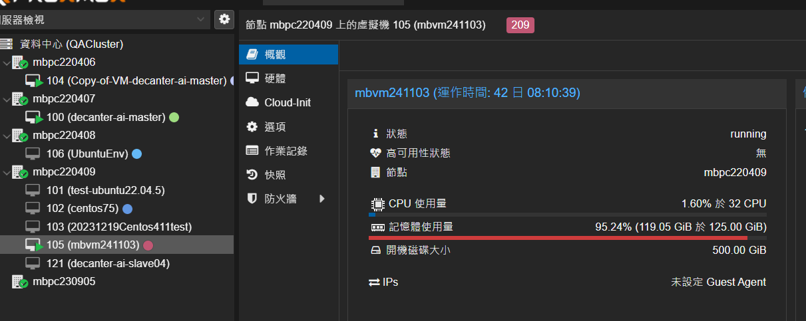

# PVE 串接API，可以讓我詢問機器的各種狀況, 盤點機器狀況, 硬碟狀況，串接 PVE 系統 → intern
有多少台機器是使用率普遍低的
掛在誰身上的使用率是普遍低的
平均的消耗率是多少
現在最多機器的使用者有誰
現在最多使用硬碟量的是誰
現在最多使用記憶體的是誰

## work
proxmox API

base_url: https://192.168.16.180:8006/api2/json 

python on docker (爬蟲 & 整理)

csv: 
node, name, maxmem, mem, cpu, cpus

n8n(AI agent)

## 問題
最多使用記憶體 mem/maxmem

