# Syslog: 
System Logging Protocol，標準化的日誌傳輸協議，用於收集、儲存和傳輸系統日誌。最早源自Eric Allman開發的Sendmail，現在廣泛應用於伺服器、網路設備、應用程式等領域。   

## Message components
### Facility:
To specify the type of _system_ that is logging the message.
Messages with different facilities may be handled differently. 
The list of facilities available is described by the standard:

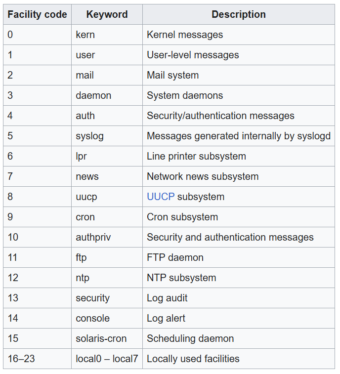

The mapping between facility code and keyword may vary in diff. OS / syslog implementations.
### Severity level:
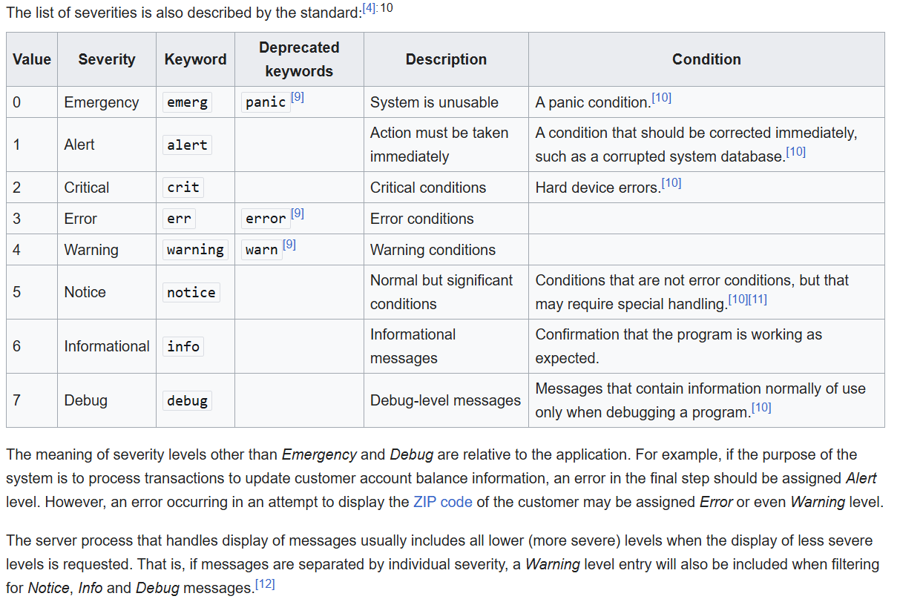

### Message:
  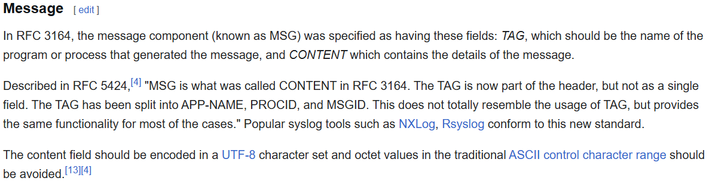


## log configuration (docker)
  - docker-compose > logger:
  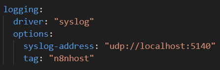
  - graylog graph:
  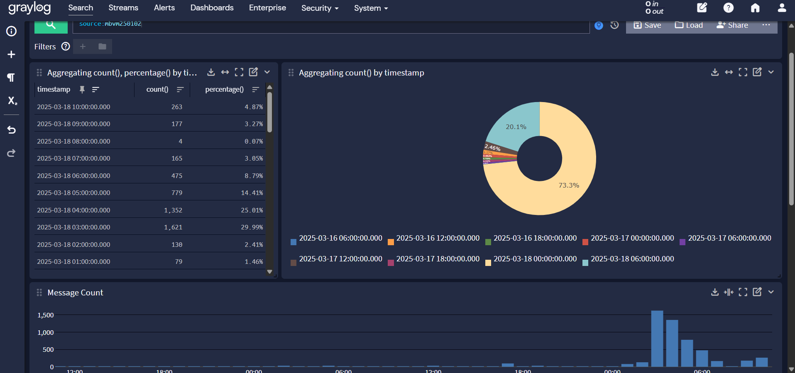
  - n8nhost v.2:
  *services*: postgres db, redis task scheduling
  *profile*: (import/export WF/Credentials)
  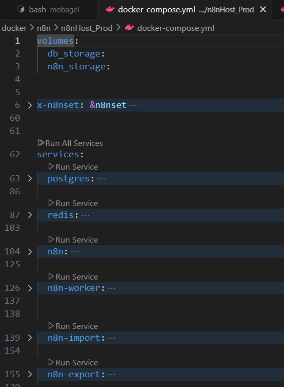
  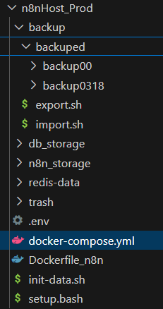

  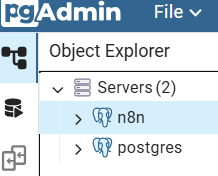

  ``` json
{
  "gl2_accounted_message_size": 145,
  "gl2_receive_timestamp": "2025-03-20 02:41:30.754",
  "level": 5,
  "gl2_remote_ip": "192.168.0.0",
  "gl2_remote_port": 50872,
  "streams": [
    "000000000000000000000001"
  ],
  "gl2_message_id": "01JPRPTNY00003KVP8PTQAPH1E",
  "source": "MSI",
  "message": "MSI martin: test mesg",
  "gl2_source_input": "67d270237c61bd1b662ee742",
  "gl2_processing_timestamp": "2025-03-20 02:41:30.754",
  "facility_num": 1,
  "gl2_source_node": "c5f0191a-323b-4cf1-a180-44b5bd6d8b76",
  "_id": "d4593621-0534-11f0-9649-0242ac130003",
  "facility": "user-level",
  "gl2_processing_duration_ms": 0,
  "timestamp": "2025-03-20T02:41:28.000Z"
}

{
  "gl2_accounted_message_size": 229,
  "gl2_receive_timestamp": "2025-03-20 09:05:51.535",
  "level": 6,
  "gl2_remote_ip": "172.19.0.1",
  "gl2_remote_port": 37587,
  "streams": [
    "000000000000000000000001",
    "67dbd429ce2a4636f30847b3"
  ],
  "gl2_message_id": "01JPSCTGCR00005R9A9Z8HJS2D",
  "source": "n8nhost_worker[358608]:",
  "message": "n8nhost_worker[358608]: password authentication failed for user \"postgres\"",
  "gl2_source_input": "67d270237c61bd1b662ee742",
  "gl2_processing_timestamp": "2025-03-20 09:05:51.537",
  "facility_num": 3,
  "gl2_source_node": "c5f0191a-323b-4cf1-a180-44b5bd6d8b76",
  "_id": "85a54b00-056a-11f0-ab56-0242ac130004",
  "facility": "system daemon",
  "gl2_processing_duration_ms": 2,
  "timestamp": "2025-03-20T09:05:51.000Z"
}
```

# graylog
## deploy
docker ref:
https://github.com/Graylog2/docker-compose/tree/main/open-core

envs:
https://go2docs.graylog.org/current/setting_up_graylog/server_configuration_settings_reference.htm?

###

## regular functions 
Search: 初始介面
dashboard: 介面管理
stream: log 分類
pipeline: log 批次處理 (while receiving)  --rule
alert: 問題回報 --notification

## graylog alert
### steps
#### Pipeline (unnecessary)
Add custom field to log on graylog receiving the log (for backlog Notification)
!!! Log message Parsing also do here!

**Pipeline Rule example:**

*Code:*
``` JS (graylog DSL, regex using java regex litirals)
rule "Extract host n8n log from message"
when
    has_field("message") && contains(to_string($message.message), "e03dz51WM7KCJUaa")
then
    let msg = to_string($message.message);
    let matched0 = regex( " (https.*)", to_string(msg))["0"];

    let matched2 = regex( "(\\d{4}-\\d{2}-\\d{2}T\\d{2}:\\d{2}:\\d{2})", to_string(msg))["0"];
    let matched2 = replace(matched2, "T", " ");
    
    set_field("n8n_log", matched0);
    set_field("n8n_ts", matched2);
    set_field("localhost_ip", "192.168.16.19");
end
```

*Rule Simulation:* (message field)

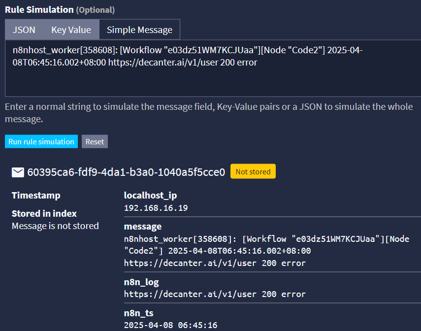

#### Event & Notification Definition

Event: logs Filter & Aggregation / frequency / fields / backlog (!!!)
Event Details -> Filter & Aggregation -> Fields -> Notifications -> Summary

Notification: send alert method (slack / webhook / mail) / message format
**backlog**: a object array contain all message about Logs that Event found. 

### note
*!!! **Notification template** include fully parameters can be use in Notification*
'Alerts & Events' (dashboard) only include necessary info & query result 

*!!! get queried Logs for Notification by setting **backlog** (default not)*
setting on 'Event Definition > edit ur event > Filter & Aggregation > Aggregation > Notifications

*!!! **Aggression** these Logs to avoid message flooding (a log found -> a message send)*
setting on 'Event Definition > edit ur event > Filter & Aggregation > Aggregation > Group by Field (Group by Field)
https://go2docs.graylog.org/current/interacting_with_your_log_data/event_definitions.html

### Notification template
### slack

*passing message*
``` 
--- [Event Definition] ---------------------------
Title:       ${event_definition_title}
Type:        ${event_definition_type}
--- [Event] --------------------------------------
Alert Replay:         ${http_external_uri}alerts/${event.id}/replay-search
Timestamp:            ${event.timestamp}
Message:              ${event.message}
Source:               ${event.source}
Priority:             ${event.priority}
Alert:                ${event.alert}
Event Fields:
${foreach event.fields field}
${field.key}: ${field.value}
${end}
${if backlog}
--- [Backlog] ------------------------------------
Last messages accounting for this alert:
${foreach backlog message}
${message.timestamp}  ::  ${message.source}  ::  ${message.message}
${end}${end}
```


### http webhook
*passing json object* (application/json)
``` json
{
  "event_definition_id": "${event_definition_id}",
  "event_definition_type": "${event_definition_type}",
  "event_title": "${event_definition_title}",
  "event_definition_description": "${event_definition_description}",
  "job_definition_id": "${job_definition_id}",
  "event_id": "${event.id}",
  "event_origin_context": "${event.origin_context}",
  "event_source_streams": "${event.source_streams}",
  "event_alert": "${event.alert}",
  "event_message": "${event.message}",
  "event_source": "${event.source}",
  "event_priority": "${event.priority}"${if backlog},
  "backlog": [
  ${foreach backlog message}
  { "id": "${message.id}",
    "message": "${message.message}"}${if ! last_message},${end}${end}
  ]${end}
}
```

example：
``` json
[
  {
    "headers": {
      "x-real-ip": "192.168.16.19",
      "x-forwarded-for": "192.168.16.19",
      "host": "n8n.mobagel.com",
      "connection": "upgrade",
      "content-length": "596",
      "content-type": "application/json; charset=utf-8",
      "accept-encoding": "gzip",
      "user-agent": "okhttp/4.12.0"
    },
    "params": {},
    "query": {},
    "body": {
      "event_definition_id": "NotificationTestId",
      "event_definition_type": "test-dummy-v1",
      "event_title": "Event Definition Test Title",
      "event_definition_description": "Event Definition Test Description",
      "job_definition_id": "<unknown>",
      "event_id": "TEST_NOTIFICATION_ID",
      "event_origin_context": "urn:graylog:message:es:testIndex_42:b5e53442-12bb-4374-90ed-0deadbeefbaz",
      "event_source_streams": "",
      "event_alert": "true",
      "event_message": "Notification test message triggered from user <local:admin>",
      "event_source": "000000000000000000000001",
      "event_priority": "2"
    },
    "webhookUrl": "https://n8n.mobagel.com/webhook/117ed0bd-7279-493b-816b-03cb473ac804",
    "executionMode": "production"
  }
]
```

## n8n log on docker

### observation
- observation:
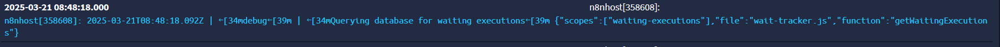
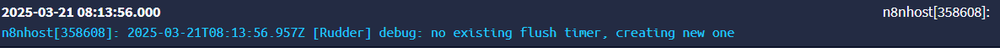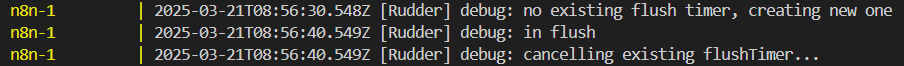
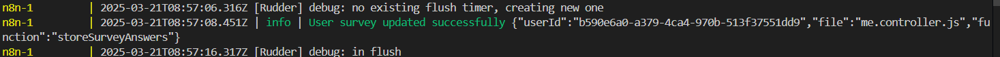
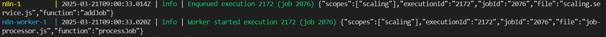
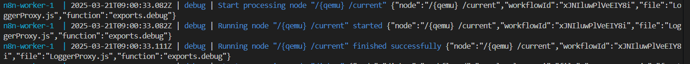
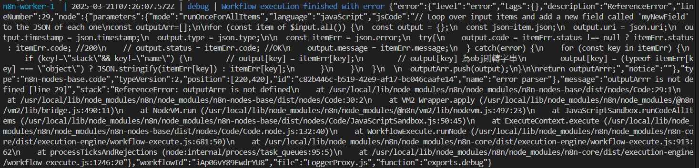
SAML
https://docs.n8n.io/hosting/logging-monitoring/logging/#adding-logs : front log 

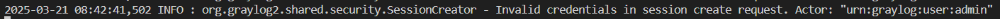


env:
SAML --> price
https://docs.n8n.io/user-management/saml/setup/
CODE_ENABLE_STDOUT
https://docs.n8n.io/hosting/configuration/environment-variables/logs/#n8n-logs
DB_LOGGING_OPTIONS
https://docs.n8n.io/hosting/configuration/environment-variables/logs/#n8n-logs
https://orkhan.gitbook.io/typeorm/docs/logging#logging-options

### log configuration (docker)
see Syslog > log configuration (docker)


# BTW: 
## using node_module on n8n node
env (for n8n recognition, default all banned):
1. - NODE_FUNCTION_ALLOW_BUILTIN=crypto
module_path: /usr/local/lib/node_modules/n8n

- BUILTIN modules:
``` js
const allowedModules = [
	'assert',
	'buffer',
	'crypto',
	'events',
	'path',
	'stream',
	'string_decoder',
	'timers',
	'url',
	'util',
];
```
- Allow using module:
``` yml
environment:
      - NODE_FUNCTION_ALLOW_BUILTIN=crypto,path
```


2. - NODE_FUNCTION_ALLOW_EXTERNAL=uuid //# (需額外下載(使用 npm install on Dockerfile))
module_path: /home/node/node_modules

- Download module:
``` Dockerfile
# 以官方 n8n 映像檔為基礎
FROM n8nio/n8n:1.85.4

# 安裝你想用的外部套件
RUN npm install --omit=dev --no-package-lock \
    uuid \
    lodash \
    dayjs

# 避免 Docker cache 不更新模組
RUN rm -rf /home/node/.n8n/node_modules
```

- Allow using module:
``` yml
environment:
      - NODE_FUNCTION_ALLOW_EXTERNAL=uuid,lodash,dayjs
```

重啟 container 即可於 Code node 使用對應 module

https://docs.n8n.io/hosting/configuration/configuration-examples/modules-in-code-node/
https://chatgpt.com/share/67f8c864-7548-8004-b446-a0a202d9484c

## slack webhook
## WEB API token

## may use keyword: mongodb GUI