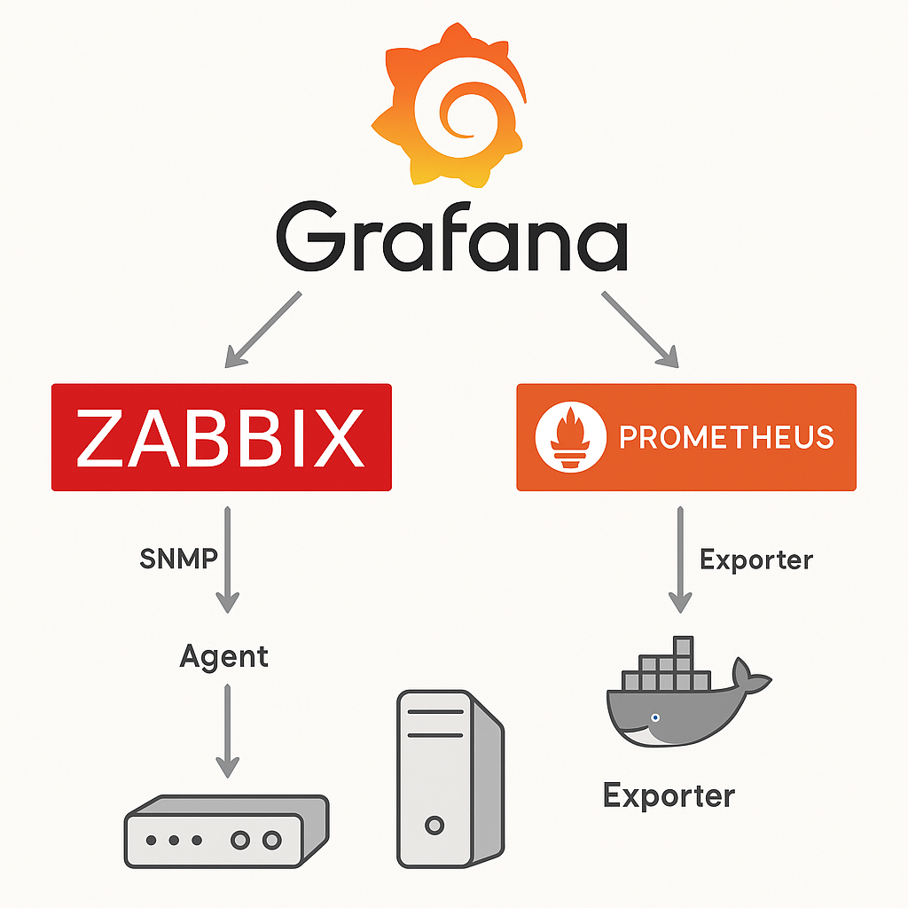
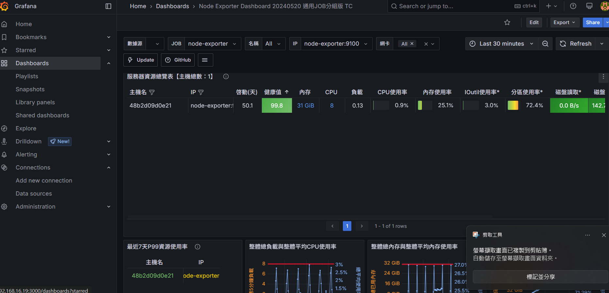
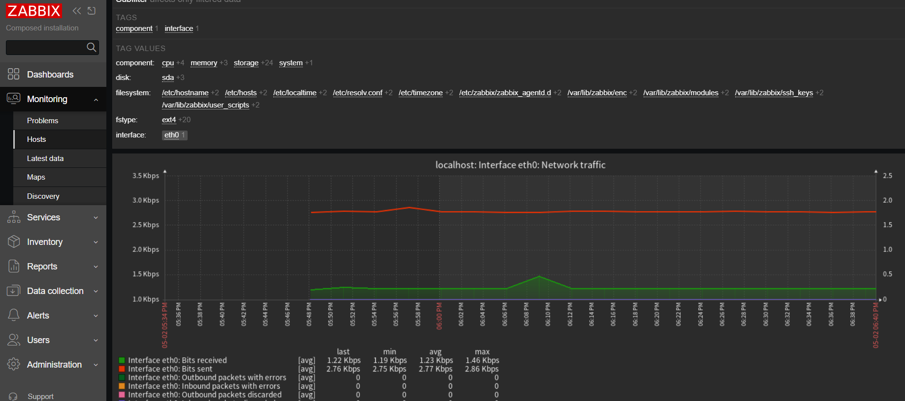

會議記錄
    說明要做的項目
    網路流量監控及後續告警通知
    每週review 一次進度

待辦事項
    4/22 研究哪些網路流量監控軟體，提供相關分析比較後進行討論

# 網路管理

## Target

### 小結

目前看下來，覺得 Zabbix 以及 Prometheus + Grafana 還是較主流的 網路流量監控 解決方案。
接下來我預計優先針對這些工具進行深入研究，包含其 功能特性、部署架構 與 應用情境 等，並進行分析比較，再作後續討論。 (待整理, 在後面)
此外，我也會參考實際的使用案例與 YouTube 上的相關教學資源，藉此更全面了解各工具在實務上的表現與操作方式。  (待研究)

完成這部分後，接著再拓展研究其他監控工具，以尋找適合的選項。

### 0. google
https://www.gartner.com/reviews/market/network-management-tools
https://www.comparitech.com/net-admin/network-monitoring-tools/

### 1. GPT 

#### Q1: 企業的網路監控軟體

🔧 開源方案（可免費使用，彈性高）
1. Zabbix

- 功能：全面的網路、伺服器、應用監控。

- 優點：高彈性、自訂警示條件、支援 SNMP、API。

- 適用場景：中大型企業、資料中心。

2. Nagios / Icinga

- 功能：經典的主機/服務監控，擴充性強。

- 優點：社群活躍，外掛豐富。

- Icinga 是 Nagios 的分支，介面與 API 更現代。

- 適用場景：技術團隊具備自動化與維護能力。

3. Prometheus + Grafana

- 功能：以時間序列數據為主的監控系統。

- 優點：與容器、Kubernetes 整合良好，支援 Alertmanager。

- 適用場景：DevOps 團隊、微服務架構。

4. LibreNMS

- 功能：基於 SNMP 的網路設備監控。

- 優點：支援自動發現、自訂圖表、裝置地圖。

- 適用場景：管理大量網路設備（如交換器、路由器）。

5. Graylog（針對日誌與事件分析）

- 功能：集中式日誌收集與分析。

- 適合結合 Zabbix/Prometheus 使用，作為事件調查工具。

💼 商業方案（含支援與專業服務）
6. PRTG Network Monitor（Paessler）

- 功能：簡易安裝、內建多種感測器（監控 CPU、頻寬、存儲等）。

- 優點：圖形化操作界面、適合非程式人員。

- 收費：最多 100 個感測器免費。

7. SolarWinds Network Performance Monitor

- 功能：業界知名，功能極為完整（頻寬分析、故障偵測、拓撲圖）。

- 缺點：價格偏高，但企業等級可靠。

- 適用場景：大型企業、電信等對 SLA 要求高的環境。

8. ManageEngine OpManager

- 功能：監控網路、伺服器、虛擬化等。

- 優點：介面友好，整合報表、通知系統。

- 收費：依節點數收費，但比 SolarWinds 親民。

#### Q1.5: open sources network monitors

在你列出的工具中，真正開源（open source）且接近 Zabbix 或 Prometheus + Grafana 那種程度的自由度與社群支援的工具其實不多，大多數是 SaaS、付費或限制重重的試用版。以下是從中篩選出來的 開源級別或接近開源精神、適合中小企業導入 的幾個工具：

| 名稱 | 類型 | 特點 | 是否推薦給中小企業 |
|------|------|------|------------------|
| **Zabbix** | 開源 | 全方位監控，支援 SNMP/agent，適合傳統與中小企業用 | ✅ 極推薦 |
| **Prometheus + Grafana** | 開源 | 彈性強、支援現代微服務監控，Grafana 視覺化好 | ✅ 推薦（需有基礎技術力） |
| **Nagios Core** | 開源 | 經典穩定架構，有豐富社群 plugin，但設定偏繁瑣 | ⚠️ 適合喜歡手動控制的人 |
| **Icinga** | 開源 | Nagios fork，功能擴展性佳，Web UI 改善多 | ✅ 如果你考慮 Nagios，更建議用 Icinga |
| **Checkmk Raw Edition** | 部分開源 | 基於 Nagios，但更易用、支援自動化檢測 | ✅ 適合要快上手又能自訂的團隊 |
| **LibreNMS** | 開源 | SNMP 為主，適合網路設備監控、介面友善 | ✅ 對中小企業很不錯（尤其是網管） |

#### Q2: Zabbix or Prometheus + Grafana

| 項目 | **Zabbix** | **Prometheus + Grafana** |
|------|------------|---------------------------|
| **架構設計理念** | 傳統式主動/被動監控，整合平台（all-in-one） | 時間序列資料收集 + 可視化，偏重微服務與容器環境 |
| **資料儲存** | 使用資料庫（MySQL/PostgreSQL）儲存監控資料 | 使用內建 TSDB（時間序列資料庫） |
| **資料收集方式** | Agent、SNMP、IPMI、SSH、Trapper 等等 | Pull 模型（主動拉取），支援 Exporter、PushGateway |
| **告警系統** | 內建強大告警機制與 escalation、通知路由 | 使用 Alertmanager（需手動設定，較彈性但需花時間） |
| **可視化介面** | 內建圖表、儀表板、報表系統 | 透過 Grafana 建構儀表板（更漂亮、彈性強） |
| **設定方式** | GUI 設定（模板、主機、觸發器） | 主要用 YAML 設定，PromQL 查詢語言 |
| **監控對象** | 各類主機、網路設備、應用層（較全方位） | 適合 metrics 性質（如容器資源、系統指標） |
| **擴充性/彈性** | 高，但要透過模板管理，偏重傳統環境 | 高度模組化、支援多種 exporter |
| **容器與雲支援** | 支援但設定略複雜（靠 agent） | 原生支援 Kubernetes、Docker、Cloud |
| **學習曲線** | 介面導向，入門容易但進階複雜 | 需懂 YAML、PromQL，入門稍難但彈性高 |
| **維運成本** | 一套整合管理，升級需停機風險 | 元件分離，維護彈性，但需 DevOps 經驗 |
| **適合對象** | 網路團隊、傳統 IT 基礎設施 | DevOps 團隊、SRE、小型團隊快速部署 |

| 環境特徵 | 推薦工具 |
|----------|----------|
| **你要監控大量 Linux/Windows 伺服器** | **Zabbix**，因為 agent 安裝簡單且功能豐富 |
| **你有大量 SNMP 網路設備要監控** | **Zabbix**，SNMP 整合度好 |
| **你使用 Kubernetes、Docker、微服務** | **Prometheus + Grafana**，原生支援 Pod、Node、Container metrics |
| **你偏好 GUI 設定與圖表整合** | **Zabbix**（一站式） |
| **你需要強大的自訂圖表、查詢語法能力** | **Grafana（搭配 Prometheus）** |
| **你想要設計複雜告警條件、整合 Slack/Email/Teams** | **兩者都可以，但 Prometheus + Alertmanager 彈性更強（需會 PromQL）** |

🔧 混合使用（進階架構）
- 有些企業會 Zabbix + Grafana、甚至 Zabbix + Prometheus 混合使用：

- 用 Zabbix 收集 SNMP 與主機資訊，將資料丟到 Grafana 呈現；

- 用 Prometheus 監控容器系統，Grafana 統一做視覺化；

- 或用 Zabbix 來補 Prometheus 無法做的被動式監控（如 IPMI、Ping、應用程式狀態）。

 Zabbix or Prometheus + Grafana 2

對於 **中小型企業（尤其是資訊公司）**，選擇 Zabbix 或 Prometheus + Grafana 各有優缺點，以下是比較與建議：

---

 🔍 **Zabbix**

 ✅ 優點：
- **開箱即用**：Zabbix 提供完整 Web UI、警報通知、監控模板，部署後可以快速開始使用。
- **支援 SNMP、Agent、IPMI、外部腳本等**，適合異質環境。
- **集中式架構**：比較適合少量或中等規模的集中式部署。
- **安裝簡單，對新手友善**（只要你熟悉 LAMP/LEMP 環境）。

 ❌ 缺點：
- 對大型或微服務架構的支援較差，擴展性較弱。
- 自訂彈性比 Prometheus 低，例如資料處理與視覺化較為固定。

---

 🔍 **Prometheus + Grafana**

 ✅ 優點：
- **高彈性、高效能**：非常適合監控微服務架構、Kubernetes 等現代應用。
- **模組化設計**，可以整合 Alertmanager、Loki（日誌）、Tempo（追蹤）等組件。
- 搭配 Grafana，有非常靈活的視覺化與告警設定能力。
- 有很多 exporter 可選，涵蓋 Linux、Windows、資料庫、容器等。

 ❌ 缺點：
- **需要較多手動設定**，對入門者較不友善。
- 若沒有 Alertmanager、Pushgateway 等元件，功能會比較零散。
- 不適合大量 SNMP 設備或傳統 IT 基礎建設的監控。

---

 ✅ **建議**
對於 **中小型資訊公司**，建議依情境選擇：

| 條件 | 建議 |
|------|------|
| 你偏好**開箱即用、圖形介面完整、快速上手** | ✅ **Zabbix** |
| 你有 DevOps 團隊，需監控 Kubernetes、容器、現代應用 | ✅ **Prometheus + Grafana** |
| 想要擴展到**日誌、追蹤整合（Observability）** | ✅ **Prometheus + Grafana + Loki** |
| 偏向監控 SNMP 裝置、網路設備 | ✅ **Zabbix** 更適合 |

---

#### Q2.2: 被管理設備 exporter / agent 

基本上，如果你要深入監控設備或主機，「是否需要安裝 exporter 或 agent」取決於以下幾個因素：

✅ 不需要安裝 agent/exporter 的情況
(Zabbix、LibreNMS、Checkmk、Nagios、Icinga)
適合快速部署、基礎監控：

| 方式 | 說明 | 常見用途 |
|------|------|----------|
| **SNMP** | 多數網路設備（如 switch、router）都內建 SNMP 支援，不需額外安裝 agent | 網路設備監控（流量、連接數、狀態） |
| **Ping / ICMP** | 可以監控設備是否存活，不需安裝任何東西 | 可用性檢查 |
| **HTTP / TCP Port 檢查** | 用來確認服務是否在線，例如 web server | 服務監控 |
| **Syslog / NetFlow / sFlow** | 網路設備送 log / 流量資料給監控系統 | 日誌與流量分析 |
 
❗需要安裝 agent 或 exporter 的情況
當你要做「深入監控」如 CPU、記憶體、磁碟、應用程式等：

#### Q2.5: Zabbix or Prometheus + Grafana exporter 或 agent 

| 項目 | **Zabbix Agent** | **Prometheus Node Exporter** |
|------|------------------|------------------------------|
| 架構 | push/pull 皆可，Zabbix Server 主控 | pull-only，由 Prometheus 定期抓資料 |
| 部署難易 | 安裝簡單，整合性強（Zabbix Server 自動辨識） | 安裝簡單，但需手動設 Zabbix-style 的監控項目 |
| 安全性 | 支援主動模式、加密傳輸、連線驗證 | 不內建加密，要靠額外工具（如 Nginx + TLS）保護 |
| 可監控內容 | 系統資源、服務狀態、自訂 key、日誌、使用者數等 | 系統資源（CPU、RAM、磁碟、網路）為主 |
| 自訂彈性 | 高，自訂 item、trigger、script（甚至能整合 shell/python） | 中，必須額外寫 exporter 或重寫指標處理邏輯 |
| 效能消耗 | 輕量（Zabbix Agent 2 支援 plugin） | 極輕量（Go 寫的、只讀 `/proc`） |
| 整合性 | 自動納管、支援 auto-registration、Web UI 全整合 | 必須搭配 Prometheus + Grafana + Alertmanager 使用 |
| 告警處理 | 內建告警、動作、依條件執行 script | 要搭 Alertmanager 或自己寫通知邏輯 |
| 適合用途 | 高整合需求、傳統或混合 IT 環境 | 容器化、微服務、DevOps 團隊為主 |

#### Q2.5.1 網路設備 

對於 **網路設備**，通常需要依照設備的功能和支持的監控協議來決定是否需要使用 **exporter**，以下是針對 **網路設備** 和 **主機設備** 的不同情況說明：

---

 🖥️ **機器設備（Linux / Windows 主機）**

- **Prometheus Node Exporter**：在主機上安裝 **Node Exporter** 可以讓 Prometheus 監控該主機的系統資源，如 CPU、記憶體、磁碟、網路等。
- **Zabbix Agent**：也能監控主機的系統資源，並且可以自定義腳本來監控服務、進程、磁碟空間等。

---

 🌐 **網路設備（Switch、Router、Firewall 等）**

大部分網路設備（例如 Cisco、Juniper、Ubiquiti、HP 等）都支援某些標準協議來提供監控資料，這些協議主要包括：

1. **SNMP（簡單網路管理協議）**
2. **NetFlow/sFlow**（用於流量監控）
3. **Syslog**（日誌監控）

這些協議讓 **Prometheus** 和 **Zabbix** 能夠監控網路設備，但在 Prometheus 中，這就需要使用到 **exporter**。

 **Prometheus 監控網路設備：**

1. **SNMP Exporter**：  
   - Prometheus 的 **SNMP Exporter** 允許你從支援 SNMP 的網路設備抓取監控資料。
   - 你需要將網路設備的 SNMP 設置啟用並在 Prometheus 中配置 SNMP Exporter 來拉取數據。
   - **Prometheus SNMP Exporter** 支援常見的網路設備如交換機、路由器等。

2. **Blackbox Exporter**：  
   - 用於監控網路服務的可用性（例如 HTTP、DNS、Ping 等），這是一個 **外部可用性** 監控工具，對於網路設備的簡單存活檢查很有用。

 **Zabbix 監控網路設備：**

1. **SNMP 支援**：  
   - Zabbix 本身就非常擅長 SNMP 監控，對於大多數的網路設備（如路由器、交換機）可以直接透過 SNMP 協議來抓取數據。
   - 在 Zabbix 中，只需要將 SNMP 設置開啟並配置設備的 SNMP 社區字串，就可以監控該設備的流量、性能等指標。

2. **自定義 SNMP 模板**：  
   - Zabbix 提供許多 **預設模板** 來幫助你監控常見網路設備（例如 Cisco、Juniper 等）。

---

 ⚠️ **總結：網路設備是否需要 exporter？**

1. **Prometheus**：  
   - **需要 exporter**，特別是使用 SNMP Exporter 來拉取網路設備的數據，或者可以用 Blackbox Exporter 來檢查設備的存活狀態。

2. **Zabbix**：  
   - **不需要 exporter**，只要設備支持 SNMP 或其他監控協議，Zabbix 可以直接抓取數據來監控網路設備。只需安裝 SNMP 並配置好社區字串。

---

 🚀 **推薦**
- 若你的需求主要是 **監控網路設備的流量、介面狀態、錯誤等指標**，並且 **已經在使用 Prometheus + Grafana**，則可以選擇 **Prometheus SNMP Exporter**。
- 若你希望一個更加 **集中的監控平台**（包括主機、網路設備），並且不希望額外配置 exporter，那麼 **Zabbix** 是更適合的選擇，因為它原生就支援 SNMP 且配置簡單。

需要我幫忙提供具體的配置方法或安裝步驟嗎？

#### Q2.7: 為什麼科技巨頭都用 Prometheus

 ✅ 總結：科技巨頭選 Prometheus 的原因

| 核心優勢 | 說明 |
|----------|------|
| ☁️ 雲原生友善 | 特別適合 Kubernetes、Docker 等容器化架構 |
| 💥 可擴展性強 | 單機高效，支援 federation |
| 🔧 易於整合與自定義 | 開發者可直接在應用中暴露 metrics |
| 🌐 開源社群活躍 | 維護成本低，學習資源豐富 |
| 🔐 控制權高 | 自建部署，不受 SaaS 限制 |

科技巨頭（如 Google、Meta、Netflix、Red Hat 等）大量使用 **Prometheus**，主要是因為它非常適合現代雲端與微服務架構。
以下是它受歡迎的核心原因：

---

 🚀 一、原生支援 **雲端、容器、微服務**

| 特點 | 說明 |
|------|------|
| 🔁 **服務動態變化友善** | Kubernetes 環境中，服務常常啟動/關閉/自動擴縮容。Prometheus 透過 service discovery 能自動追蹤這些變動。 |
| 🧱 **與 Kubernetes 原生整合** | Prometheus 是 Kubernetes 官方推薦監控解法，無需額外安裝 agent，就能收集 Pod、Node、Service 等 metrics。 |
| 📦 **Exporter 多、彈性強** | 幾乎所有知名應用、系統、資料庫（如 MySQL、NGINX、Redis、Ceph）都有 Prometheus exporter。 |

---

 ⚡ 二、效能與擴展性強

| 特點 | 說明 |
|------|------|
| ⏱ **高效時間序列資料庫** | Prometheus 自帶 TSDB，可儲存數百萬條 metrics 且查詢快速。 |
| 🧠 **無需 central DB 或 broker** | 比起 Zabbix/Nagios 這類中心式架構，Prometheus 是獨立運行、無單點瓶頸（可多個 Prometheus 分工監控） |
| 🌍 **支援 federation 架構** | 可以建立多層 Prometheus 結構（如地區分層）實現橫向擴展。 |

---

 🔍 三、觀測性標準化（Observability Ready）

| 特點 | 說明 |
|------|------|
| 📊 **支援 Metrics 標準格式** | 用戶或開發者能在應用中用簡單語法輸出 metrics，如 `http_requests_total`、`disk_usage_bytes`。 |
| 📈 **結合 Grafana 視覺化超強** | Grafana + Prometheus 幾乎成為 DevOps 團隊的標配。 |
| 🔔 **Alertmanager 整合告警流程** | 自動化告警、重試、群組、自訂路由，符合現代 SRE 實務需求。 |

---

 🧠 四、由 Google 發想，CNCF 支援

- Prometheus 最初由前 Google 工程師在 SoundCloud 開發，類似於 Google 的內部工具 **Borgmon**。
- 2016 年被 CNCF（Cloud Native Computing Foundation）收編，成為繼 Kubernetes 後的第二個官方專案，現在是雲原生標準。

---

 🏢 五、大型企業關注點對應

| 科技公司關注點 | Prometheus 對應解決方案 |
|----------------|--------------------------|
| 自動化部署 | 與 Kubernetes/Helm/Ansible 結合 |
| 巨量 metrics 採集 | pull-based 架構 + sharding |
| 去中心化、彈性好維護 | 多個 Prometheus server 可互不干擾運作 |
| 成本控制 | 開源免費，企業可自行管控資源成本 |

---

如果你的環境是容器化（Kubernetes）、自動化部署（CI/CD）、微服務架構，**Prometheus 幾乎是最適合的解法**。

但如果是傳統 VM + 少量服務 + 複雜告警流程不需要，Zabbix 或 LibreNMS 等工具仍更簡單、即用。

你目前是容器化環境還是以實體 / VM 為主？我可以幫你推薦更合適的搭配方案。

#### Q2.8: Zabbix + Prometheus 搭配

🔁 Zabbix + Prometheus 搭配架構建議

| 模組 | 負責內容 | 工具建議 |
|------|----------|----------|
| 🎛️ 系統與設備監控 | 傳統 VM、實體機、網路設備（SNMP） | ✅ **Zabbix** |
| 📈 容器與微服務監控 | Kubernetes、Docker、App 指標 | ✅ **Prometheus + Grafana** |
| 🔔 通知與告警 | 詳細告警條件 + Action Script | ✅ **Zabbix**（也可補 Alertmanager） |
| 📦 metrics 整合 | 應用層指標整合與轉接 | ➕ 可使用 [zabbix_exporter](https://github.com/cavaliercoder/zabbix_exporter) 或自建 exporter |
| 🧩 可視化 | 圖表與 dashboard | ✅ Grafana（可同時連 Zabbix 與 Prometheus 資料源） |

## 使用案例 (待找)

**Prometheus + Grafana**

**tutorial**

- https://medium.com/kaito-blog-%E6%B5%B7%E6%96%97%E6%A8%A3-%E3%81%AE-it%E5%AE%85/grafana-%E7%95%AA%E5%A4%96%E7%AF%871-2-1-%E4%BD%BF%E7%94%A8grafana-prometheus%E7%9B%A3%E6%8E%A7website%E6%95%88%E8%83%BD%E8%88%87%E5%81%A5%E5%BA%B7%E7%8B%80%E6%B3%81-dd42c95a67e1

- https://www.youtube.com/watch?v=pGSkPutCKtQ

**docker compose:**
Prometheus + Grafana

**dashboard template**

grafana template of node exporter:

1. https://grafana.com/grafana/dashboards/16098-node-exporter-dashboard-20240520-job/

2. https://grafana.com/grafana/dashboards/1860-node-exporter-full/

 Prometheus vs Zabbix: A Comprehensive Comparison Guide for IT Monitoring
https://medium.com/@squadcast/prometheus-vs-zabbix-a-comprehensive-comparison-guide-for-it-monitoring-2025-10b28c0521d5

