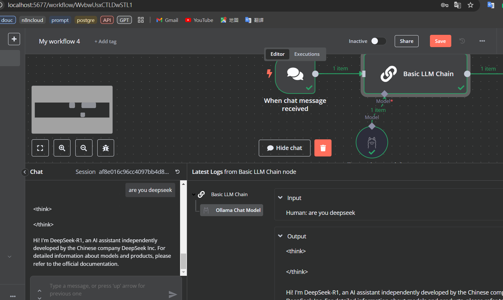
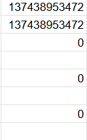
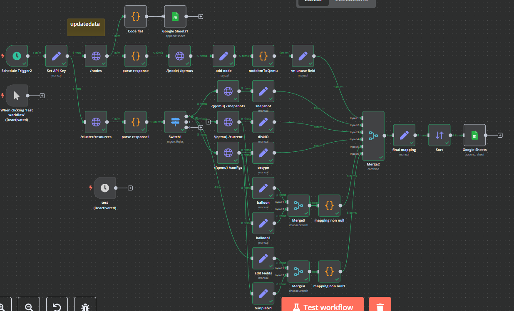
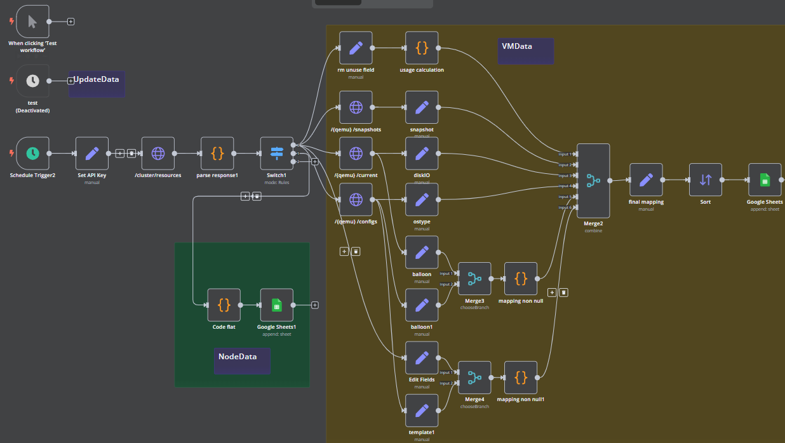
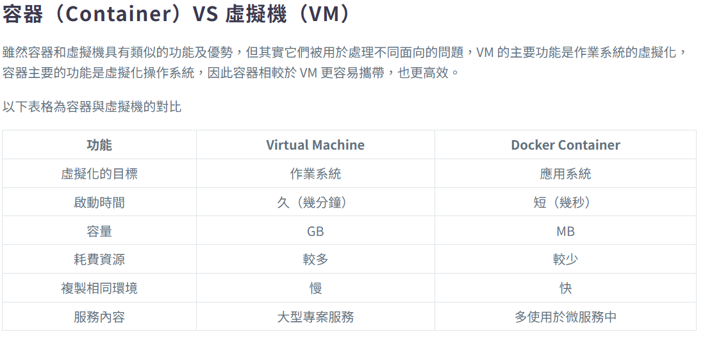
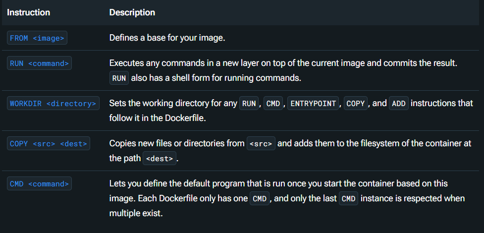

### Email workflow webhook
https://n8n.mobagel.com/webhook-test/fb7dfaea-06ef-488d-9929-b1df859a8a39


### 使用 self-hosted-ai-starter-kit 版本建置

目前能初步執行使用，可與 docker上的 ollama 建立之 llm 連接



語法整理(待寫)

**補充**
‧先前建置n8n with postgres出現 EACESS error 原因為user帳號設定使用到保留字`user`，導致user未正確建立，n8n 無法存取資料庫(log被EACESS洗版，為單獨查看postgres log時發現)。
‧EACESS error 在修改 storage volume 的位置後，若未預先建立資料夾，也會出現。


### PVE API workflow  欄位調整:

1. disk:
    qemu(VM) disk 不正常回應(都是0)，但disk read/write值正常 `/{vmid}/ststus/current`，而 node 的 disk / disk IO 皆可正常回應 

2. ostype: 正常回應 `/{vmid}/config`

3. balloon 部分缺失 ( )
    `/{vmid}/config` & `/{vmid}/ststus/current` 各有部分結果 (`3回覆: 0`  &  `2回覆:1374389...`)

4. template: API文件顯示  包含此資料，但此API回覆缺失此項資訊(皆無回覆)。
          目前用 `/cluster/resource` 取得之 template數值 (無缺項，但都是0, 不確定是否能正確反映模板虛擬機)。。



p.s. balloon, template 不確定API可靠性，暫時都查看兩個API回覆


**放置部分**  使用 n8n + LLM API 進行相關資訊的 QA、報表生成


### 研究 host端不同 n8n 間 workflow, credentials 的轉移方法
https://docs.n8n.io/hosting/cli-commands/

#### 避免 不同資料庫間欄位衝突 (mysql / postgres sql) ，使用 n8n CLI 匯出 / 入資料
優點: 跨資料庫輕鬆轉移
缺點: API key / execusions /user seeting 等無法匯出, workflow, credentials only

##### export:

command: (in container)
``` bash (in home folder (~) )
mkdir -p backup backup/workflows backup/credentials

n8n export:workflow --all --output=./backup/workflows --separate
n8n export:credentials --all --output=./backup/credentials --separate
exit
```

上步驟完成後 
本機用: docker cp my_container:/home/node/backup ./backup 取得檔案   
or 直接預先設定掛載資料夾:
```yml
volumes:
      - ./n8n/backup:/backup
```


##### import:

``` yml
n8n-import:
    <<: *service-n8n # 共用變數, with img, networks, env settings (其他可自行添加)
    hostname: n8n-import
    container_name: n8n-import
    entrypoint: /bin/sh
    command:
      - "-c"   #sh -c
      - "n8n import:credentials --separate --input=/backup/credentials && n8n import:workflow --separate --input=/backup/workflows"
    volumes:
      - ./n8n/backup:/backup
    depends_on:
      postgres:
        condition: service_healthy
```

#### 備份:
優點: 快速, 轉移完整
缺點: 環境要求一致 (資料庫)


n8n_storage db_storage
``` bash  
#(pwd default (/ == ./))
user@000$ sudo mkdir -p /path/to/backup
user@000$ sudo tar -czvf /path/to/backup/backup_$(date +%Y%m%d_%H%M%S).tar.gz db_storage n8n_storage
user@000$ sudo tar -xzvf /mnt/backup/backup_20250225_160000.tar.gz -C /path/to/restore
```

**以下為補充** 其他參考方法: 以下需先掛載 本地volume

``` dockerfile
CMD ["sh", "-c", "n8n import:credentials --separate --input=/backup/credentials && n8n import:workflow --separate --input=/backup/workflows && n8n"]
```

command: (in container, without docker-compose)
``` bash
docker exec -it n8n sh
n8n import:credentials --separate --input=/backup/credentials
n8n import:workflow --separate --input=/backup/workflows
```


# docker 報告架構 (整理中)
Docker 是一種開源軟體平台，它的構想理念是「Build and Ship any Application Anywhere」，意即讓開發者在虛擬環境中，開發、部署和管理任的何應用程式。
Docker 的輕量化特性，利於微服務的部署，提供應用程式獨立的測試環境。讓使用者專注於應用程式的開發，為省下建置環境的時間與精力。 

**虛擬化技術:** 
`目的`: 解決不同電腦的作業系統與硬體資源配置不相容
目前常見的虛擬化技術有兩種:
  以作業系統為單位的虛擬化技術，稱為虛擬機 (Virtual Machine)，如 VMware
  以 APP 為單位的虛擬化技術，稱為容器化（Containerize），如 Docker Container。

比較: VM Machine vs Docker Container


## docker基本元素

**container 容器**
基於 image / 安裝腳本 建置出的隔離運行環境。
一般會以 Microservice 方式使用 container，也就是會同時啟動多個 container 組成完整的 service。

**image 映像檔**
image 是創建容器的模板，我們能將它想像為一種虛擬機快照（snapshot），其中包含開發者需要部署的應用程式、作業系統和編譯環境。開發者能透過映像檔建置不同的容器，在容器中，每個應用程式都是獨立運行的，彼此互不影響，通常會從 Docker Hub 下載官方的 image 使用，也可以根據官方的 image 修改後使用，或者自行製作。
官方模板包含OS, 編/直譯器, db, web service...，還有各類應用程式如: wordpress, gitlab, prometheus。

``` bash
mobagel@mbvm:~/n8nHost_psql$
sudo chown -R 1000:1000 ./n8n_storage
sudo chmod -R 700 ./n8n_storage
drwx------ 2 mobagel mobagel 4096 Feb 25 15:32 ./n8n_storage #修改後權限

sudo chown -R 999:999 ./db_storage
sudo chmod -R 700 ./db_storage
drwx------ 19 lxd docker 4096 Feb 25 15:16 ./db_storage #修改後權限

docker volume ls 
docker volume inspect {volume_Name}
sudo ls -ld  /var/lib/docker/volumes/n8n_data
drwx-----x 3 root root 4096 Feb 14 17:08 /var/lib/docker/volumes/n8n_data
```


## 安裝腳本

差異: dockerfile 偏 image/container單獨調校 (`build`)，docker-compose則是整合多種服務(containers)的整合 也能在對container進行一定程度的調整

### `dockerfile`



#### 1. `FROM <image>`
定義鏡像的基礎。 每個 `Dockerfile` 都該從 `FROM` 開始，指定一個基礎鏡像。 可以從官方的基礎鏡像開始，也可以選擇其他現有的鏡像。

範例：
```Dockerfile
FROM ubuntu:20.04
```
這表示你的鏡像會基於 Ubuntu 20.04 這個基礎鏡像來構建。

---

#### 2. `RUN <command>`
在當前鏡像層中執行命令。(build時執行)
每次使用 `RUN` 指令時，Docker 都會創建一個新的鏡像層並提交結果。這個指令通常用來安裝軟體包或執行其他設置命令。

範例：
```Dockerfile
RUN apt-get update && apt-get install -y curl
```
這會在鏡像中安裝 `curl`。

---

#### 3. `WORKDIR <directory>`
設置工作目錄，之後的 `RUN`、`CMD`、`ENTRYPOINT`、`COPY` 和 `ADD` 指令會在這個目錄中執行。如果指定的目錄不存在，Docker 會自動創建它。

範例：
```Dockerfile
WORKDIR /app
```
這會將工作目錄設置為 `/app`，之後所有的指令都會在這個目錄下執行。

---

#### 4. `COPY <src> <dest>`
將檔案或目錄從主機複製到容器內。`<src>` 是源檔案或目錄，`<dest>` 是容器內的目標路徑。

範例：
```Dockerfile
# 複製本地的 `localfile.txt` 到容器的 `/usr/src/app/` 目錄。
COPY ./localfile.txt /usr/src/app/

# P.S. 掛載，利於重複構建
RUN --mount=type=cache,id=pnpm-store,target=/root/.local/share/pnpm/store pnpm install
```


---

#### 5. `CMD <command>`
定義容器啟動時執行的默認程序。每個 `Dockerfile` 只能有一個 `CMD` 指令，如果有多個 `CMD`，只有最後一個會生效。`CMD` 通常用來指定容器啟動後要執行的命令。

範例：
```Dockerfile
CMD ["python", "app.py"]
```
這會讓容器 啟動時用 `python` 執行器運行 `app.py`。

---

#### 6. `ENV <key> <value>`
設置環境變數。這些環境變數可以在容器內部被訪問，通常用來配置應用程式的運行環境，例如資料庫密碼、API 金鑰等。

範例：
```Dockerfile
ENV APP_ENV=production
```
這會在容器中設置 `APP_ENV` 環境變數為 `production`。

---

#### 7. `EXPOSE <port>`
告訴 Docker 這個容器會使用哪些端口。這不會實際開放端口，它只是作為一個指示，讓 Docker 知道容器運行時會使用到哪些端口。
要讓容器對外部可訪問，還需要在 `docker run` 時使用 `-p` 參數來映射端口。

範例：
```Dockerfile
EXPOSE 80
```
這會告訴 Docker 容器運行時會使用端口 80。


### `docker-compose`
image, build, container_name, command, environment, volumes, ports, restart, networks, depends_on, deploy, cpu, mem, logging


## docker 指令
1. docker (指令參數 / dockerfile)
docker run

stop

2.  docker-compose (安裝docker-compose套件) / docker compose (Docker 20.10後版本為內建)  (指令參數 / dockerfile)
docker-compose down && docker-compose up -d  (-v: delete volumes) 
