target: 開發機
action: vzdump

ssh
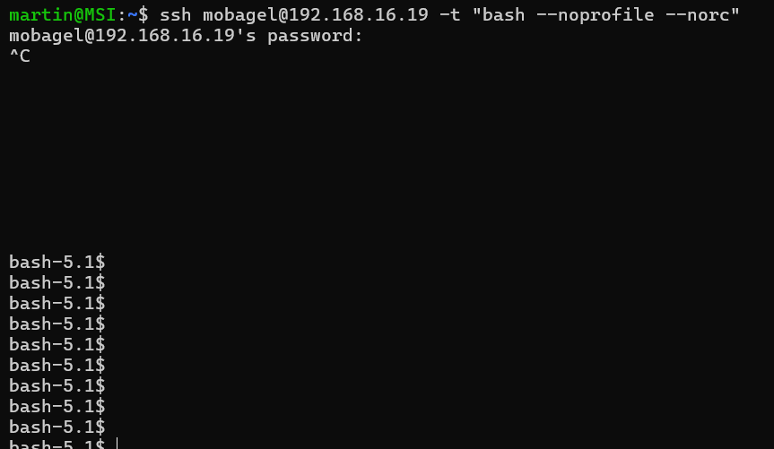

cadvisor
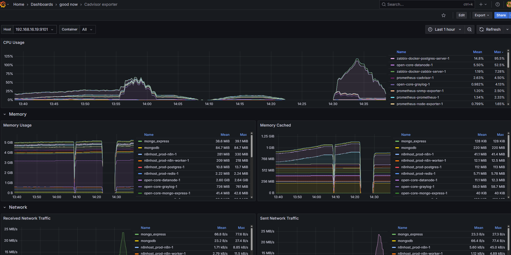

journalctl
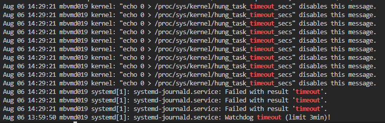

node
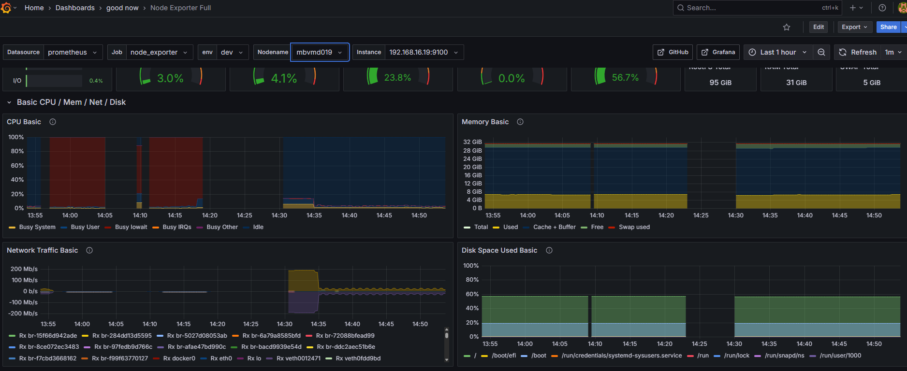

io
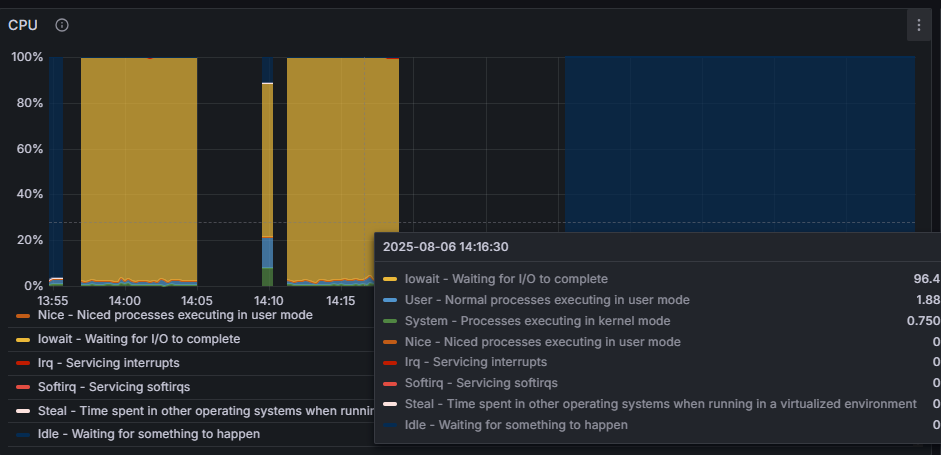

Pressure Stall 
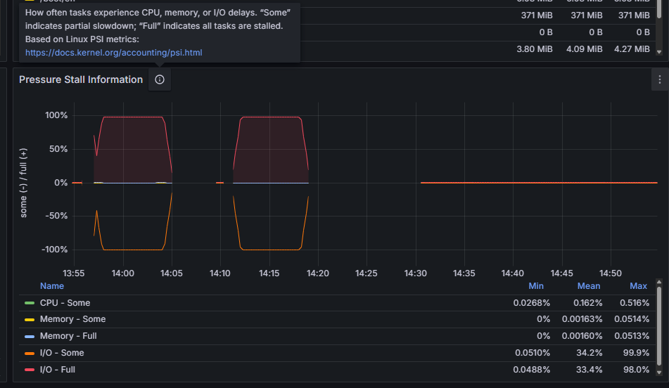

dirty
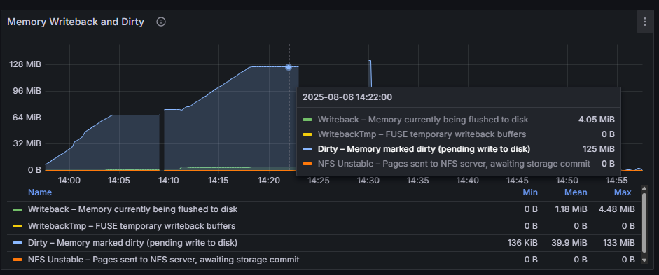

16:03 開始 prometheus 1s

node_exporter / cadvisor(1 failure) / VMdynamic(snmp ifin/out, 6 failure) 

30m

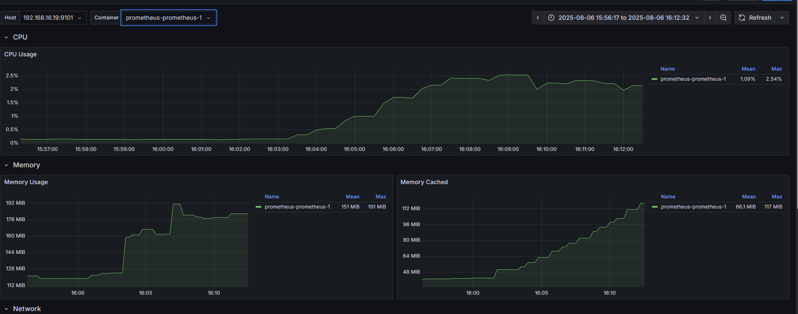

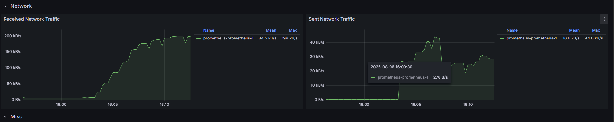

3h

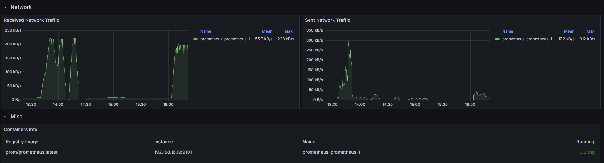

7d
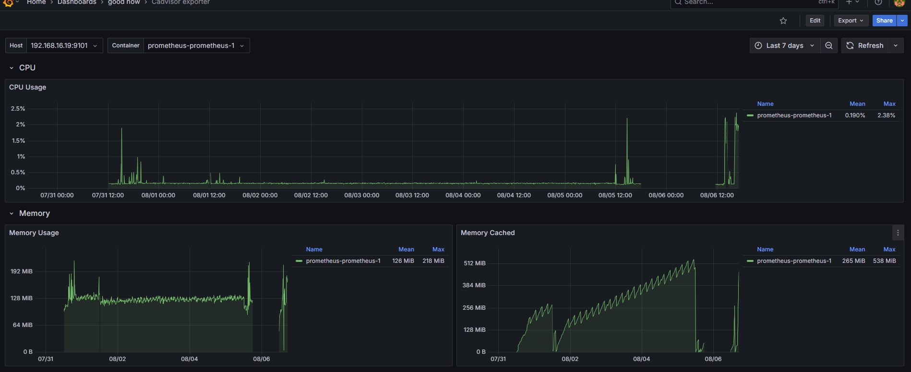

**cpu mem 正常**

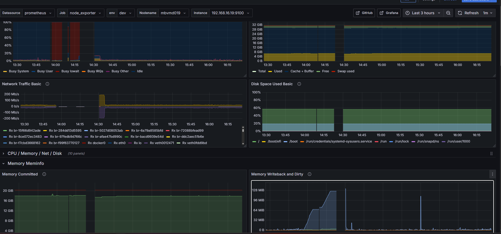

1.8 G

(30 container adding)
(2 node adding, one updating (15+ days))