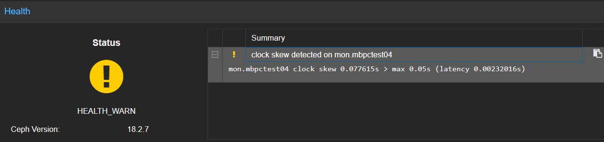
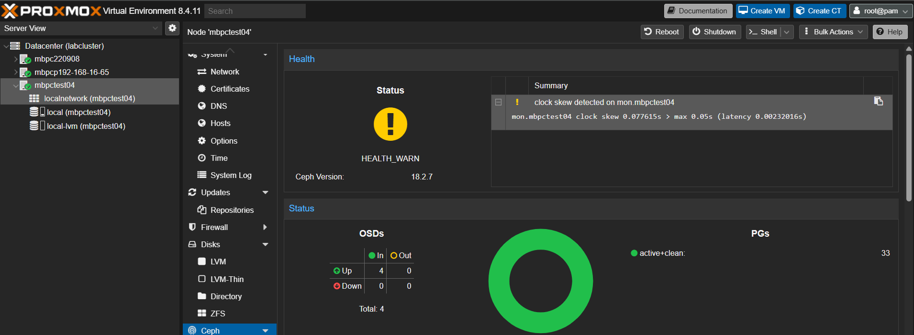

# ProxmoxVE VM 建置 (以 Ubuntu 為例)

## 0. ~ 建立 Proxmox VE Node account & 設置路由   & 前言 

- 有機會再補上前面步驟！

- 後續操作於 https://<Node_ip>:8006/ 的 UI (Proxmox VE UI) 、 CLI (Node 的 Shell) 、 console (跟 VM 的 console (server 端CLI))

## 1. 修改 Proxmox VE Node 套件來源（Repository）

Proxmox VE 預設使用需付費訂閱的 enterprise 軟體來源。若系統未啟用有效訂閱，更新套件時可能出現錯誤或提示訊息。為了正常使用更新功能，建議改用官方提供的 no-subscription（免費）來源。

### 1.1 手動修改方式
``` sh
# 編輯 Ceph 軟體來源
nano /etc/apt/sources.list.d/ceph.list
# 將以下內容：
# deb https://enterprise.proxmox.com/debian/ceph-quincy bookworm enterprise
# 改為：
deb http://download.proxmox.com/debian/ceph-quincy bookworm no-subscription

# 編輯 Proxmox VE 軟體來源
nano /etc/apt/sources.list.d/pve-enterprise.list
# 將以下內容：
# deb https://enterprise.proxmox.com/debian/pve bookworm pve-enterprise
# 改為：
deb http://download.proxmox.com/debian/pve bookworm pve-no-subscription

# 更新 APT 套件清單
apt update
```
### 1.2 自動化腳本（.bash）
``` bash
# 修改 PVE source 為 no-subscription 
sed -i 's|https://enterprise.proxmox.com|http://download.proxmox.com|g; s|enterprise|no-subscription|g' /etc/apt/sources.list.d/pve-enterprise.list
# 修改 Ceph source 為 no-subscription 
sed -i 's|https://enterprise.proxmox.com|http://download.proxmox.com|g; s|enterprise|no-subscription|g' /etc/apt/sources.list.d/ceph.list

# 更新 APT 套件清單
apt update
```

## 2. 至 Ubuntu 官網下載 iso
[iso_desk](https://releases.ubuntu.com/jammy/ubuntu-22.04.5-desktop-amd64.iso)
 / [iso_srv](https://releases.ubuntu.com/jammy/ubuntu-22.04.5-live-server-amd64.iso)

本範例下載 server 版本: ubuntu-22.04.5-live-server-amd64.iso


## 3. 創建 VM 並安裝 ubuntu

### 3.1 手動

- 於 UI 創建 VM 並配置資源


- Ubuntu user 設定

| Ubuntu 安裝欄位          | 範例值         | 顯示在登入提示符的部位         |
| -------------------- | ----------- | ------------------- |
| **Your name**        | `test0`     | 不顯示在提示符中（只是帳號描述）    |
| **Your server name** | `mbvmtest0` | 出現在cli後半 `...@mbvmtest0` |
| **Pick a username**  | `mobagel`   | 出現在cli前半 `mobagel@...`   |

實際ssh連線使用 ({Pick a username}@{VM_ip}) 進行連線


### 3.2 自動
使用 cil script (還沒調好，script能完成 vm 建立 + ubuntu 安裝)

#### cli 

``` sh
# cloud init

# passwd: openssl rand -base64 12

#!/bin/bash

# 檢查參數
if [ "$#" -lt 2 ]; then
  echo "❌ 用法: $0 <vm_name/username> <password>"
  exit 1
fi

# === 參數設定 ===
VMID=$1
VM_NAME="$2"
CI_USER="$2"
CI_PASS="$3"

NODE="mbpc220908"
ISO_STORAGE="local"
ISO_FILE="iso/ubuntu-22.04.5-live-server-amd64.iso"
DISK_STORAGE="local-lvm"
BRIDGE="vmbr0"

# === 創建 VM ===
echo "🛠 Creating VM $VMID ($VM_NAME)..."
qm create $VMID \
  --name "$VM_NAME" \
  --memory 2048 \
  --cores 2 \
  --cpu "x86-64-v2-AES" \
  --machine q35 \
  --net0 virtio,bridge=$BRIDGE \
  --scsihw virtio-scsi-pci \
  --scsi0 $DISK_STORAGE:32 \
  --ide2 $ISO_STORAGE:$ISO_FILE,media=cdrom \
  --boot order=scsi0;ide2 \
  --vga qxl \
  --ostype l26 \
  --agent enabled=1 \
  --description "Ubuntu 22.04 VM with Cloud-Init (no network config)"

# === 加 Cloud-Init Drive ===
echo "💾 Adding Cloud-Init drive..."
qm set $VMID --ide3 $DISK_STORAGE:cloudinit

# === 設定 Cloud-Init 使用者和密碼 ===
echo "🔐 Setting Cloud-Init credentials..."
qm set $VMID --ciuser "$CI_USER" --cipassword "$CI_PASS"

# ❌ 不設定 IP / DHCP / 網路介面
# ✅ Cloud-Init 會忽略網路設定，讓 VM 使用預設方式或由你手動設定

# === 重新產生 Cloud-Init 映像 ===
qm cloudinit regenerate $VMID

# === 啟動 VM ===
echo "🚀 Starting VM $VMID..."
qm start $VMID

echo "✅ VM $VMID ($VM_NAME) created and started without network config."
```


## ssh 設定
``` sh
qm set 100 --sshkey /root/.ssh/id_rsa.pub
qm cloudinit update 100
qm set 100 --ciuser "$Username"
qm reboot 100
ssh -i ~/.ssh/id_rsa mbvm250603@192.168.16.63 # ssh連線
# ssh -i ~/.ssh/id_rsa mbvm250604@192.168.16.64
```

### 如iso設定時未安裝openssh-server ()
- 使用console 於 VM 安裝 openssh-server，完成後方能用 ssh 指令連線
``` sh
sudo apt update
sudo apt install openssh-server
sudo systemctl enable --now ssh
```

## 網路拓樸調整
- 網路拓樸

  - v0 預設      

sysctl -w net.ipv4.ip_forward=1


修改node nano /etc/network/interfaces
``` sh
auto lo
iface lo inet loopback

iface enp5s0 inet manual

auto vmbr0
iface vmbr0 inet static
        address 192.168.16.62/24
        gateway 192.168.16.1
        bridge-ports enp5s0
        bridge-stp off
        bridge-fd 0

## 新增網卡 vmbr1
auto vmbr1
iface vmbr1 inet static
        address 172.23.0.1/24
#        gateway 172.23.0.1  
        bridge-ports none  
        bridge-stp off
        bridge-fd 0

source /etc/network/interfaces.d/*
```

- 改完重啟網卡，確認vmbr1 成功新增
``` bash
root@mbpc220908:~# systemctl restart networking

root@mbpc220908:~# ip a | grep "vmbr"
2: enp5s0: <BROADCAST,MULTICAST,UP,LOWER_UP> mtu 1500 qdisc mq master vmbr0 state UP group default qlen 1000
31: vmbr0: <BROADCAST,MULTICAST,UP,LOWER_UP> mtu 1500 qdisc noqueue state UP group default qlen 1000
    inet 192.168.16.62/24 scope global vmbr0
32: vmbr1: <BROADCAST,MULTICAST,UP,LOWER_UP> mtu 1500 qdisc noqueue state UNKNOWN group default qlen 1000
    inet 172.23.0.1/24 scope global vmbr1
```

- 1. 設定NAT 處理 內外網ip 轉換
暫時:
``` sh
192.168.16.62 / 172.23.0.1 (host):

# iptables -t nat -A POSTROUTING -s 172.23.0.0/24 -o vmbr0 -j MASQUERADE
sed -i 's/^#\?net.ipv4.ip_forward=.*/net.ipv4.ip_forward=1/' /etc/sysctl.conf || echo 'net.ipv4.ip_forward=1' | tee -a /etc/sysctl.conf
# 192.168.16.63 (srv1):

sudo ip route add default via 192.168.16.62
# sudo ip route add 172.23.0.0/24 via 192.168.16.62

# 192.168.16.28 (srv2):

ip sudo ip route add 172.23.0.0/24 via 192.168.16.62
sudo ip addr add .168.1.100/24 dev enp6s18
sudo ip route add 0.0.0.0/0 via 172.23.0.1  # 等效(===) default via 172.23.0.1 dev enp6s18
sudo ip addr del 192.168.16.28/24 dev enp6s18

# sudo nano /etc/netplan/$(ls /etc/netplan/ | head -n 1)
network:
    version: 2
    ethernets:
        enp6s18:
            dhcp4: no
            addresses:
                - 172.23.0.100/24
        #     gateway4: 172.23.0.1
            routes:
                - to: default
                  via: 172.23.0.1
            nameservers:
                addresses:
                    - 8.8.8.8
                    - 8.8.4.4

```


透過 Proxmox 網頁介面設定（推薦）
登入 Proxmox VE 的 Web 界面（通常是 https://你的PVE_IP:8006）

選擇虛擬機（QM）> Hardware > Network Device (點選 Edit 編輯)

「Bridge」欄位 改成 Node 新增的網卡 (我的是vmbr1)


##


- **注意:網卡設定完要重啟**


<!-- iptables -A FORWARD -s 172.23.0.0/24 -o vmbr0 -j ACCEPT
iptables -A FORWARD -d 172.23.0.0/24 -i vmbr0 -m state --state ESTABLISHED,RELATED -j ACCEPT -->
