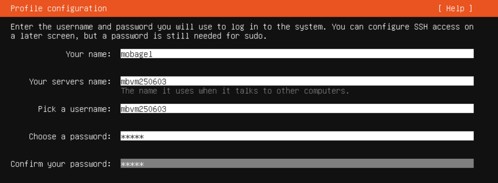
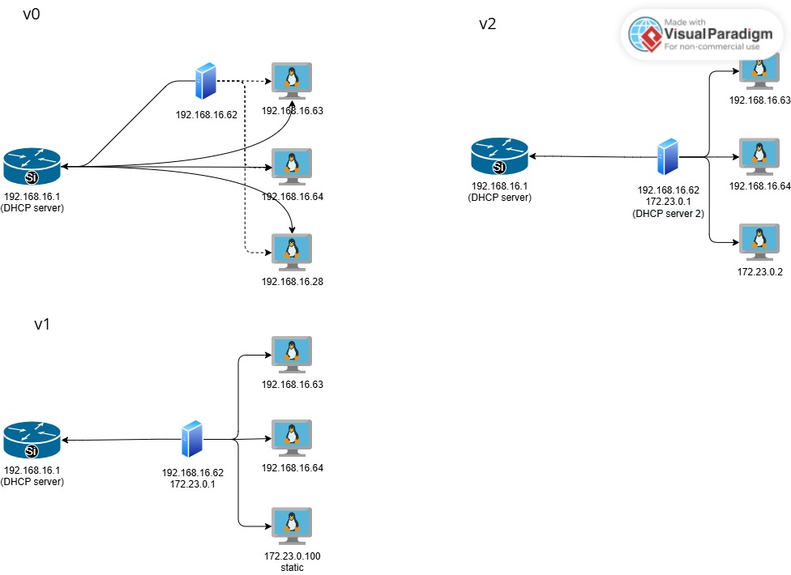
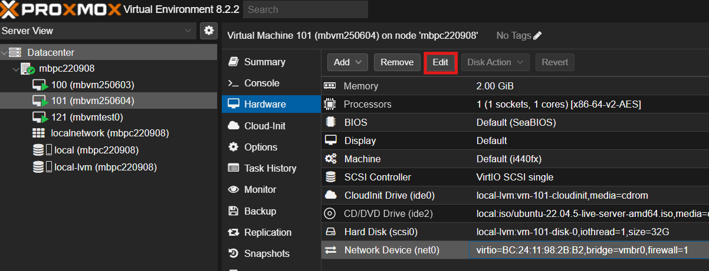
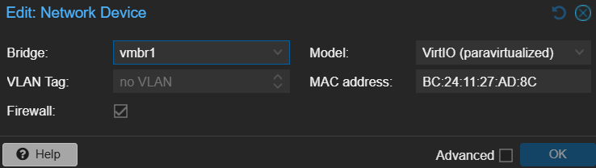

# ProxmoxVE VM 建置 (以 Ubuntu 為例)

## 0. ~ Proxmox VE Node account 建立完畢 & 設置路由   & 前言 

- 有機會再補上前面步驟！ 

- 後續操作皆於 https://<Node_ip>:8006/ 的 
UI (Proxmox VE UI) 、 CLI (Node 的 Shell) 跟 console (VM 的 console (server 端CLI))

  - CLI 開啟方式: 在 UI 左側樹狀圖中找到目標 Node，右上 "Shell" 展開
  - console 開啟方式: 在 UI 左側樹狀圖中找到目標 VM，右上 ""
  dependency
  **VM 端**: 強烈建議使用[ssh](#4-ssh-設定) [免密碼](/journals_1/ProxmoxVE/other.md#ssh-免密碼登入)
            (ubuntu OS 安裝時設定為佳, 使用建議 *localhost* -ssh- *PVE Node* -ssh- *VM on the Node*) 


## 1. 修改 Proxmox VE Node 套件來源（Repository）

Proxmox VE 預設使用需付費訂閱的 enterprise 軟體來源。若系統未啟用有效訂閱，更新套件時可能出現錯誤或提示訊息。為了正常使用更新功能，建議改用官方提供的 no-subscription（免費）來源。
(URIs / Suites 類型可能不同，enterprise -> no-subscription 即可，其他不用改)

### 1.1 手動修改 (UI)

依序展開 Node > Updates > Repositories ， 選擇 "Add"

依次選擇以下來源： 
1. no-subscription
2. Ceph Quincy 或 Ceph Reef（擇一，皆為 no-subscription）

選擇原先 enterprise 來源 (如 https://enterprise.proxmox.com/debian/ceph-quincy)， 選擇 "Disable"

展開 Node > Sheel，輸入 apt update 套用來源

### 1.1.2 手動修改方式 (CLI)
``` sh
# 編輯 Ceph 軟體來源 
nano /etc/apt/sources.list.d/ceph.list
# 將以下內容：
# deb https://enterprise.proxmox.com/debian/ceph-quincy bookworm enterprise
# 改為：
deb http://download.proxmox.com/debian/ceph-quincy bookworm no-subscription

# 編輯 Proxmox VE 軟體來源
nano /etc/apt/sources.list.d/pve-enterprise.list
# 將以下內容：
# deb https://enterprise.proxmox.com/debian/pve bookworm pve-enterprise
# 改為：
deb http://download.proxmox.com/debian/pve bookworm pve-no-subscription

# 更新 APT 套件清單
apt update
```
### 1.1.3 自動化腳本（.bash）
``` bash
# 修改 PVE source 為 no-subscription 
sed -i 's|https://enterprise.proxmox.com|http://download.proxmox.com|g; s|enterprise|no-subscription|g' /etc/apt/sources.list.d/pve-enterprise.list
# 修改 Ceph source 為 no-subscription 
sed -i 's|https://enterprise.proxmox.com|http://download.proxmox.com|g; s|enterprise|no-subscription|g' /etc/apt/sources.list.d/ceph.list

# 更新 APT 套件清單
apt update
```

### 1.2 完成後確認 Node 成功啟用

## 2. 至 Ubuntu 官網下載 iso

本範 ubuntu 版本為 ubuntu-22.04.5 [iso_desk](https://releases.ubuntu.com/jammy/ubuntu-22.04.5-desktop-amd64.iso)
 / [iso_srv](https://releases.ubuntu.com/jammy/ubuntu-22.04.5-live-server-amd64.iso)

本範例下載 server 版本: ubuntu-22.04.5-live-server-amd64.iso


## 3. 創建 VM 並安裝 ubuntu

### 3.1 手動

- 於 UI 創建 VM 並配置資源
  - Node 右鍵點選 → 選擇 "Shell"

- Ubuntu 安裝 user 設定


  | Ubuntu 安裝欄位      | 範例值       | 顯示在登入提示符的部位   |
  | -------------------- | ----------- | ---------------------------- |
  | **Your name**        | `test0`     | 不顯示在提示符中（只是帳號描述）|
  | **Your server name** | `mbvmtest0` | 出現在cli後半 `...@mbvmtest0` |
  | **Pick a username**  | `mobagel`   | 出現在cli前半 `mobagel@...`   |

  - 此範例中，Ubuntu VM 使用 mobagel 作為 OS 的 username，且實際ssh連線使用 ({Pick a username}@{VM_ip}) 進行連線

- Ubuntu 安裝 ssh 設定


### 3.2 自動
使用 cil script (還沒調好，script能完成 vm 建立 + ubuntu 安裝)

#### cli 

``` sh
# cloud init

# passwd: openssl rand -base64 12

#!/bin/bash

# 檢查參數
if [ "$#" -lt 2 ]; then
  echo "❌ 用法: $0 <vm_name/username> <password>"
  exit 1
fi

# === 參數設定 ===
VMID=$1
VM_NAME="$2"
CI_USER="$2"
CI_PASS="$3"

NODE="mbpc220908"
ISO_STORAGE="local"
ISO_FILE="iso/ubuntu-22.04.5-live-server-amd64.iso"
DISK_STORAGE="local-lvm"
BRIDGE="vmbr0"

# === 創建 VM ===
echo "🛠 Creating VM $VMID ($VM_NAME)..."
qm create $VMID \
  --name "$VM_NAME" \
  --memory 2048 \
  --cores 2 \
  --cpu "x86-64-v2-AES" \
  --machine q35 \
  --net0 virtio,bridge=$BRIDGE \
  --scsihw virtio-scsi-pci \
  --scsi0 $DISK_STORAGE:32 \
  --ide2 $ISO_STORAGE:$ISO_FILE,media=cdrom \
  --boot order=scsi0;ide2 \
  --vga qxl \
  --ostype l26 \
  --agent enabled=1 \
  --description "Ubuntu 22.04 VM with Cloud-Init (no network config)"

# === 加 Cloud-Init Drive ===
echo "💾 Adding Cloud-Init drive..."
qm set $VMID --ide3 $DISK_STORAGE:cloudinit

# === 設定 Cloud-Init 使用者和密碼 ===
echo "🔐 Setting Cloud-Init credentials..."
qm set $VMID --ciuser "$CI_USER" --cipassword "$CI_PASS"

# ❌ 不設定 IP / DHCP / 網路介面
# ✅ Cloud-Init 會忽略網路設定，讓 VM 使用預設方式或由你手動設定

# === 重新產生 Cloud-Init 映像 ===
qm cloudinit regenerate $VMID

# === 啟動 VM ===
echo "🚀 Starting VM $VMID..."
qm start $VMID

echo "✅ VM $VMID ($VM_NAME) created and started without network config."
```


## 4. ssh 設定

- 如果安裝 ubuntu 時未同時安裝openssh-server，需使用console 於 VM 安裝 openssh-server，完成後方能用 ssh 指令連線
``` sh
sudo apt update
sudo apt install openssh-server
sudo systemctl enable --now ssh
```


### 4.1 ssh 免密碼登入

- 本地 ssh 方法

[ssh-免密碼登入](/journals_1/ProxmoxVE/other.md#ssh-免密碼登入)

- Node Shell ssh 連線方法
``` sh
qm set 100 --sshkey /root/.ssh/id_rsa.pub
qm cloudinit update 100
qm set 100 --ciuser "$Username"
qm reboot 100
ssh -i ~/.ssh/id_rsa mbvm250603@192.168.16.63 # ssh連線
# ssh -i ~/.ssh/id_rsa mbvm250604@192.168.16.64
```
 


## 5. 練習: 網路拓樸調整
- 網路拓樸

  - v0 預設      
  - [v1](#v1-靜態-ip-設定)
  - v2 (等dhcp)

### 0. 概念補充 (可略)

- metric (Linux 網路架構):
  - metric 是用來表示路由的「優先順序」。

  - 數字越小，優先權越高。

  - 當有多條相同目標（如 default）的路由時，系統會選擇 metric 最小的那一條。

  | Metric 值    | 用途/意義               | 備註                  |
  | ----------- | ------------------- | ------------------- |
  | **0**       | 最高優先權（絕對最先選）        | 通常不用這麼低，除非明確要強制使用某條 |
  | **1–99**    | 高優先權                | 常用於靜態路由、手動設定        |
  | **100**     | 預設值（若無特別指定）         | 很多 DHCP 路由預設是這個     |
  | **200–300** | 備援路由、高優先權的 fallback | 通常手動用來做自動備援切換       |
  | **500+**    | 極低優先權，當成「備胎」或除錯用途   | 幾乎永遠不會被選上，除非其他全部掛掉  |

### v1 靜態 ip 設定  

#### 192.168.16.62 / 172.23.0.1 (host):

1. IP forwarding

- 確保 Linux 核心開啟 IPv4 封包轉送。

``` bash
sysctl -w net.ipv4.ip_forward=1 # 暫時
sed -i 's/^#\?net.ipv4.ip_forward=.*/net.ipv4.ip_forward=1/' /etc/sysctl.conf || echo 'net.ipv4.ip_forward=1' | tee -a /etc/sysctl.conf # 永久，這裡用指令調整 /etc/sysctl.conf 設定
```

2. 設定 NAT 規則

- 允許從 172.23.0.0/24 子網發出的封包，經由 vmbr0 介面（通常是主機對外的橋接介面）送出時進行 IP 位址偽裝（MASQUERADE）。

``` bash
iptables -t nat -A POSTROUTING -s 172.23.0.0/24 -o vmbr0 -j MASQUERADE
```

- 效果：讓主機可以轉發從一個介面收到的 IP 封包到另一個介面 —— 就像路由器一樣運作。

3. 新增 vmbr 虛擬網卡: 

- 編輯設定檔 (nano /etc/network/interfaces)，加入 vmbr1 虛擬網卡 (內網)：
  此 host vmbr0 連接 192.168.16.1 (通常是自己的 router)

``` sh
auto lo
iface lo inet loopback

iface enp5s0 inet manual

auto vmbr0
iface vmbr0 inet static
        address 192.168.16.XX/24
        gateway 192.168.16.1
        bridge-ports enp5s0
        bridge-stp off
        bridge-fd 0

auto vmbr1
iface vmbr1 inet static
    address 172.23.0.1/24
    bridge-ports none
    bridge-stp off
    bridge-fd 0

source /etc/network/interfaces.d/*
```

4. 改完，確認 vmbr1 成功新增

``` bash
systemctl restart networking # 重啟驅動

ip a | grep "vmbr" # 檢查指令
```
- 範例輸出
2: enp5s0: <BROADCAST,MULTICAST,UP,LOWER_UP> mtu 1500 qdisc mq master vmbr0 state UP group default qlen 1000
31: vmbr0: <BROADCAST,MULTICAST,UP,LOWER_UP> mtu 1500 qdisc noqueue state UP group default qlen 1000
    inet 192.168.16.XX/24 scope global vmbr0
32: vmbr1: <BROADCAST,MULTICAST,UP,LOWER_UP> mtu 1500 qdisc noqueue state UNKNOWN group default qlen 1000
    inet 172.23.0.1/24 scope global vmbr1

#### 192.168.16.63 (srv1): 

``` sh
  # 1. 修改 gateway
  
  sudo ip route add default via 192.168.16.62 # 暫時
  
  # 永久 (Netplan 設定檔，通常在 /etc/netplan/ 下，如 01-netcfg.yaml)
  sudo nano /etc/netplan/$(ls /etc/netplan/ | head -n 1)
  # 修改設定檔，調整/新增 routes 設定，此次 gateway 改為 192.168.16.62 (metric: 路由優先度)
  network:
    ethernets:
        enp6s18:
            dhcp4: true
            # dhcp4-overrides:     # 預設 metric 是100，可調整
            #   route-metric: 200 
            routes:
              - to: 0.0.0.0/0
                via: 192.168.16.62
                metric: 50
    version: 2

  # 2. 套用設定
  sudo netplan apply
  # WARNING:root:Cannot call Open vSwitch: ovsdb-server.service is not running. # 可略，除非你真的要用 Open vSwitch(OVS)

```

### 192.168.16.28 (srv2) 設定為 172.23.0.100

#### 1. 臨時設定（立即生效，重開機會消失）

```bash
# 新增 172.23.0.2/24 IP 到網卡
sudo ip addr add 172.23.0.2/24 dev enp6s18

# 設定預設路由為 172.23.0.1 ，等效(===) default via 172.23.0.
sudo ip route add default via 172.23.0.1 dev enp6s18
```

---

#### 2. 永久設定（Netplan 設定檔）

1. 編輯 Netplan 設定檔（檔名依實際情況調整，通常在 `/etc/netplan/` 下）：

  ```bash
  sudo nano /etc/netplan/$(ls /etc/netplan/ | head -n 1)
  ```

2. 內容範例（將 enp6s18 設定為靜態 IP 172.23.0.100/24，並指定 gateway 與 DNS）：

  ```yaml
  network:
    version: 2
    ethernets:
        enp6s18:
            dhcp4: no
            addresses:
                - 172.23.0.100/24
        #     gateway4: 172.23.0.1
            routes:
                - to: default
                  via: 172.23.0.1
            nameservers:
                addresses:
                    - 8.8.8.8
                    - 8.8.4.4

3. 套用設定：

  ```bash
  sudo netplan apply
  sudo systemctl restart networking
  ```

---

#### 3. Proxmox VE 網頁介面設定（推薦）

1. 登入 Proxmox VE Web 介面（通常是 https://你的PVE_IP:8006）
2. 選擇虛擬機（VM）> Hardware > Network Device，點選 Edit 編輯 
3. 「Bridge」欄位選擇主機新增的網卡（如 vmbr1）

---


「Bridge」欄位 改成 Node 新增的網卡 (我的是vmbr1)


### v2 動態 ip 設定 (dhcp)
##


- **注意:網卡設定完要重啟**


<!-- iptables -A FORWARD -s 172.23.0.0/24 -o vmbr0 -j ACCEPT
iptables -A FORWARD -d 172.23.0.0/24 -i vmbr0 -m state --state ESTABLISHED,RELATED -j ACCEPT -->
