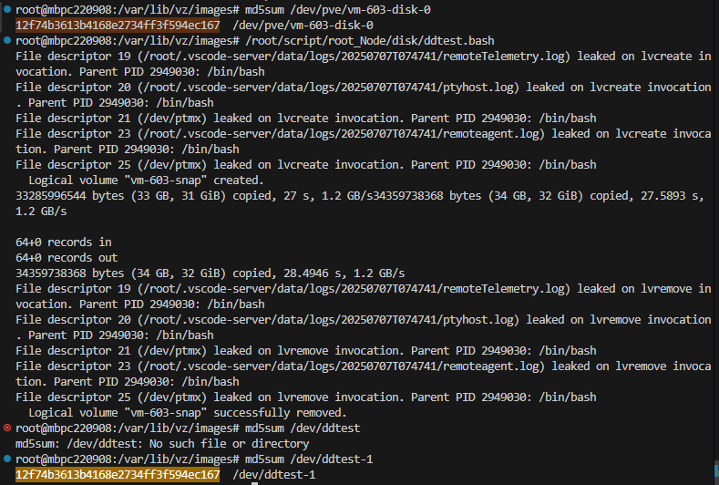

# 實體資料搬移 / 備份


Ref:

[PVE douc.](https://pve.proxmox.com/pve-docs/chapter-vzdump.html) (https://<urPVEserver>/pve-docs/chapter-vzdump.html) 

[LVM — pv, vg, lv!](https://sean22492249.medium.com/lvm-pv-vg-lv-1777a84a3ce8)

gpt

script:

[scripts](/journals_1/ProxmoxVE/scripts/disk/home/)

## 0. 儲存格式概覽 (GPT, [可略](#v1-直接-copy-qemu-img-根據虛擬硬碟實際用的space-dd-逐bit-copy)) 

### 🧾 效能與空間使用比較表（PVE）
| 格式 / 技術      | 效能（I/O速度） | 空間效率    | 支援快照               | 支援壓縮  | 支援精簡配置 (Thin)        | 適合用途           |
| ------------ | --------- | ------- | ------------------ | ----- | -------------------- | -------------- |
| **RAW**      | ⭐⭐⭐⭐⭐（最快） | ⭐（固定空間） | ❌（除非在ZFS等支援快照的存儲上） | ❌     | ❌                    | 高效能 VM         |
| **QCOW2**    | ⭐⭐～⭐⭐⭐    | ⭐⭐⭐⭐    | ✅                  | ✅（可選） | ✅（預設為 thin）          | 測試、備份 VM       |
| **VMDK**     | ⭐⭐～⭐⭐⭐    | ⭐⭐⭐     | ✅（依儲存）             | ❌     | ✅（依設定）               | VMware 移植      |
| **LVM**      | ⭐⭐⭐⭐      | ⭐⭐      | ✅（透過 LVM snapshot） | ❌     | ❌                    | 穩定、高 IOPS 需求   |
| **LVM-thin** | ⭐⭐⭐⭐      | ⭐⭐⭐⭐    | ✅                  | ❌     | ✅（thin provisioning） | 需支援快照與節省空間的 VM |

| 項目    | RAW on 傳統儲存（如 ext4） | RAW on LVM（LVM 卷）   |
| ----- | ------------------- | ------------------- |
| 實體位置  | 一個 `.raw` 檔案        | 一個邏輯磁碟區（LV）         |
| 存取方式  | 經由檔案系統存取            | 直接區塊層存取             |
| 效能    | 稍慢（受檔案系統影響）         | 較快（更接近原生磁碟）         |
| 快照支援  | 除非用 ZFS/BTRFS，否則困難  | 支援（使用 LVM snapshot） |
| 可精簡配置 | 否                   | 傳統 LVM 否，LVM-thin 是 |


### 🧪 效能說明（高到低）

1. **RAW**：幾乎是直接磁碟映射，無格式開銷，效能最佳。
2. **LVM / LVM-thin**：接近原生磁碟效能，低延遲，特別適合高 IOPS。
3. **QCOW2**：支援功能多但 I/O 開銷較大（可用 `cache=writeback` 調整）。
4. **VMDK**：在非 VMware 系統上效能中等，不是 PVE 的最佳格式。

---

### 📦 空間利用率說明（高到低）

1. **LVM-thin / QCOW2**：精簡配置，不立即佔用實體空間。
2. **VMDK**：支援 thin，但效能比 QCOW2 略差。
3. **LVM**：預先配置空間，無精簡功能。
4. **RAW**：完全佔滿磁碟空間（除非使用 sparse files）。

---

### 🔧 使用建議

| 使用情境                | 建議格式                   |
| ------------------- | ---------------------- |
| **效能最大化（如資料庫）**     | RAW on LVM / LVM / LVM-thin      |
| **空間節省（如大量 VM）**    | LVM-thin or QCOW2      |
| **需快照、備份、測試用 VM**   | QCOW2                  |
| **從 VMware 匯入的 VM** | VMDK（暫用，建議轉 RAW/QCOW2） |

---

### ⚠️ 注意：

* **LVM-thin** 支援快照，但過多快照會造成 metadata 滿溢，需監控。
* **QCOW2** 可能因 snapshot 或 fragmentation 導致 I/O 降低（可定期壓縮）。
* 在 ZFS、Ceph 或其他後端存儲上使用這些格式時，也會影響效能（ZFS 建議直接用 RAW）。
* LVM-thin 需完善監控
| 比較項目                 | **LVM (raw)** | **LVM-thin** |
| -------------------- | ------------- | ------------ |
| 分配磁碟大小時              | 實體空間會被立即保留    | 不會保留，只寫入時才佔用 |
| 有無 over-provision 風險 | ❌ 沒有風險        | ✅ 有風險（需監控）   |
| 實體空間不足時              | 建立 VM 會失敗     | VM 會崩潰或寫入錯誤  |
| 可建立的 VM 數量           | 受限於實體容量       | 可超額建立（但危險）   |


## v1: 直接 copy (qemu-img: 根據虛擬硬碟實際用的space, dd: 逐bit copy)

1. Node端:

``` sh
# 1. 建立目標 VM 映像目錄（如果還沒建立）
mkdir -p /var/lib/vz/images/121/

# 2. 直接轉換並輸出到目標資料夾
qemu-img convert -f raw -O qcow2 -c /dev/pve/vm-110-disk-2 /var/lib/vz/images/121/vm-110-disk-2.qcow2

# 3. 驗證檔案是否存在
ls -lh /var/lib/vz/images/121/

# 4. Cli 新增硬碟 or UI <your_VM> -> Hardware -> Add (UI可能找不到)
qm set 121 -scsi1 local:121/vm-110-disk-2.qcow2
```

2. VM 端:

``` bash
ssh mbvmtest0 #

## 0. 前置檢查指令 (選1)
lsblk                        # 查看系統目前的磁碟與分割區（確認 sdb1 存在）
sudo fdisk -l /dev/sd[a-z]      # 檢查 /dev/sdb 分割表與格式資訊（確保 sdb1 有格式化）

## 1. mount
sudo mkdir -p /mnt/sdb       # 建立 mount point
sudo mount /dev/sdb1 /mnt/sdb  # 將 /dev/sdb1 分割區掛載到 /mnt/sdb 資料夾

# 取得 UUID
UUID=$(sudo blkid -s UUID -o value "$PARTITION")

# 備份並修改 /etc/fstab
echo "👉 設定 /etc/fstab 自動掛載..."
sudo cp /etc/fstab /etc/fstab.bak
sudo sed -i "\|$MOUNT_POINT|d" /etc/fstab  # 移除舊的掛載記錄（相同掛載點）
echo "UUID=$UUID  $MOUNT_POINT  ext4  defaults  0  2" | sudo tee -a /etc/fstab

df -h /mnt/sdb               # 確認是否成功掛載
ls /mnt/sdb                  # 檢查掛載後資料夾中是否有內容（驗證是否正常讀寫）

## 2. check

sudo nano /mnt/sdb/omg.txt

```


### VM 中掛載

#### 0. UI 新增 VM disk

- 目標VM > Hardware > Add > 選擇 Hard Disk > 選擇實體 storage >新增

#### 0.1 於 VM 中查看掛載點

```bash
sudo fdisk -l
```

#### 1. 重新用 `fdisk` 建立一個單一分割區

```bash
sudo fdisk /dev/sdb
```

依序執行以下操作：

* `n`：新增分割區
* `p`：主分割區
* `1`：第一個分割
* 按兩次 Enter：使用整顆磁碟
* `w`：寫入並退出

---

#### 2. 格式化成 ext4 檔案系統 (只對空白 disk !!!)

```bash
sudo mkfs.ext4 /dev/sdb1
```

---

#### 3. 建立並掛載

```bash
sudo mkdir -p /mnt/data
sudo mount /dev/sdb1 /mnt/data
```

---

#### 4. 驗證

```bash
df -h | grep /mnt/data
```


```bash
sudo blkid /dev/sdb1
```


## v2: #2. 調整 加上snapshot

``` sh
lvcreate --size 2G --snapshot --name snap_vm110 /dev/pve/vm-110-disk-0

qemu-img convert -f raw -O qcow2 -c /dev/pve/vm-110-disk-0 /var/lib/vz/images/121/vm-110-disk-0.qcow2

lvremove /dev/pve/snap_vm110
```

## v3: 使用 dd 直接覆寫lvm thin

``` sh
setsid lvcreate -s -n vm-603-snap -L4G /dev/pve/vm-603-disk-0

dd if=/dev/pve/vm-603-snap of=/dev/ddtest-1 bs=512M status=progress conv=fsync

lvremove -y /dev/pve/vm-603-snap
```


## Scripts

v2 [link](/journals_1/ProxmoxVE/scripts/scp/script/root_Node/disk/VM_disk_mig_lvm2qcow2.bash)
v3 [link](/journals_1/ProxmoxVE/scripts/scp/script/root_Node/disk/VM_disk_mig_lvm2lvm_dd.bash)


### test

snapshot + qemu-img / dd

#### 1 系統碟 lvm qcow2 

ok

#### 2 系統碟 lvm dd 512M (add1, 120 -> 111)

vmid: 120


vmid: 111


#### 3 系統碟 lvm dd 512M (add1, 121 (~sde) -> 102 (~sdb))

* 兩台VM**掛載情形不同**

須調整掛載設定 (fstab) -> reboot 才能正常啟動

-> sol: uuid管理 / nofail / x-systemd.automount / systemd mount unit

#### 4 關機 dd 512M

603




#### statistic

* 
* MD5: 不一樣 123 一樣 4 --> 關機複製可完整 copy

## vmdump

- 能也只能完整複製整個 VM，空間小，點擊 restore 即可重建 (or qm restore)


