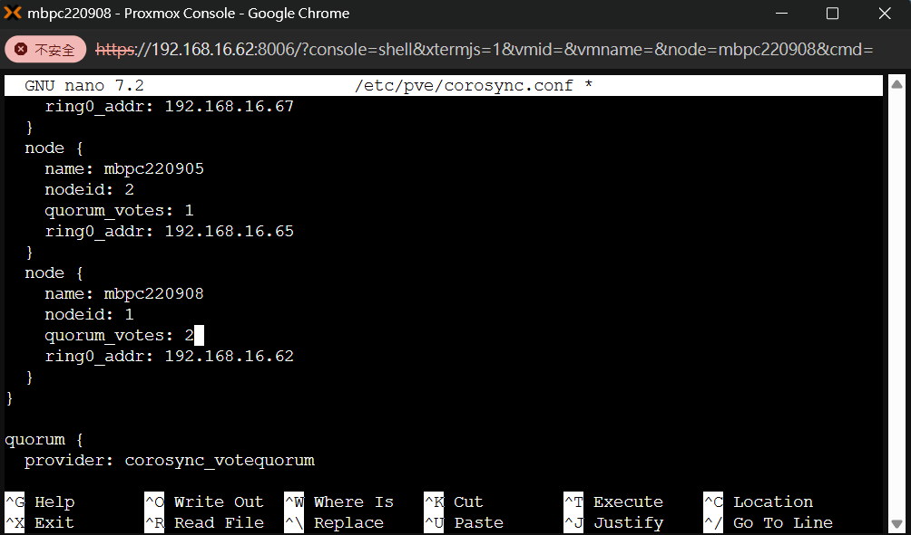
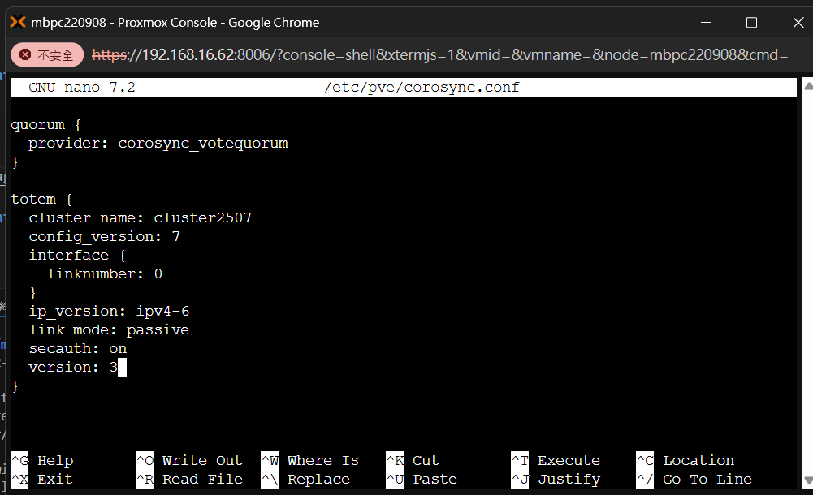
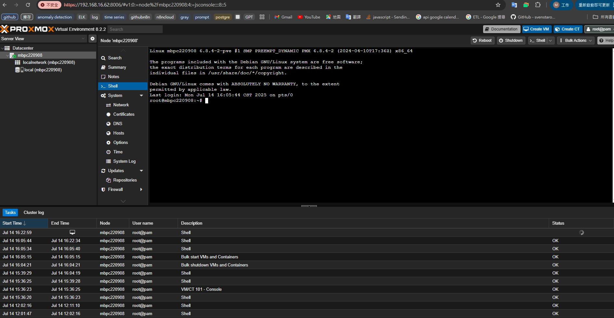
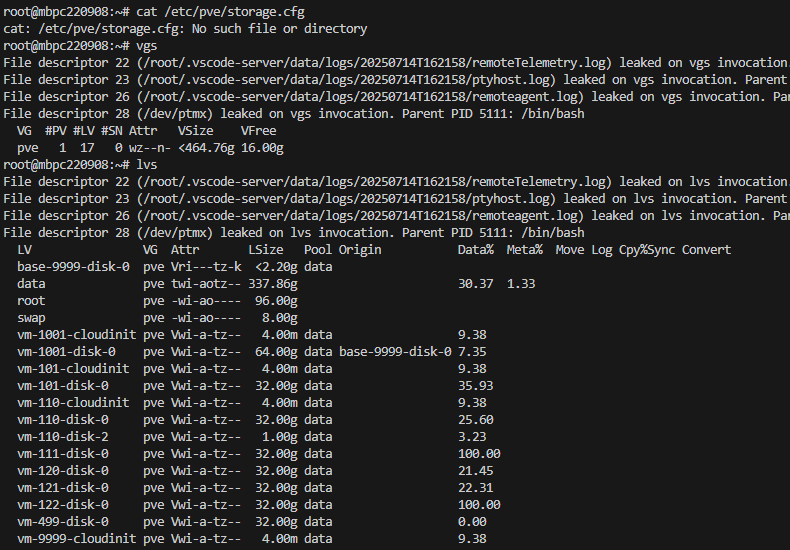
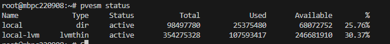

## Sysprep

[tool_virt-sysprep](https://askubuntu.com/questions/1394329/syspreping-an-ubuntu-image)

[researaching](https://chatgpt.com/share/686ba4e3-bd0c-8004-8b2b-1c68d4ee0e80)


# cluster 操作

## cluster create  (master node)

pvecm create "cluster_name"

## cluster add  (外部 node 加入)

pvecm add "master_node_ip"

## cluster 

## deleted node in cluster 

``` sh

# 確認節點已下線
pvecm status

# !!!: 事前務必確認 node 已下線(建議) + VM 已轉移 / vzdump + quorum 符合條件
pvecm delnode ${nodename}

# (可選) 刪除殘留 node 資料
rm /etc/pve/nodes/${nodename}

```

## deleted node recovery

<!-- /var/lib/pve-cluster/config.db 在加入 cluster 時會自動備份到 /var/lib/pve-cluster/backup/config-1753336469.sql.gz  -->


## batch hostname rename

**steps**: 
 1. 一起改名 (hostnamectl) 
 2. 改 /etc/pve/corosync.conf (共用) 
 3. 改 /etc/pve/node/nodename (共用) 
 4. 逐個 systemctl restart corosync pveproxy pvecluster

``` sh
hostnamectl set-hostname 新hostname
```


## 補充: quorum 機制

- ref:

    https://www.youtube.com/watch?reload=9&app=desktop&v=TXFYTQKYlno

### def & :

``` ruby
quorum = N/2 + 1
```


當只有 2 個 node 時，quorum = 2/2 + 1 = 2，需要兩個 node 都在線才能選出 Leader，若任一 node 掛掉就無法達成 quorum。

如果你不小心執行了像 `pvecm delnode` 等操作，導致 PVE Cluster **無法達成 quorum**，系統會進入「無法進行叢集操作」的狀態，例如：

* VM/LXC 無法啟動或遷移
* Web UI 顯示 `No quorum`
* HA 功能停擺


### ✅ **情境 1：還有 2 個以上的 Node，只是不在 quorum**

你可能誤刪其中一個 node，但實際上還有其他 node 活著。此時可以手動重新建立 quorum。

#### 解法：

1. **確認存活 node 狀態**

   ```bash
   pvecm status
   ```

2. **重新加入節點（如果誤刪的是其中一台）**

   * 先在被刪的 node 上清除 cluster 設定：

     ```bash
     systemctl stop pve-cluster corosync
     rm -rf /etc/pve/corosync.conf /etc/corosync/*
     ```
   * 再重新加入 cluster：

     ```bash
     pvecm add <IP-of-existing-cluster-node>
     ```

3. **確認 quorum 是否恢復**

   ```bash
   pvecm status
   ```

---


### ❗ **情境 2：只剩下 1 個 Node（或沒有 quorum 數）**

這是最常見的情境：**你不小心 del 掉其他 node，現在只剩 1 台在跑**，導致無 quorum。

#### 解法有兩種：

---

#### 🔧 法1：**強制重建單機 Cluster（毀損叢集，不可恢復原其他節點）**

⚠️ **這會破壞原叢集資料，慎用！建議只在你確定不會再加入原 node 時使用。**

1. 停止 cluster 服務：

   ```bash
   systemctl stop pve-cluster corosync
   ```

2. 備份並清除 cluster 設定：

   ```bash
   mv /etc/pve/corosync.conf /etc/pve/corosync.conf.bak
   rm -rf /etc/corosync/*
   ```

3. 重建單機 cluster：

   ```bash
   pvecm create mycluster
   ```

4. 重新啟動服務：

   ```bash
   systemctl restart pve-cluster corosync
   ```

5. 確認 cluster 狀態：

   ```bash
   pvecm status
   ```

---

#### ⚙️ 法2：**加一個輕量 Node（Container/Raspberry Pi）來補足 quorum**

如果原叢集還有其他節點可能恢復，可以考慮部署一個輕量節點來協助達成 quorum。

* 加一個 vote=1 的 container node
* 或使用 QDevice（需要額外設定 corosync-qdevice）

---

## ✅ 建議做法（事後）

* **使用備份**還原重要 VM。
* **定期拍快照**、使用 vzdump 備份。
* **避免在 quorum 不足時做叢集操作**。
* **開啟 corosync qdevice** 作為仲裁機制，避免兩節點陷入無 quorum。


### 解決方案

| 方法           | 可行性 | 正式建議 | 資料一致性 | 備註      |
| ------------ | --- | ---- | ----- | ------- |
| 法1：vote=0    | 高   | ❌    | ❌     | 測試可用    |
| 法2：非正式 node  | 高   | ✅    | ✅     | 輕量但有效   |
| 法3：仲裁節點      | 高   | ✅    | ✅     | 分散式環境推薦 |

### 法1：修改 vote(正式環境不建議)

- 將其中一個 Node 的 vote 設為 2，讓此 node 可以單獨達成 quorum。這樣可以在只有一個 node 存活的情況下仍維持服務。

    - 優點：簡單快速，可在測試環境使用。

    - 缺點：風險高，無法保證資料一致性，容易發生 split-brain。




### 法2：加入非正式 Node（例如 container / Raspberry Pi）

- 加上一個輕量級第三節點（如樹梅派或 Docker container）作為 tie-breaker node（不提供實際服務），協助達成 quorum。

    - 優點：不影響正式 node 的負載，也可提升容錯能力。

    - 缺點：需要額外的設置與網路資源。

    ```    yml
    node1 : 正式 node
    node2 : 正式 node
    node3 : 非正式 node（vote=1，no data）
    ```


### 法3：使用 Arbitrator / Witness Node（見於 Ceph、Proxmox、GlusterFS 等）

- 設立一個 仲裁節點（Arbiter 或 Witness），只參與 quorum 選舉，不存儲資料。適合分散式叢集環境中保證 quorum 的穩定性。

    - 優點：保證 quorum，不影響資料一致性，低資源需求。

    - 缺點：需額外設置仲裁服務（如 corosync + pacemaker）。

- 常見應用：

    - Proxmox VE 的 QDevice

    - Ceph 的 Monitor Arbiter

    - GlusterFS 的 Arbiter Brick


## cluster conntction ( to master)

- state table

|   |             |   |        | 
|------------|--------------------------------------|----------|------------------------------------|
|------------|--------------------------------------|----------|------------------------------------|

- 從 其他機器 (mbpc220904, 192.168.16.67)透過 pvecm add 指令 加入 cluster (mbpc220908, 192.168.16.62, master)

``` sh
# 加入
root@mbpc220904:~# pvecm add 192.168.16.62

# 刪    除

root@mbpc220904:~# systemctl stop pve-cluster corosync

root@mbpc220908:~# pvecm status
root@mbpc220908:~# pvecm expected 2
```

- 連線正常時 master 


- 停止服務


- stop 後 master 顯示離線


## cluster remove node

- both:

嘗試

``` sh
rm -rf /etc/pve/nodes/<mbpc220905>
```


``` sh
pvecm expected 1
```

- Master:

- Client:

``` sh
# 1st
systemctl stop pve-cluster corosync
pmxcfs -l
rm -rf /etc/pve/corosync.conf
rm -rf /var/lib/corosync/*
rm -rf /etc/corosync/*
# rm -rf /var/lib/pve-cluster/* 
#

# cd /etc/pve/nodes

killall -9 pmxcfs

reboot
```

``` sh
root@mbpc220904:~# pvecm add 192.168.16.62
Please enter superuser (root) password for '192.168.16.62': password input aborted
root@mbpc220904:~# pvecm add 192.168.16.65
Please enter superuser (root) password for '192.168.16.65': 
Establishing API connection with host '192.168.16.65'
The authenticity of host '192.168.16.65' can't be established.
X509 SHA256 key fingerprint is 3B:10:23:3E:41:87:35:23:16:F8:D8:B0:93:30:11:02:7D:47:26:FA:1B:DB:15:3A:DC:C4:31:E4:E4:9E:62:0A.
Are you sure you want to continue connecting (yes/no)? yes
Login succeeded.
check cluster join API version
No cluster network links passed explicitly, fallback to local node IP '192.168.16.67'
Request addition of this node
Join request OK, finishing setup locally
stopping pve-cluster service
backup old database to '/var/lib/pve-cluster/backup/config-1753336469.sql.gz'
Job for corosync.service failed because the control process exited with error code.
starting pve-cluster failed: See "systemctl status corosync.service" and "journalctl -xeu corosync.service" for details.
root@mbpc220904:~# 
```


## node 移出 cluster

### fs 整理

/etc/pve

| 檔案/資料夾            | 用途說明                  | 屬於誰？                    |
| ----------------- | --------------------- | ----------------------- |
| `qemu-server/`    | 所有 VM 的設定檔 (`*.conf`) | 節點本地（但存在於 cluster db 中） |
| `lxc/`            | LXC Container 設定檔     | 節點本地                    |
| `nodes/`          | 各節點個別設定資料夾（如 GUI 設定）  | 節點本地                    |
| `local/`          | 舊版設定目錄（不再推薦使用）        | 節點本地                    |
| `storage.cfg`     | 儲存空間定義                | Cluster 共用, 單機必須     |
| `datacenter.cfg`  | 資料中心（全域）設定            | Cluster 共用, 單機必須       |
| `user.cfg`        | Proxmox 使用者與權限        | Cluster 共用, 單機必須    |
| `vzdump.cron`     | 備份排程                  | Cluster 共用, 單機必須     |
| `sdn/`            | 軟體定義網路設定              | Cluster 共用              |
| `corosync.conf`   | Cluster 網路通訊設定        | Cluster 共用              |
| `firewall/`       | Cluster 層級防火牆規則       | Cluster 共用              |
| `authkey.pub`     | Cluster 授權金鑰          | Cluster 共用              |
| `pve-root-ca.pem` | 叢集的 CA 憑證             | Cluster 共用              |

| 類型               | 說明                                                                           |
| ---------------- | ---------------------------------------------------------------------------- |
| **Cluster only** | `corosync.conf`、`/etc/corosync/`、`/var/lib/corosync/` 👉 可以刪除，重建 cluster 才需要 |
| **共用 + 單機必須**    | `storage.cfg`、`datacenter.cfg`、`user.cfg`、`vzdump.cron` 👉 **單機仍需保留或重建**     |
| **節點本地 VM 設定**   | `qemu-server/`、`lxc/` 👉 和 VM 直接相關，最重要資料                                     |


### 實作

- 流程: 備份 -> 移除 -> 復原

``` sh
# 統一的備份時間戳
BACKUP_TIME=$(date +%F_%H%M%S)
BACKUP_DIR="/root/pve_backup_$BACKUP_TIME"

# 建立備份目錄
mkdir -p "$BACKUP_DIR"

# 備份 VM 配置檔（虛擬機器設定）
cp -a /etc/pve/qemu-server "$BACKUP_DIR/"

# 備份 cluster 設定和 corosync 配置
cp -a /etc/pve/corosync.conf "$BACKUP_DIR/" 2>/dev/null || echo "corosync.conf 不存在，跳過"
cp -a /etc/corosync "$BACKUP_DIR/" 2>/dev/null || echo "/etc/corosync 不存在，跳過"
cp -a /var/lib/corosync "$BACKUP_DIR/" 2>/dev/null || echo "/var/lib/corosync 不存在，跳過"

# 備份 cluster 資料庫（pve-cluster）
cp -a /var/lib/pve-cluster "$BACKUP_DIR/"

echo "✅ 備份完成，所有資料已儲存到 $BACKUP_DIR"


# --------------------------

   # Step 1: 停止服務
   systemctl stop pve-cluster corosync 
   # ?pmxcfs


   # Step 2: 啟動 pmxcfs 在本地模式（不使用 cluster）
   pmxcfs -l

   # Step 3: 刪除 cluster 和 corosync 設定（請小心！）
   # rm -f /var/lib/pve-cluster/config.db*
   rm -rf /var/lib/pve-cluster/*
   rm -f /etc/pve/corosync.conf
   rm -rf /var/lib/corosync/*
   rm -rf /etc/corosync/*

   # Step 4: 終止 pmxcfs 進程 & 重開機
   killall -9 pmxcfs
   reboot


# --------------------------


# 請替換為你實際的備份資料夾名稱
BACKUP_DIR="/root/pve_backup_2025-07-15_104500"

# 停止相關服務
systemctl stop pve-cluster corosync pmxcfs
# killall -9 pmxcfs

# 卸載 /etc/pve 如果是壞掉的 FUSE 掛載
umount -l /etc/pve 2>/dev/null

# 啟動 pmxcfs 本地模式讓 /etc/pve 可寫
pmxcfs -l &
sleep 3  # 等待 pmxcfs 啟動

# 恢復 VM 設定檔
cp -a "$BACKUP_DIR/qemu-server" /etc/pve/

# 恢復 corosync 設定（若你還是要用 cluster，可選擇性還原）
if [ -f "$BACKUP_DIR/corosync.conf" ]; then
  cp -a "$BACKUP_DIR/corosync.conf" /etc/pve/
fi
if [ -d "$BACKUP_DIR/corosync" ]; then
  cp -a "$BACKUP_DIR/corosync" /etc/
fi
if [ -d "$BACKUP_DIR/corosync" ]; then
  cp -a "$BACKUP_DIR/corosync" /var/lib/
fi

# 恢復 cluster 資料庫（慎用！只適用你確定還原整個 cluster 狀態）
cp -a "$BACKUP_DIR/pve-cluster" /var/lib/

# 結束本地 pmxcfs
killall -9 pmxcfs
sleep 2

# 重新啟動服務
systemctl start pmxcfs
systemctl start pve-cluster
systemctl start corosync  # 如果你還使用 cluster

# 驗證是否恢復成功
ls /etc/pve/qemu-server

```


- 檔案服務檢查正常，但 UI 仍顯示另一個 node，並且連線錯誤


``` sh
# 2nd
systemctl stop pve-cluster
systemctl stop corosync
systemctl stop pveproxy
systemctl stop pvedaemon
systemctl stop pvestatd
systemctl stop pve-manager


rm -rf /etc/corosync/*
rm -rf /var/lib/corosync/*
rm -rf /var/lib/pve-cluster/*

systemctl start pve-cluster
systemctl start corosync
systemctl start pveproxy
systemctl start pvedaemon
systemctl start pvestatd
systemctl start pve-manager
```

- 第二次重連後，UI 會卡住，重新整理後連線成功。


- 檢查 systemctl status pve-cluster 時發現


``` sh
# 1. 停止 rrdcached 服務
systemctl stop rrdcached

# 2. 刪除損壞的 cache 資料
rm -rf /var/lib/rrdcached/db/pve2*

# 3. 重新啟動服務
systemctl start rrdcached

# 4. (可選) 重啟 pve-cluster 強制更新 RRD 檔案
systemctl restart pve-cluster
```

- rrdcached 重啟後正常


#

``` sh
node lost quorum
received write while not quorate
cpg_join failed: 14
can't initialize service
```


## 問題分析

* **叢集目前沒有 quorum（過半節點）**，只有你這台節點活著（members: 1/3182633），導致叢集無法正常接受寫入操作。
* 因為沒有 quorum，`pmxcfs`（叢集檔案系統）只能以唯讀或限制狀態運行，無法修改 `/etc/pve` 內容。
* 

## 解決方向

### 1. 確認叢集節點數量與狀況

* 你目前有多少節點還在線？（例如用 `pvecm status` 或 `pvecm nodes` 查看）
* 是否有其他節點已經關機或網路斷線？
* 如果是只有你這一台節點在，叢集就失去了 quorum。

---

### 2. 如何在失去 quorum 時「強制移除節點」？

Proxmox 有一個**強制修改叢集設定的方式**，但這是破壞性操作，請先備份。

---

### 強制刪除節點（在主節點上）

1. 編輯 `/etc/pve/corosync.conf`（這是叢集配置檔）

```bash
nano /etc/pve/corosync.conf
```

2. 手動刪除不想要的節點設定。

3. 編輯完後，儲存並重新載入 corosync：

```bash
systemctl restart corosync
```

4. 接著重新啟動 `pve-cluster`：

```bash
systemctl restart pve-cluster
```

---

### 3. 如果你只能用單一節點（沒有 quorum）

可以設定讓叢集繞過 quorum 檢查（風險自負）：

```bash
pvecm expected 1
```

這會告訴叢集只期望 1 個節點，叢集就會恢復 quorum，允許你進行寫操作。

---

### 4. 你執行這個指令後，再試一次刪除節點：

```bash
pvecm delnode mbpc220905
```

---

### 5. 最後在被移除的節點（`mbpc220905`）上：

* 停止叢集服務：

```bash
systemctl stop pve-cluster corosync
```

* 卸載 `/etc/pve`：

```bash
umount /etc/pve
```

* 清理叢集配置（如果要繼續用該節點獨立運行）：

```bash
rm -rf /etc/pve/*
```

* 重啟該節點：

```bash
reboot
```

---

## 總結

* 目前問題是叢集失去 quorum，無法改寫叢集設定。
* 執行 `pvecm expected 1` 告訴叢集只期望一個節點，可以讓 `pmxcfs` 恢復寫入。
* 再執行 `pvecm delnode` 移除節點。
* 再到被移除節點做停止服務卸載等動作。


# 問題

### 1. local lvm 不見



- 檢查 /etc/pve/storage.cfg / lvs / vgs，其中 storage.cfg 消失 其他正常


- 重寫  storage.cfg


- systemctl restart pvedaemon pveproxy

- pvesm status


#### 重建 qemu config (VM)

/etc/pve/qemu-server/<vmid>.conf

- server vm

``` yml
boot: order=scsi0;net0
cores: 2
cpu: x86-64-v2-AES
# ide2: local:iso/ubuntu-22.04.5-live-server-amd64.iso,media=cdrom,size=2086842K
machine: q35
memory: 2048
meta: creation-qemu=8.1.5,ctime=1752483292
name: mbvm250604
net0: virtio=BC:24:11:37:B6:4C,bridge=vmbr0,firewall=1
ostype: l26
scsi0: local-lvm:vm-101-disk-0,iothread=1,size=32G
scsihw: virtio-scsi-single
sockets: 1
vga: qxl
```

- cloudinitVM

``` yml

```


### 2.