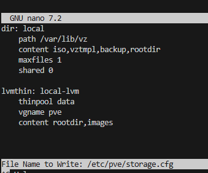

## Sysprep

[tool_virt-sysprep](https://askubuntu.com/questions/1394329/syspreping-an-ubuntu-image)

[researaching](https://chatgpt.com/share/686ba4e3-bd0c-8004-8b2b-1c68d4ee0e80)


# cluster 操作

## cluster create


## quorum

- ref:

    https://www.youtube.com/watch?reload=9&app=desktop&v=TXFYTQKYlno

### def & :

``` ruby
quorum = N/2 + 1
```


當只有 2 個 node 時，quorum = 2/2 + 1 = 2，需要兩個 node 都在線才能選出 Leader，若任一 node 掛掉就無法達成 quorum。

如果你不小心執行了像 `pvecm delnode` 等操作，導致 PVE Cluster **無法達成 quorum**，系統會進入「無法進行叢集操作」的狀態，例如：

* VM/LXC 無法啟動或遷移
* Web UI 顯示 `No quorum`
* HA 功能停擺


### ✅ **情境 1：還有 2 個以上的 Node，只是不在 quorum**

你可能誤刪其中一個 node，但實際上還有其他 node 活著。此時可以手動重新建立 quorum。

#### 解法：

1. **確認存活 node 狀態**

   ```bash
   pvecm status
   ```

2. **重新加入節點（如果誤刪的是其中一台）**

   * 先在被刪的 node 上清除 cluster 設定：

     ```bash
     systemctl stop pve-cluster corosync
     rm -rf /etc/pve/corosync.conf /etc/corosync/*
     ```
   * 再重新加入 cluster：

     ```bash
     pvecm add <IP-of-existing-cluster-node>
     ```

3. **確認 quorum 是否恢復**

   ```bash
   pvecm status
   ```

---


### ❗ **情境 2：只剩下 1 個 Node（或沒有 quorum 數）**

這是最常見的情境：**你不小心 del 掉其他 node，現在只剩 1 台在跑**，導致無 quorum。

#### 解法有兩種：

---

#### 🔧 法1：**強制重建單機 Cluster（毀損叢集，不可恢復原其他節點）**

⚠️ **這會破壞原叢集資料，慎用！建議只在你確定不會再加入原 node 時使用。**

1. 停止 cluster 服務：

   ```bash
   systemctl stop pve-cluster corosync
   ```

2. 備份並清除 cluster 設定：

   ```bash
   mv /etc/pve/corosync.conf /etc/pve/corosync.conf.bak
   rm -rf /etc/corosync/*
   ```

3. 重建單機 cluster：

   ```bash
   pvecm create mycluster
   ```

4. 重新啟動服務：

   ```bash
   systemctl restart pve-cluster corosync
   ```

5. 確認 cluster 狀態：

   ```bash
   pvecm status
   ```

---

#### ⚙️ 法2：**加一個輕量 Node（Container/Raspberry Pi）來補足 quorum**

如果原叢集還有其他節點可能恢復，可以考慮部署一個輕量節點來協助達成 quorum。

* 加一個 vote=1 的 container node
* 或使用 QDevice（需要額外設定 corosync-qdevice）

---

## ✅ 建議做法（事後）

* **使用備份**還原重要 VM。
* **定期拍快照**、使用 vzdump 備份。
* **避免在 quorum 不足時做叢集操作**。
* **開啟 corosync qdevice** 作為仲裁機制，避免兩節點陷入無 quorum。


### 解決方案

| 方法           | 可行性 | 正式建議 | 資料一致性 | 備註      |
| ------------ | --- | ---- | ----- | ------- |
| 法1：vote=0    | 高   | ❌    | ❌     | 測試可用    |
| 法2：非正式 node  | 高   | ✅    | ✅     | 輕量但有效   |
| 法3：仲裁節點      | 高   | ✅    | ✅     | 分散式環境推薦 |

### 法1：修改 vote(正式環境不建議)

- 將其中一個 Node 的 vote 設為 2，讓此 node 可以單獨達成 quorum。這樣可以在只有一個 node 存活的情況下仍維持服務。

    - 優點：簡單快速，可在測試環境使用。

    - 缺點：風險高，無法保證資料一致性，容易發生 split-brain。


### 法2：加入非正式 Node（例如 container / Raspberry Pi）

- 加上一個輕量級第三節點（如樹梅派或 Docker container）作為 tie-breaker node（不提供實際服務），協助達成 quorum。

    - 優點：不影響正式 node 的負載，也可提升容錯能力。

    - 缺點：需要額外的設置與網路資源。

    ```    yml
    node1 : 正式 node
    node2 : 正式 node
    node3 : 非正式 node（vote=1，no data）
    ```


### 法3：使用 Arbitrator / Witness Node（見於 Ceph、Proxmox、GlusterFS 等）

- 設立一個 仲裁節點（Arbiter 或 Witness），只參與 quorum 選舉，不存儲資料。適合分散式叢集環境中保證 quorum 的穩定性。

    - 優點：保證 quorum，不影響資料一致性，低資源需求。

    - 缺點：需額外設置仲裁服務（如 corosync + pacemaker）。

- 常見應用：

    - Proxmox VE 的 QDevice

    - Ceph 的 Monitor Arbiter

    - GlusterFS 的 Arbiter Brick


## cluster conntction ( to master)

- state table

|   |             |   |        | 
|------------|--------------------------------------|----------|------------------------------------|
|------------|--------------------------------------|----------|------------------------------------|

- 從 其他機器 (mbpc220904, 192.168.16.67)透過 pvecm add 指令 加入 cluster (mbpc220908, 192.168.16.62, master)

``` sh
# 加入
root@mbpc220904:~# pvecm add 192.168.16.62

# 刪    除

root@mbpc220904:~# systemctl stop pve-cluster
root@mbpc220904:~# systemctl stop corosync

root@mbpc220908:~# pvecm status
root@mbpc220908:~# pvecm expected 2
```

- 連線正常時 master 


- 停止服務


- stop 後 master 顯示離線


## cluster remove node

- both:

嘗試

``` sh
rm -rf /etc/pve/nodes/<mbpc220905>
```


``` sh
pvecm expected 1
```

- Master:

- Client:

``` sh
# 1st
systemctl stop pve-cluster
systemctl stop corosync
pmxcfs -l
rm -rf /etc/pve/corosync.conf
rm -rf /var/lib/corosync/*
rm -rf /etc/corosync/*
rm -rf /var/lib/pve-cluster/* 
# rm -rf /etc/pve/nodes/<mbpc220905>

killall -9 pmxcfs
reboot

```

## node 移出 cluster


``` sh
# 1st
systemctl stop pve-cluster
systemctl stop corosync

# killall -9 pmxcfs
pmxcfs -l  # local mode，/etc/pve 改為可寫入的本機版本

# rm /var/lib/pve-cluster/config.db*
rm -rf /etc/pve/corosync.conf
rm -rf /var/lib/corosync/*
rm -rf /etc/corosync/*
rm -rf /var/lib/pve-cluster/* 

killall -9 pmxcfs
reboot

```
- 檔案服務檢查正常，但 UI 仍顯示另一個 node，並且連線錯誤


``` sh
# 2nd
systemctl stop pve-cluster
systemctl stop corosync
systemctl stop pveproxy
systemctl stop pvedaemon
systemctl stop pvestatd
systemctl stop pve-manager


rm -rf /etc/corosync/*
rm -rf /var/lib/corosync/*
rm -rf /var/lib/pve-cluster/*

systemctl start pve-cluster
systemctl start corosync
systemctl start pveproxy
systemctl start pvedaemon
systemctl start pvestatd
systemctl start pve-manager
```

- 第二次重連後，UI 會卡住，重新整理後連線成功。


- 檢查 systemctl status pve-cluster 時發現


``` sh
# 1. 停止 rrdcached 服務
systemctl stop rrdcached

# 2. 刪除損壞的 cache 資料
rm -rf /var/lib/rrdcached/db/pve2*

# 3. 重新啟動服務
systemctl start rrdcached

# 4. (可選) 重啟 pve-cluster 強制更新 RRD 檔案
systemctl restart pve-cluster
```

- rrdcached 重啟後正常


#

``` sh
node lost quorum
received write while not quorate
cpg_join failed: 14
can't initialize service
```


## 問題分析

* **叢集目前沒有 quorum（過半節點）**，只有你這台節點活著（members: 1/3182633），導致叢集無法正常接受寫入操作。
* 因為沒有 quorum，`pmxcfs`（叢集檔案系統）只能以唯讀或限制狀態運行，無法修改 `/etc/pve` 內容。
* 

## 解決方向

### 1. 確認叢集節點數量與狀況

* 你目前有多少節點還在線？（例如用 `pvecm status` 或 `pvecm nodes` 查看）
* 是否有其他節點已經關機或網路斷線？
* 如果是只有你這一台節點在，叢集就失去了 quorum。

---

### 2. 如何在失去 quorum 時「強制移除節點」？

Proxmox 有一個**強制修改叢集設定的方式**，但這是破壞性操作，請先備份。

---

### 強制刪除節點（在主節點上）

1. 編輯 `/etc/pve/corosync.conf`（這是叢集配置檔）

```bash
nano /etc/pve/corosync.conf
```

2. 手動刪除不想要的節點設定。

3. 編輯完後，儲存並重新載入 corosync：

```bash
systemctl restart corosync
```

4. 接著重新啟動 `pve-cluster`：

```bash
systemctl restart pve-cluster
```

---

### 3. 如果你只能用單一節點（沒有 quorum）

可以設定讓叢集繞過 quorum 檢查（風險自負）：

```bash
pvecm expected 1
```

這會告訴叢集只期望 1 個節點，叢集就會恢復 quorum，允許你進行寫操作。

---

### 4. 你執行這個指令後，再試一次刪除節點：

```bash
pvecm delnode mbpc220905
```

---

### 5. 最後在被移除的節點（`mbpc220905`）上：

* 停止叢集服務：

```bash
systemctl stop pve-cluster corosync
```

* 卸載 `/etc/pve`：

```bash
umount /etc/pve
```

* 清理叢集配置（如果要繼續用該節點獨立運行）：

```bash
rm -rf /etc/pve/*
```

* 重啟該節點：

```bash
reboot
```

---

## 總結

* 目前問題是叢集失去 quorum，無法改寫叢集設定。
* 執行 `pvecm expected 1` 告訴叢集只期望一個節點，可以讓 `pmxcfs` 恢復寫入。
* 再執行 `pvecm delnode` 移除節點。
* 再到被移除節點做停止服務卸載等動作。


# 問題

### 1. local lvm 不見


- 檢查 /etc/pve/storage.cfg / lvs / vgs，其中 storage.cfg 消失 其他正常


- 重寫  storage.cfg


- systemctl restart pvedaemon pveproxy

- pvesm status


#### 重建 qemu config (VM)

/etc/pve/qemu-server/<vmid>.conf

- server vm

``` yml
boot: order=scsi0;net0
cores: 2
cpu: x86-64-v2-AES
# ide2: local:iso/ubuntu-22.04.5-live-server-amd64.iso,media=cdrom,size=2086842K
machine: q35
memory: 2048
meta: creation-qemu=8.1.5,ctime=1752483292
name: mbvm250604
net0: virtio=BC:24:11:37:B6:4C,bridge=vmbr0,firewall=1
ostype: l26
scsi0: local-lvm:vm-101-disk-0,iothread=1,size=32G
scsihw: virtio-scsi-single
sockets: 1
vga: qxl
```

- cloudinitVM

``` yml

```


### 2.