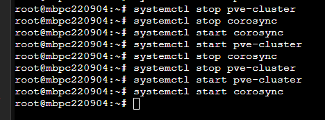

## Sysprep

[tool_virt-sysprep](https://askubuntu.com/questions/1394329/syspreping-an-ubuntu-image)

[researaching](https://chatgpt.com/share/686ba4e3-bd0c-8004-8b2b-1c68d4ee0e80)


# cluster 操作

## cluster create


## cluster conntction ( to master)

- state table

| 時間 from to | 工作內容           | 任務狀態 | 遇到的問題      | 
|------------|--------------------------------------|----------|------------------------------------|
|------------|--------------------------------------|----------|------------------------------------|

- 從 其他機器 (mbpc220904, 192.168.16.67)透過 pvecm add 指令 加入 cluster (mbpc220908, 192.168.16.62, master)

``` sh
# 加入
root@mbpc220904:~# pvecm add 192.168.16.62

# 刪    除

root@mbpc220904:~# systemctl stop pve-cluster
root@mbpc220904:~# systemctl stop corosync

root@mbpc220908:~# pvecm status
root@mbpc220908:~# pvecm expected 2
```

- 連線正常時 master 


- 停止服務


- stop 後 master 顯示離線


## cluster remove node

- both:

嘗試

``` sh
rm -rf /etc/pve/nodes/<mbpc220905>
```


``` sh
pvecm expected 1
```

- Master:

- Client:

``` sh
# 1st
systemctl stop pve-cluster
systemctl stop corosync
pmxcfs -l
rm -rf /etc/pve/corosync.conf
rm -rf /var/lib/corosync/*
rm -rf /etc/corosync/*
rm -rf /var/lib/pve-cluster/* 
# rm -rf /etc/pve/nodes/<mbpc220905>

killall -9 pmxcfs
reboot

```

## 清除 node cluster 資料


``` sh
# 1st
systemctl stop pve-cluster
systemctl stop corosync
pmxcfs -l
rm -rf /etc/pve/corosync.conf
rm -rf /var/lib/corosync/*
rm -rf /etc/corosync/*
rm -rf /var/lib/pve-cluster/* 
# rm -rf /etc/pve/nodes/<mbpc220905>

killall -9 pmxcfs
reboot

```
- 檔案服務檢查正常，但 UI 仍顯示另一個 node，並且連線錯誤


``` sh
# 2nd
systemctl stop pve-cluster
systemctl stop corosync
systemctl stop pveproxy
systemctl stop pvedaemon
systemctl stop pvestatd
systemctl stop pve-manager


rm -rf /etc/corosync/*
rm -rf /var/lib/corosync/*
rm -rf /var/lib/pve-cluster/*

systemctl start pve-cluster
systemctl start corosync
systemctl start pveproxy
systemctl start pvedaemon
systemctl start pvestatd
systemctl start pve-manager
```

- 第二次重連後，UI 會卡住，重新整理後連線成功。


- 檢查 systemctl status pve-cluster 時發現


``` sh
# 1. 停止 rrdcached 服務
systemctl stop rrdcached

# 2. 刪除損壞的 cache 資料
rm -rf /var/lib/rrdcached/db/pve2*

# 3. 重新啟動服務
systemctl start rrdcached

# 4. (可選) 重啟 pve-cluster 強制更新 RRD 檔案
systemctl restart pve-cluster
```

- rrdcached 重啟後正常


#

``` sh
node lost quorum
received write while not quorate
cpg_join failed: 14
can't initialize service
```


## 問題分析

* **叢集目前沒有 quorum（過半節點）**，只有你這台節點活著（members: 1/3182633），導致叢集無法正常接受寫入操作。
* 因為沒有 quorum，`pmxcfs`（叢集檔案系統）只能以唯讀或限制狀態運行，無法修改 `/etc/pve` 內容。
* 

## 解決方向

### 1. 確認叢集節點數量與狀況

* 你目前有多少節點還在線？（例如用 `pvecm status` 或 `pvecm nodes` 查看）
* 是否有其他節點已經關機或網路斷線？
* 如果是只有你這一台節點在，叢集就失去了 quorum。

---

### 2. 如何在失去 quorum 時「強制移除節點」？

Proxmox 有一個**強制修改叢集設定的方式**，但這是破壞性操作，請先備份。

---

### 強制刪除節點（在主節點上）

1. 編輯 `/etc/pve/corosync.conf`（這是叢集配置檔）

```bash
nano /etc/pve/corosync.conf
```

2. 手動刪除不想要的節點設定。

3. 編輯完後，儲存並重新載入 corosync：

```bash
systemctl restart corosync
```

4. 接著重新啟動 `pve-cluster`：

```bash
systemctl restart pve-cluster
```

---

### 3. 如果你只能用單一節點（沒有 quorum）

可以設定讓叢集繞過 quorum 檢查（風險自負）：

```bash
pvecm expected 1
```

這會告訴叢集只期望 1 個節點，叢集就會恢復 quorum，允許你進行寫操作。

---

### 4. 你執行這個指令後，再試一次刪除節點：

```bash
pvecm delnode mbpc220905
```

---

### 5. 最後在被移除的節點（`mbpc220905`）上：

* 停止叢集服務：

```bash
systemctl stop pve-cluster corosync
```

* 卸載 `/etc/pve`：

```bash
umount /etc/pve
```

* 清理叢集配置（如果要繼續用該節點獨立運行）：

```bash
rm -rf /etc/pve/*
```

* 重啟該節點：

```bash
reboot
```

---

## 總結

* 目前問題是叢集失去 quorum，無法改寫叢集設定。
* 執行 `pvecm expected 1` 告訴叢集只期望一個節點，可以讓 `pmxcfs` 恢復寫入。
* 再執行 `pvecm delnode` 移除節點。
* 再到被移除節點做停止服務卸載等動作。

