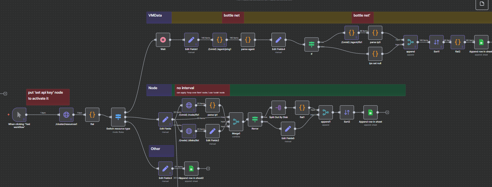
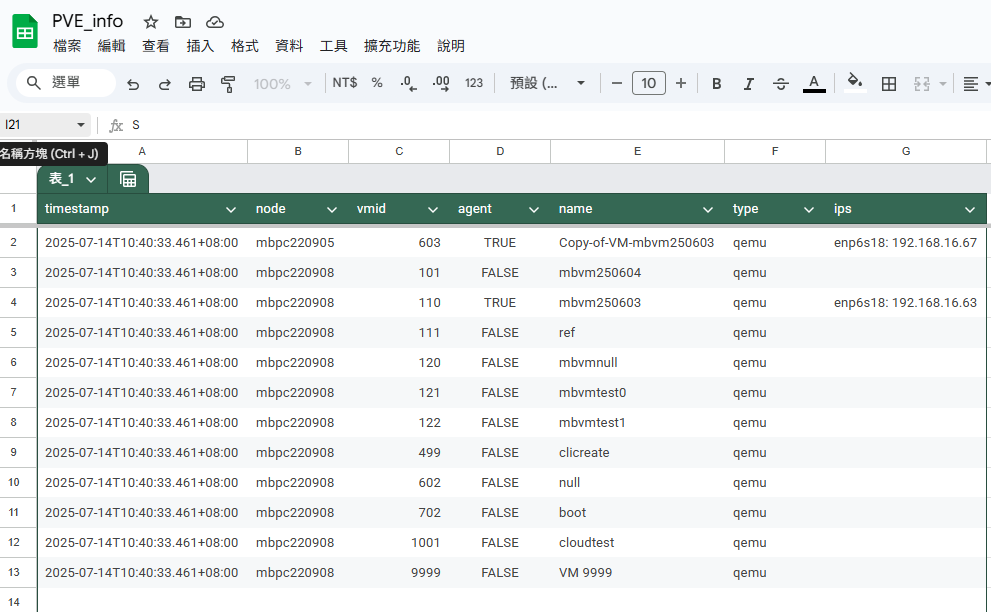

[qemu-guest-agent](#qemu-guest-agent)

[pve-api](#pve-api)

# qemu-guest-agent

## QA

Q: qemu-guest-agent 安裝?
A: 只能透過 client 安裝 (沒找到外部設定方式)

Q: UI 自訂調整?
A: 不能用 qemu-guest-agent 改動


## 指令

[qemu-guest-agent](https://pve.proxmox.com/wiki/Qemu-guest-agent#Host)

1. Client (VM) 安裝 qemu-guest-agent

``` sh
sudo apt-get install qemu-guest-agent
```

2. 確認 Server 端 (Node) 的 ${VM} > Option > QEMU Guest Agent > Use QEMU Guest Agent 有勾選


``` sh
qm set 110 --agent 1
# qm set 603 --agent enabled=1,freeze-fs-on-backup=0
```

3. 重啟 VM


### qm guest cmd <vmid> <command>  (qm agent)

Execute QEMU Guest Agent commands. 
- 包裝好的指令

<vmid>: <integer> (100 - 999999999)
The (unique) ID of the VM.

<command>: <fsfreeze-freeze | fsfreeze-status | fsfreeze-thaw | fstrim | get-fsinfo | get-host-name | get-memory-block-info | get-memory-blocks | get-osinfo | get-time | get-timezone | get-users | get-vcpus | info | network-get-interfaces | ping | shutdown | suspend-disk | suspend-hybrid | suspend-ram>
The QGA command.

| 指令名稱                     | 用途說明                                               |
| ------------------------ | -------------------------------------------------- |
| `ping`                   | 測試 guest agent 是否有回應                               |
| `get-osinfo`             | 回傳 VM 的作業系統資訊（名稱、版本等）                              |
| `get-time`               | 顯示 VM 裡的目前時間（以 UNIX 時間格式）                          |
| `get-timezone`           | 顯示 VM 設定的時區                                        |
| `get-users`              | 顯示目前登入中的使用者列表                                      |
| `get-vcpus`              | 顯示 VM 的虛擬 CPU 資訊                                   |
| `network-get-interfaces` | 列出所有 VM 內的網卡與其 IP、MAC、狀態等                          |
| `fstrim`                 | 在 VM 內執行 `fstrim`，釋放空間（用於 thin-provision 儲存）       |
| `fsfreeze-freeze`        | 將檔案系統凍結，暫停寫入（用於 snapshot 前）                        |
| `fsfreeze-thaw`          | 解凍檔案系統，恢復正常寫入                                      |
| `fsfreeze-status`        | 查詢目前檔案系統是否凍結                                       |
| `shutdown`               | 命令 guest OS 正常關機（需要 guest agent 和支援 ACPI/shutdown） |


### qm guest exec <vmid> <vmcmd> --<option>

- ls -l

``` sh
qm guest exec 110 --timeout 0 -- /bin/bash -c 'ls -l'
# === qm guest exec 110 --timeout 0 -- ls -l

## output
{
   "exitcode" : 0,
   "exited" : 1,
   "out-data" : "total 2097224\nlrwxrwxrwx   1 root root          7 Sep 11  2024 bin -> usr/bin\ndrwxr-xr-x   4 root root       4096 Jul  3 06:10 boot\ndr-xr-xr-x   2 root root       4096 Sep 11  2024 cdrom\ndrwxr-xr-x  21 root root       4180 Jul  9 07:02 dev\ndrwxr-xr-x 101 root root       4096 Jul  9 08:31 etc\ndrwxr-xr-x   4 root root       4096 Jun 27 06:08 home\nlrwxrwxrwx   1 root root          7 Sep 11  2024 lib -> usr/lib\nlrwxrwxrwx   1 root root          9 Sep 11  2024 lib32 -> usr/lib32\nlrwxrwxrwx   1 root root          9 Sep 11  2024 lib64 -> usr/lib64\nlrwxrwxrwx   1 root root         10 Sep 11  2024 libx32 -> usr/libx32\ndrwx------   2 root root      16384 Jun 25 06:38 lost+found\ndrwxr-xr-x   2 root root       4096 Sep 11  2024 media\ndrwxr-xr-x   4 root root       4096 Jul  6 23:53 mnt\ndrwxr-xr-x   2 root root       4096 Sep 11  2024 opt\ndr-xr-xr-x 203 root root          0 Jul  9 07:02 proc\ndrwx------   5 root root       4096 Jul  9 07:04 root\ndrwxr-xr-x  30 root root        880 Jul  9 08:31 run\nlrwxrwxrwx   1 root root          8 Sep 11  2024 sbin -> usr/sbin\ndrwxr-xr-x   6 root root       4096 Sep 11  2024 snap\ndrwxr-xr-x   2 root root       4096 Sep 11  2024 srv\n-rw-------   1 root root 2147483648 Jun 25 06:39 swap.img\ndr-xr-xr-x  13 root root          0 Jul  9 07:02 sys\ndrwxrwxrwt  12 root root       4096 Jul  9 07:08 tmp\ndrwxr-xr-x  14 root root       4096 Sep 11  2024 usr\ndrwxr-xr-x  13 root root       4096 Se
   p 11  2024 var\n"
}
```


- apt update

    - synchronous 根據執行結果輸出


``` sh
qm guest exec 110 --synchronous=0 apt update
qm guest exec-status 110 1650

qm guest exec 110 --synchronous=1 apt update
```


### qm guest passwd <vmid> <username> [OPTIONS] (無條件重設密碼)


## 總結

指令便利 
hostname/ip 


## ref:
https://pve.proxmox.com/pve-docs/qm.1.html
https://foxi.buduanwang.vip/virtualization/pve/530.html
[guest exec](https://forum.proxmox.com/threads/executing-command-through-qm-guest-exec-limitations.102051/)


# PVE API

## notice

1. 關於指令注入

API 不能對 node 執行任意 shell 命令 (安全考量)，但能對容器或 VM 注入

- 容器或 VM 裡：

    QEMU VM：使用 guest-agent → /nodes/{node}/qemu/{vmid}/agent/exec

    LXC 容器：使用 /nodes/{node}/lxc/{vmid}/exec API

<!-- 另外 /nodes/{node}/execute
| 功能                          | `/nodes/{node}/execute` API | 任意 Shell 指令 |
| --------------------------- | --------------------------- | ----------- |
| 執行多個 PVE API 操作             | ✅ Yes                       | ❌ No        |
| 執行 arbitrary shell commands | ❌ No                        | ✅ Yes       |
| 安全性                         | ✅ 安全（只執行已定義的 API）           | ⚠️ 潛在風險     |

 -->

## token setup

- 基本使用

以下是如何在 **Proxmox Virtual Environment (PVE)** 中生成與使用 API Token 的步驟：

### 1. **生成 API Token**

- 1. 首先，請先登入到 Proxmox 的 Web 管理界面：

  1. 打開瀏覽器，並輸入你的 Proxmox 管理頁面網址（例如 `https://your-proxmox-server:8006`）。
  2. 使用管理員帳戶登入。
  3. 進入 **資料中心 (Datacenter)** → **權限 (Permissions)** → **API Tokens**。
  4. 點擊右上角的 **Add** 按鈕來創建一個新的 API Token。

    * **Token ID**：為該 API Token 設置一個識別名稱（例如 `mytoken`）。
    * **User**：選擇要生成 Token 的使用者帳戶。
    * **Role**：選擇該 Token 的權限角色（例如 `PVEAdmin` 或其他自訂角色）。
    * **Comment**：可選填一些備註來幫助你識別這個 Token 的用途。
    * **Expiration**：設置 Token 的有效期限（這是選擇性設定）。

  生成後，你會得到 **API Token** 的 ID 和 **Secret**（密鑰）。

  **請妥善保管這些資料，特別是 Secret，因為生成後就無法再次查看它。**

- 2. 其次，設定 API 權限

  1. 進入 **資料中心 (Datacenter)** → **權限 (Permissions)**
  2. 新增 API Token Premission 範例如下：

  


### 2. **使用 API Token**

Proxmox 使用 **JWT (JSON Web Token)** 進行認證，當你進行 API 請求時，需要將 Token 以 HTTP Header 的形式傳遞。下面是如何使用 Token 進行 API 請求的範例：

#### API 結構 & 操作範例：：

當你已經有了 **API Token ID** 和 **Secret**，可以這樣使用 cURL 發送 API 請求：

```bash
curl -k -X GET "https://your-proxmox-server:8006/api2/json/nodes" \
-H "Authorization: PVEAPIToken=mytoken!your-token-id=your-token-secret"
```

* `https://your-proxmox-server:8006/api2/json` api entry
* `/nodes` uri

* `your-proxmox-server` 是你的 Proxmox 伺服器的地址。
* `mytoken!your-token-id` 是你生成的 Token ID（例如 `mytoken!abc123`）。
* `your-token-secret` 是你在生成 Token 時得到的密鑰。


- 使用方式可參考 [PVE API Viewer](https://pve.proxmox.com//pve-docs/api-viewer/index.html)

1. **查看節點（Nodes）列表：**

   ```bash
   curl -k -X GET "https://your-proxmox-server:8006/api2/json/nodes" \
   -H "Authorization: PVEAPIToken=mytoken!your-token-id=your-token-secret"
   ```

2. **創建虛擬機：**

   ```bash
   curl -k -X POST "https://your-proxmox-server:8006/api2/json/nodes/your-node-name/qemu" \
   -H "Authorization: PVEAPIToken=mytoken!your-token-id=your-token-secret" \
   -d "vmid=100&name=testvm&memory=2048&cores=2"
   ```

3. **查看虛擬機資訊：**

   ```bash
   curl -k -X GET "https://your-proxmox-server:8006/api2/json/nodes/your-node-name/qemu/100/status/current" \
   -H "Authorization: PVEAPIToken=mytoken!your-token-id=your-token-secret"
   ```

### - **注意事項：**

  * 請確保你的 Proxmox 伺服器已經啟用了 HTTPS。
  * 當你使用 API Token 時，要特別注意權限控制。確保每個 Token 只擁有執行特定操作的最小權限，避免過度授權。
  * 若要調整 API Token 的權限或過期時間，可以在 Proxmox Web 界面進行修改。


## practice 

- 位置 :
  https://n8n.mobagel.com/workflow/PGv6ijlkCLCaVFiF/debug/71300
  id: it.mobagel.com
  pwd: Mobagel5355!

- 爬蟲架構



- 結果 (agent + ip, disk)

 


- agent ping


  - 無agent

  

  - 有agent

  


- SSD/HDD  (by type:"nvme")


  - disk 資訊

  
