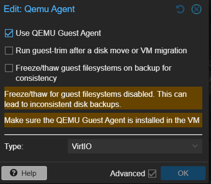
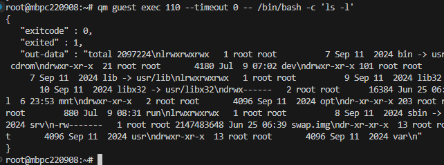
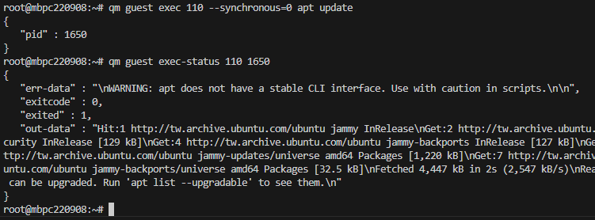
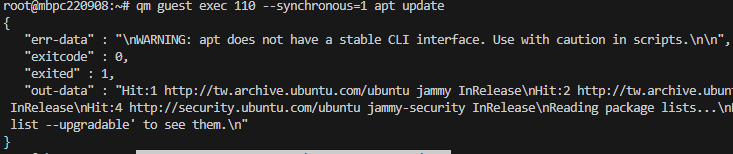

# qemu-guest-agent

## QA

Q: qemu-guest-agent 安裝?
A: 只能透過 client 安裝 (沒找到外部設定方式)

Q: UI 自訂調整?
A: 不能用 qemu-guest-agent 改動


## 指令

[qemu-guest-agent](https://pve.proxmox.com/wiki/Qemu-guest-agent#Host)

1. Client (VM) 安裝 qemu-guest-agent

``` sh
sudo apt-get install qemu-guest-agent
```

2. 確認 Server 端 (Node) 的 ${VM} > Option > QEMU Guest Agent > Use QEMU Guest Agent 有勾選



``` sh
qm set 110 --agent 1
# qm set 603 --agent enabled=1,freeze-fs-on-backup=0
```

3. 重啟 VM


### qm guest cmd <vmid> <command>  (qm agent)

Execute QEMU Guest Agent commands. 
- 包裝好的指令

<vmid>: <integer> (100 - 999999999)
The (unique) ID of the VM.

<command>: <fsfreeze-freeze | fsfreeze-status | fsfreeze-thaw | fstrim | get-fsinfo | get-host-name | get-memory-block-info | get-memory-blocks | get-osinfo | get-time | get-timezone | get-users | get-vcpus | info | network-get-interfaces | ping | shutdown | suspend-disk | suspend-hybrid | suspend-ram>
The QGA command.

| 指令名稱                     | 用途說明                                               |
| ------------------------ | -------------------------------------------------- |
| `ping`                   | 測試 guest agent 是否有回應                               |
| `get-osinfo`             | 回傳 VM 的作業系統資訊（名稱、版本等）                              |
| `get-time`               | 顯示 VM 裡的目前時間（以 UNIX 時間格式）                          |
| `get-timezone`           | 顯示 VM 設定的時區                                        |
| `get-users`              | 顯示目前登入中的使用者列表                                      |
| `get-vcpus`              | 顯示 VM 的虛擬 CPU 資訊                                   |
| `network-get-interfaces` | 列出所有 VM 內的網卡與其 IP、MAC、狀態等                          |
| `fstrim`                 | 在 VM 內執行 `fstrim`，釋放空間（用於 thin-provision 儲存）       |
| `fsfreeze-freeze`        | 將檔案系統凍結，暫停寫入（用於 snapshot 前）                        |
| `fsfreeze-thaw`          | 解凍檔案系統，恢復正常寫入                                      |
| `fsfreeze-status`        | 查詢目前檔案系統是否凍結                                       |
| `shutdown`               | 命令 guest OS 正常關機（需要 guest agent 和支援 ACPI/shutdown） |


### qm guest exec <vmid> <vmcmd> --<option>

- ls -l

``` sh
qm guest exec 110 --timeout 0 -- /bin/bash -c 'ls -l'
# === qm guest exec 110 --timeout 0 -- ls -l

## output
{
   "exitcode" : 0,
   "exited" : 1,
   "out-data" : "total 2097224\nlrwxrwxrwx   1 root root          7 Sep 11  2024 bin -> usr/bin\ndrwxr-xr-x   4 root root       4096 Jul  3 06:10 boot\ndr-xr-xr-x   2 root root       4096 Sep 11  2024 cdrom\ndrwxr-xr-x  21 root root       4180 Jul  9 07:02 dev\ndrwxr-xr-x 101 root root       4096 Jul  9 08:31 etc\ndrwxr-xr-x   4 root root       4096 Jun 27 06:08 home\nlrwxrwxrwx   1 root root          7 Sep 11  2024 lib -> usr/lib\nlrwxrwxrwx   1 root root          9 Sep 11  2024 lib32 -> usr/lib32\nlrwxrwxrwx   1 root root          9 Sep 11  2024 lib64 -> usr/lib64\nlrwxrwxrwx   1 root root         10 Sep 11  2024 libx32 -> usr/libx32\ndrwx------   2 root root      16384 Jun 25 06:38 lost+found\ndrwxr-xr-x   2 root root       4096 Sep 11  2024 media\ndrwxr-xr-x   4 root root       4096 Jul  6 23:53 mnt\ndrwxr-xr-x   2 root root       4096 Sep 11  2024 opt\ndr-xr-xr-x 203 root root          0 Jul  9 07:02 proc\ndrwx------   5 root root       4096 Jul  9 07:04 root\ndrwxr-xr-x  30 root root        880 Jul  9 08:31 run\nlrwxrwxrwx   1 root root          8 Sep 11  2024 sbin -> usr/sbin\ndrwxr-xr-x   6 root root       4096 Sep 11  2024 snap\ndrwxr-xr-x   2 root root       4096 Sep 11  2024 srv\n-rw-------   1 root root 2147483648 Jun 25 06:39 swap.img\ndr-xr-xr-x  13 root root          0 Jul  9 07:02 sys\ndrwxrwxrwt  12 root root       4096 Jul  9 07:08 tmp\ndrwxr-xr-x  14 root root       4096 Sep 11  2024 usr\ndrwxr-xr-x  13 root root       4096 Se
   p 11  2024 var\n"
}
```



- apt update

    - synchronous 根據執行結果輸出


``` sh
qm guest exec 110 --synchronous=0 apt update
qm guest exec-status 110 1650

qm guest exec 110 --synchronous=1 apt update
```





### qm guest passwd <vmid> <username> [OPTIONS] (無條件重設密碼)


## 總結

指令便利 
hostname/ip 


## ref:
https://pve.proxmox.com/pve-docs/qm.1.html
https://foxi.buduanwang.vip/virtualization/pve/530.html
[guest exec](https://forum.proxmox.com/threads/executing-command-through-qm-guest-exec-limitations.102051/)