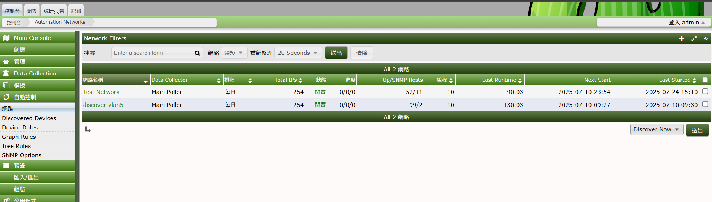

# snmp

### snmp mib 設定 & 測試

``` sh
#========== 設定 ===========

sudo nano /etc/snmp/snmp.conf


# 避免重複定義導致衝突
find /usr/share/snmp/mibs/ -type f -name "*.mib" -exec basename {} \; | sort | uniq -d # 檔名重複
find /usr/share/snmp/mibs/ -type f -name "*.mib" -exec md5sum {} \; | sort | uniq -w32 -dD # 內容完全一致

#========== 測試 ===========
# 只輸出錯誤訊息：
snmptranslate -m +SNMPv2-PDU -M /usr/share/snmp/mibs/ietf testObjectName 2>&1 >/dev/null

snmptranslate -Tp -m +ZYXEL-SYS-MEMORY-MIB | grep -i mem
# 樹狀圖 部分
            # |     |  |  |  +--hrStorageVirtualMemory(3)
            # |     |  |  |  +--hrStorageFlashMemory(9)
            # |     |  |  +-- -R-- Integer32 hrMemorySize(2)
            # |     |  |  |  +--hrDeviceVolatileMemory(20)
            # |     |  |  |  +--hrDeviceNonVolatileMemory(21)
            # |     |  |        +-- -R-- Integer32 hrSWRunPerfMem(2)
            # |     |  |        +-- -R-- Counter   ipv6IfIcmpInGroupMembQueries(15)
            # |     |  |        +-- -R-- Counter   ipv6IfIcmpInGroupMembResponses(16)
            # |     |  |        +-- -R-- Counter   ipv6IfIcmpInGroupMembReductions(17)

snmptranslate -IR -On ZYXEL-SYS-MEMORY-MIB::zyxelSysMemory
# 輸出 .1.3.6.1.4.1.890.1.15.3.50
snmpwalk -v2c -c public 192.168.16.63 system:systemstatus
```

### cacti


### GPU

| 層級/資訊類型    | Windows（有驅動）       | Linux（有驅動）                      | Windows/Linux（沒驅動） |
| ---------- | ------------------ | ------------------------------- | ------------------ |
| GPU 名稱     | ✅                  | ✅                               | ✅（透過 PCI 查）        |
| 記憶體大小      | ✅                  | ✅                               | ⛔️（無法正確判斷）         |
| 驅動版本       | ✅                  | ✅                               | ⛔️（無法判斷）           |
| 使用率        | ✅（工作管理員）           | ✅（需裝工具）                         | ⛔️                 |
| 溫度 / 功耗    | ✅（NVIDIA 控制台）      | ✅（nvidia-smi）                   | ⛔️                 |
| 多 GPU 狀態   | ✅                  | ✅                               | ⛔️                 |
| GPU 加速使用情況 | ✅（DXDiag、Task Mgr） | ✅（需 `nvidia-smi` / `radeontop`） | ⛔️                 |


# cacti


## Automation 

### Networks (discovery, 掃port)




### Device Rule

**功能**: automation template setting

root@mbpc220908:~# snmpwalk -v2c -c public 192.168.16.67 1.3.6.1.2.1.1.1.0 
SNMPv2-MIB::sysDescr.0 = STRING: Linux mbpc220904 6.8.4-2-pve #1 SMP PREEMPT_DYNAMIC PMX 6.8.4-2 (2024-04-10T17:36Z) x86_64
root@mbpc220908:~# snmpwalk -v2c -c public 192.168.16.67 1.3.6.1.2.1.1.5.0
SNMPv2-MIB::sysName.0 = STRING: mbpc220904
root@mbpc220908:~# snmpwalk -v2c -c public 192.168.16.67 1.3.6.1.2.1.1.2.0
SNMPv2-MIB::sysObjectID.0 = OID: NET-SNMP-TC::linux


### Graph Rule

**功能**: automation field discovery