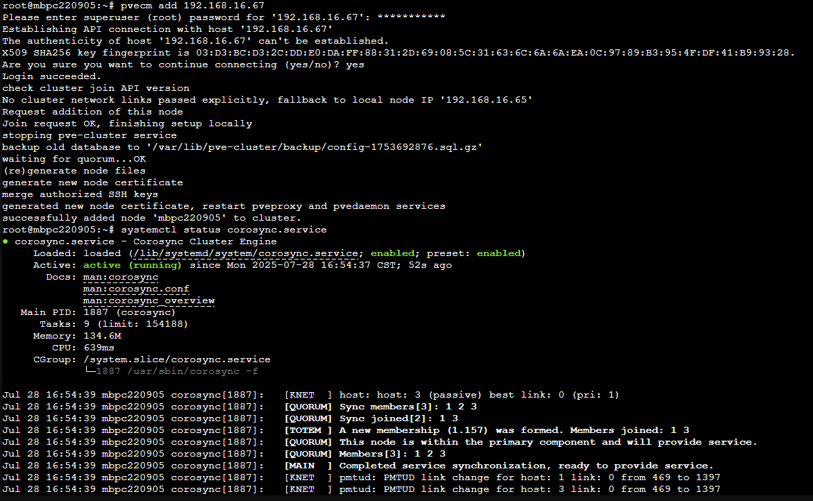

# hostname 更改流程

## PVE instance

### notice

> 記得預先 轉移 / dump node 的 VM 資料 (/var/lib/vz (local)會保留，/etc/pve (local-lvm)會清空)

> 確認移除 node 後 quorum 數量符合


### 從 cluster 上移除 node (若 node 連接 cluster)

1. 在 cluster 上其他 node 

``` sh
pvecm delnode $nodename
```


2. 在被移除 node

``` sh
# Step 1: 停止服務
systemctl stop pve-cluster corosync 

# Step 2: 啟動 pmxcfs 在本地模式（不使用 cluster）
pmxcfs -l

# Step 3: 刪除 cluster 和 corosync 設定（請小心！）
# rm -f /var/lib/pve-cluster/config.db*
rm -rf /var/lib/pve-cluster/*
rm -f /etc/pve/corosync.conf
rm -rf /var/lib/corosync/*
rm -rf /etc/corosync/*

# Step 4: 終止 pmxcfs 進程 & 重開機
killall -9 pmxcfs
```
### 舊 hostname 改成新 hostname

``` sh
hostnamectl set-hostname $newhostname
nano /etc/hosts # $檔案內 舊hostname 改成 new hostname，通常是 127.0.1.1 or static ip
```

### 完成以上動作後重啟

``` sh
reboot
```

### 最後加入新 host

``` sh
pvecm add $IP_of_the_healthy_Node_of_the_Cluster
```




### 完成hostname 更改


## Ubuntu instance

### 舊 hostname 改成新 hostname

``` sh
hostnamectl set-hostname $newhostname
nano /etc/hosts # $檔案內 舊hostname 改成 new hostname，通常是 127.0.1.1 or static ip
```

### 重啟服務以讀取新 hostname (可選)

**需要注意哪些服務**:  郵件、Web、監控、DNS、NFS ... 

| 類型                                         | 是否建議重啟                    | 原因                            |
| ---------------------------------------------- | ------------------------- | --------------------------------------------- |
| **SSH (sshd)**                            | ❌ 不需要                     | hostname 不影響 SSH 運作。                          |                  |
| **網路服務（如 Apache、Nginx）**                    | ❌ 不一定                     | 通常 hostname 不影響 web server，除非你依賴它作為 vhost 名稱。 |
| **Postfix / Sendmail**                         | ✅ 改設定檔 + 重啟               | 郵件主機名通常跟 hostname 綁定。
| **journald (日誌)**                              | ✅ 建議重啟                    | 日誌會記錄 hostname，有些情況要重啟才會反映新名稱。                |    
| **Syslog / rsyslog / syslog-ng**               | ✅ 建議重啟                    | Log 主機名稱會用 hostname。                          |
| **snmpd**                                 | ✅ 建議重啟                    | 主機名稱的mib會用   |
| **Monitoring agents（如 Zabbix agent, Datadog）** | ✅ 建議重啟                    | 監控 agent 常會回報 hostname，需重啟讓它刷新。               |
| **Docker / containerd**                  | ❌ 不需要，但容器內可能看不到新 hostname | 容器會保留原始啟動時的主機資訊。   |

``` sh
# mail 服務通常也要改 config
sudo systemctl restart systemd-journald snmpd syslog postfix
```


