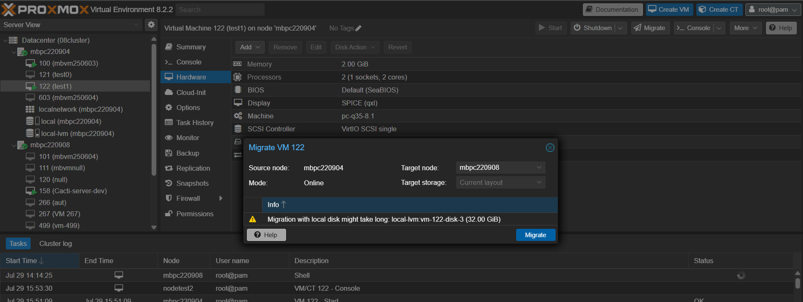

# hostname 更改流程

## PVE instance

### notice

> 記得預先 轉移 / dump node 的 VM 資料 (/var/lib/vz (local)會保留，/etc/pve (local-lvm)會清空)

> 確認移除 node 後 quorum 數量符合


此次操作為 mbpc220905 更名為 mbpcd192-168-16-65  

### 前置: 轉移 VM 資料 




### 從 cluster 上移除 node (若 node 連接 cluster)

1. 在 cluster 上其他任意 node 做刪除操作

``` sh
pvecm delnode $nodename
```


2. 在被移除 node 重設 cluster 相關設定

``` sh
# Step 1: 停止服務
systemctl stop pve-cluster corosync 

# Step 2: 啟動 pmxcfs 在本地模式（不使用 cluster）
pmxcfs -l

# Step 3: 刪除 cluster 和 corosync 設定（請小心！）
# rm -f /var/lib/pve-cluster/config.db*
rm -rf /var/lib/pve-cluster/*
rm -f /etc/pve/corosync.conf
rm -rf /var/lib/corosync/*
rm -rf /etc/corosync/*

# Step 4: 終止 pmxcfs 進程 & 重開機
killall -9 pmxcfs
```


### 舊 hostname 改成新 hostname

``` sh
# 1. 設定新主機名稱（hostname）：
hostnamectl set-hostname $newhostname # sudo 

# 2. 更新 /etc/hosts 檔案：
nano /etc/hosts # $檔案內 舊hostname 改成 new hostname，通常是 127.0.1.1 or static ip
```


- 此為 system-level 的設定變更，影響主機在網路與本地服務中的識別，部分服務需重啟才能正確套用，建議重開機（reboot）以套用所有相關服務設定。

- 特定服務在修改 hostname 後可能需要重新啟動才會更新，常見如：
    - SSH：需重新連線
    - Snmpd：需手動重啟，否則無法即時反映新 hostname
    - pve web ui 可以單獨重啟 pveproxy 查看，但其他服務的運作仍用舊名

### 完成以上動作後重啟 node 主機

目的:
- 將新 hostname 套用到主機所有服務
- 重置 cluster 相關設定，完成移除操作

``` sh
reboot
```

### 重啟後連線 (local / ssh / UI)，再次加入 cluster 

``` sh
pvecm add $IP_of_the_healthy_Node_of_the_Cluster
```

``` sh
root@mbpcd192-168-16-65:~# pvecm add 192.168.16.67
Please enter superuser (root) password for '192.168.16.67': ***********
Establishing API connection with host '192.168.16.67'
The authenticity of host '192.168.16.67' can't be established.
X509 SHA256 key fingerprint is 00:00:00:D3:00:DD:00:00:00:88:00:2D:69:00:5C:31:00:6C:00:6A:EA:0C:00:00:B3:00:4F:DF:00:00:93:28.
Are you sure you want to continue connecting (yes/no)? yes
Login succeeded.
check cluster join API version
No cluster network links passed explicitly, fallback to local node IP '192.168.16.65'
Request addition of this node
Join request OK, finishing setup locally
stopping pve-cluster service
backup old database to '/var/lib/pve-cluster/backup/config-1753763030.sql.gz'
waiting for quorum...OK
(re)generate node files
generate new node certificate
merge authorized SSH keys
generated new node certificate, restart pveproxy and pvedaemon services
successfully added node 'mbpcd192-168-16-65' to cluster.
root@mbpcd192-168-16-65:~# 
```

<!--  -->


### 完成更改 hostname 流程，可登入 UI 查看


## Ubuntu instance

### 舊 hostname 改成新 hostname

``` sh
hostnamectl set-hostname $newhostname
nano /etc/hosts # $檔案內 舊hostname 改成 new hostname，通常是 127.0.1.1 or static ip
```

### 重啟服務以讀取新 hostname (可選)

**需要注意哪些服務**:  郵件、Web、監控、DNS、NFS ... 

| 類型                                         | 是否建議重啟                    | 原因                            |
| ---------------------------------------------- | ------------------------- | --------------------------------------------- |
| **SSH (sshd)**                            | ❌ 不需要                     | hostname 不影響 SSH 運作。                          |                  |
| **網路服務（如 Apache、Nginx）**                    | ❌ 不一定                     | 通常 hostname 不影響 web server，除非你依賴它作為 vhost 名稱。 |
| **Postfix / Sendmail**                         | ✅ 改設定檔 + 重啟               | 郵件主機名通常跟 hostname 綁定。
| **journald (日誌)**                              | ✅ 建議重啟                    | 日誌會記錄 hostname，有些情況要重啟才會反映新名稱。                |    
| **Syslog / rsyslog / syslog-ng**               | ✅ 建議重啟                    | Log 主機名稱會用 hostname。                          |
| **snmpd**                                 | ✅ 建議重啟                    | 主機名稱的mib會用   |
| **Monitoring agents（如 Zabbix agent, Datadog）** | ✅ 建議重啟                    | 監控 agent 常會回報 hostname，需重啟讓它刷新。               |
| **Docker / containerd**                  | ❌ 不需要，但容器內可能看不到新 hostname | 容器會保留原始啟動時的主機資訊。   |

``` sh
# mail 服務通常也要改 config, ex. /etc/postfix/main.cf
sudo systemctl restart systemd-journald snmpd syslog postfix
```

# ref
https://pve.proxmox.com/wiki/Renaming_a_PVE_node
