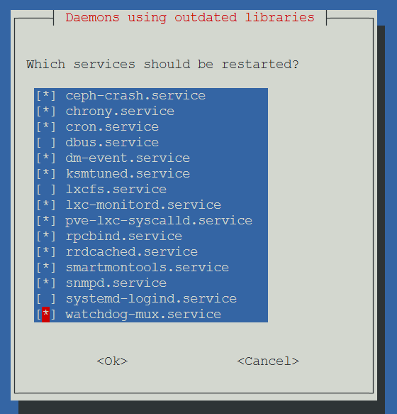
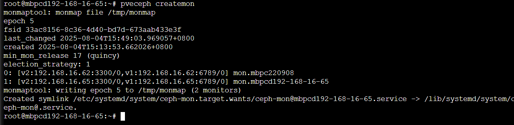
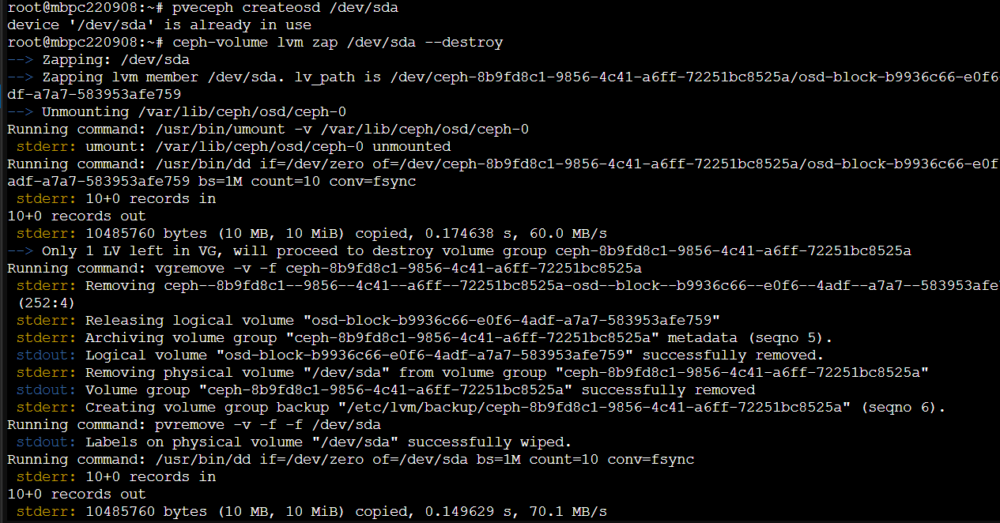
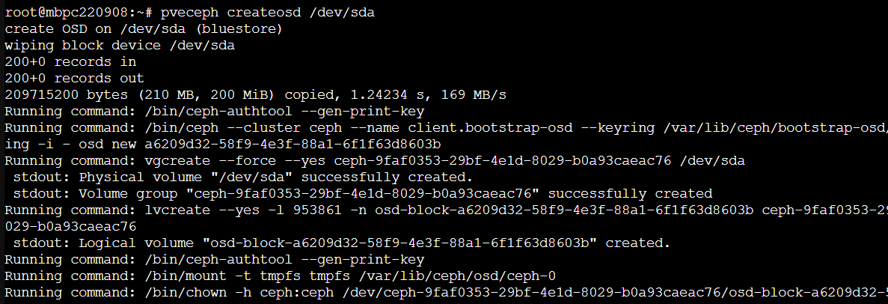
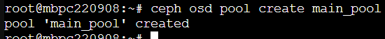
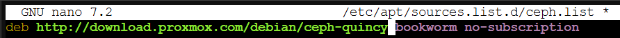
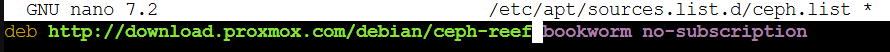
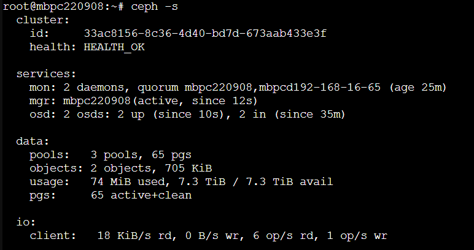
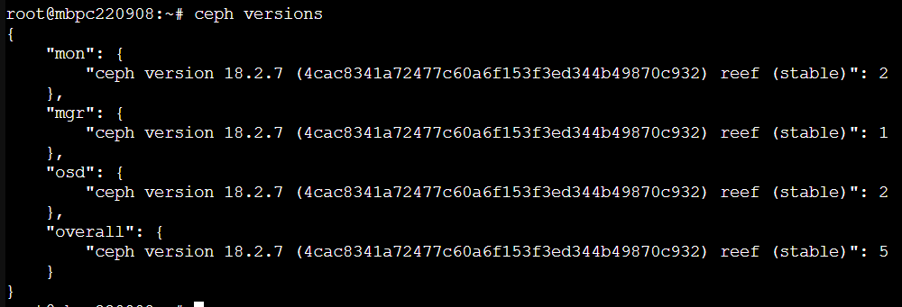

``` sh
apt update && apt full-upgrade -y

systemctl stop ceph-osd.target

pveceph init --mon-address <該節點IP>

pveceph createmon

pveceph createosd /dev/sdX

```
### 更新 node


``` sh
apt update && apt full-upgrade -y
```

### 初始化 ceph

``` sh
pveceph init --mon-address <該節點IP>
```

### 建立 monnitor


### 磁碟重建

``` sh
pveceph createosd /dev/sdX 

ceph-volume lvm zap /dev/sdX --destroy

pveceph createosd /dev/sdX
```




p.s. 重建 (pveceph createosd) 前務必移除 ceph 相關 OSD 資訊（如有）

``` sh
# 18 (reef -)
# 移除相關 OSD 資訊（如有）
ceph osd tree

ceph osd out osd.1
systemctl stop ceph-osd@1
ceph osd crush remove osd.1
ceph auth del osd.1
ceph osd rm osd.1

# 19 (squid +)


```


### 建立 pool

``` sh
# pg_num 和 pgp_num 根據集群大小調整，PVE 通常會幫你計算
# 無特殊架構需求 ceph osd pool create <poolname> 即可。
ceph osd pool create <poolname> <pg_num> <pgp_num>
```

### 刪除 pool

``` sh
ceph config set mon mon_allow_pool_delete true
ceph osd pool delete <pool_name> <pool_name> --yes-i-really-really-mean-it
ceph config set mon mon_allow_pool_delete false
```



### 在 PVE GUI 設定 Ceph Storage

進入 Datacenter > Storage > Add > RBD

填寫 Pool 名稱、監控節點 IP，並設定 Client key 等

新增完成後，就能在 PVE 裡面使用 Ceph Storage，建立 VM 的磁碟

- 找不到先用指令

``` sh
ceph osd pool application enable <poolname> rbd
```


## 升級 Ceph 17.2.8 (Quincy) → 18.2.7 (Reef)  

1. 📝 修改 Ceph 軟體來源（APT Source）

``` sh
nano /etc/apt/sources.list.d/ceph.list # 修改如下
```



2. 🔄 更新套件資訊

``` sh
apt update
```

3. 🚧 升級 MON 節點 & 升級 MGR 與 OSD 節點

``` sh
systemctl stop ceph-mon@<mon-id>
apt install --only-upgrade ceph-mon
systemctl stop ceph-mon@<mon-id>

systemctl stop ceph-mgr@<mgr-id> ceph-osd@<osd-id>
apt install --only-upgrade ceph-mgr ceph-osd
systemctl start ceph-mgr@<mgr-id> ceph-osd@<osd-id>
```

4. 🔍 檢查更新狀況
``` sh
ceph -s
ceph versions
```



5. ✅ 設定集群版本標記為 reef
``` sh
ceph osd require-osd-release reef
```


ceph osd tree
ceph osd pool ls detail
ceph pg ls-by-pool test_pool
ceph-volume lvm list


nano /etc/pve/storage.cfg
``` cfg
dir: local
        path /var/lib/vz
        content vztmpl,backup,rootdir,iso,images
        prune-backups keep-last=5
        shared 0

lvmthin: local-lvm
        thinpool data
        vgname pve
        content images,rootdir

rbd: main
        content images
        krbd 0
        pool main_pool

rbd: test
        content images
        krbd 0
        pool test_pool
```

root@mbpc220908:/etc/pve/nodes/mbpc220908/qemu-server# ceph fsid
33ac8156-8c36-4d40-bd7d-673aab433e3f


