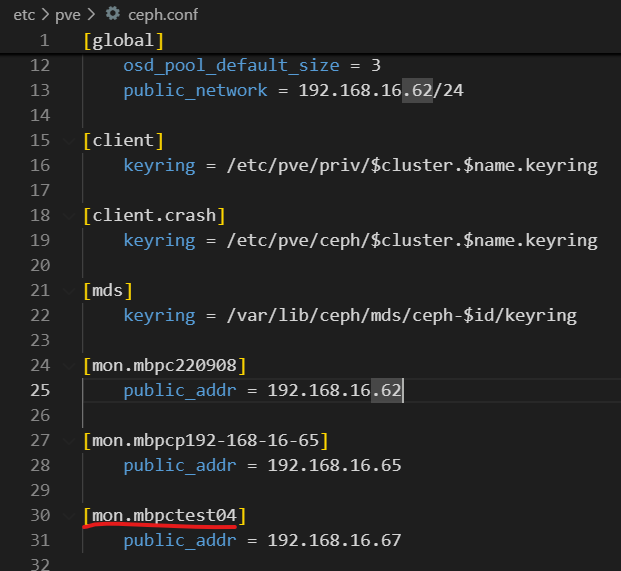
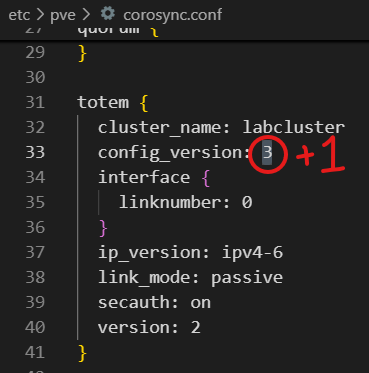

# ProxmoxVE 節點改名流程

## 系統版本訊息

**repo**


**version**

``` yaml
# 簡略
pve: 8.4.11
ceph reef: 18.2.7

# 詳細 (Summary > Package versions)
proxmox-ve: 8.4.0 #(running kernel: 6.8.12-13-pve)
pve-manager: 8.4.11 #(running version: 8.4.11/14a32011146091ed)
proxmox-kernel-helper: 8.1.4
proxmox-kernel-6.8.12-13-pve-signed: 6.8.12-13
proxmox-kernel-6.8: 6.8.12-13
proxmox-kernel-6.8.12-11-pve-signed: 6.8.12-11
proxmox-kernel-6.8.4-2-pve-signed: 6.8.4-2
ceph: 18.2.7-pve1
ceph-fuse: 18.2.7-pve1
corosync: 3.1.9-pve1
criu: 3.17.1-2+deb12u1
glusterfs-client: 10.3-5
ifupdown2: 3.2.0-1+pmx11
ksm-control-daemon: 1.5-1
libjs-extjs: 7.0.0-5
libknet1: 1.30-pve2
libproxmox-acme-perl: 1.6.0
libproxmox-backup-qemu0: 1.5.2
libproxmox-rs-perl: 0.3.5
libpve-access-control: 8.2.2
libpve-apiclient-perl: 3.3.2
libpve-cluster-api-perl: 8.1.2
libpve-cluster-perl: 8.1.2
libpve-common-perl: 8.3.4
libpve-guest-common-perl: 5.2.2
libpve-http-server-perl: 5.2.2
libpve-network-perl: 0.11.2
libpve-rs-perl: 0.9.4
libpve-storage-perl: 8.3.7
libspice-server1: 0.15.1-1
lvm2: 2.03.16-2
lxc-pve: 6.0.0-1
lxcfs: 6.0.0-pve2
novnc-pve: 1.6.0-2
proxmox-backup-client: 3.4.6-1
proxmox-backup-file-restore: 3.4.6-1
proxmox-backup-restore-image: 0.7.0
proxmox-firewall: 0.7.1
proxmox-kernel-helper: 8.1.4
proxmox-mail-forward: 0.3.3
proxmox-mini-journalreader: 1.5
proxmox-offline-mirror-helper: 0.6.7
proxmox-widget-toolkit: 4.3.13
pve-cluster: 8.1.2
pve-container: 5.3.0
pve-docs: 8.4.1
pve-edk2-firmware: 4.2025.02-4~bpo12+1
pve-esxi-import-tools: 0.7.4
pve-firewall: 5.1.2
pve-firmware: 3.16-3
pve-ha-manager: 4.0.7
pve-i18n: 3.4.5
pve-qemu-kvm: 9.2.0-7
pve-xtermjs: 5.5.0-2
qemu-server: 8.4.1
smartmontools: 7.3-pve1
spiceterm: 3.3.0
swtpm: 0.8.0+pve1
vncterm: 1.8.0
zfsutils-linux: 2.2.8-pve1
```


## 概述

本次實作為 mbpc220904 改名為 mbpctest04

節點狀態:
- 
- 加入 cluster
- ceph 包含: mon, 一顆 osd.3  


## 流程

### 1. 設定檔調整 (/etc/pve)

- **ceph.conf**



- **corosync.conf**




- **authorized_keys**


### 2. node 配置檔複製

``` sh
mkdir /etc/pve/nodes/<newhostname>
cp -r /etc/pve/nodes/<oldhostname> /etc/pve/nodes/<newhostname>
```

### 3. 改名 

``` sh
# kernal
nano /etc/hosts # 改包含舊 hotname 部分(如下圖左)
hostnamectl hostname <newhostname>

# ceph crush map
ceph osd crush rename-bucket <oldhostname> <newhostname> # 改動為下圖右部分

# ceph mon
mv /etc/systemd/system/ceph-mon.target.wants/ceph-mon@<oldhostname>.service /etc/systemd/system/ceph-mon.target.wants/ceph-mon@<newhostname>.service 
```
 

### 4. 重啟相關服務

**改名node**

``` sh
systemctl restart corosync.service pve-cluster.service ceph.target
reboot
systemctl restart chronyd # 避免clocl skew
```

**其他node**

``` sh
systemctl restart corosync.service pve-cluster.service ceph.target
```


## 附錄: 重啟後遇到問題

### clock skew


``` sh
chronyc makestep
chronyc tracking
chronyc sources -v
systemctl restart chronyd
```