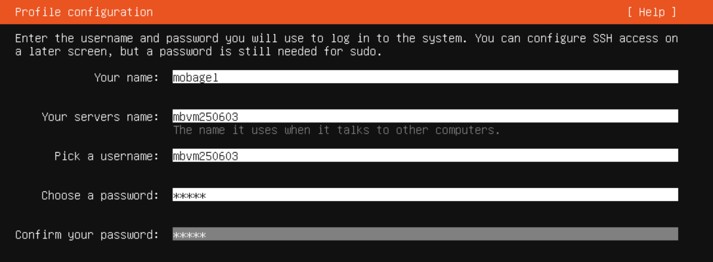

- 以下未提及 console (vm 之console) 之指令皆預設於 node 之 shell 執行 
## vm 建立
手動配置資源 or 使用 cil script (還沒調好，script能完成 vm 建立 + ubuntu 安裝)

### cli 

``` sh
# cloud init

# passwd: openssl rand -base64 12

#!/bin/bash

# 檢查參數
if [ "$#" -lt 2 ]; then
  echo "❌ 用法: $0 <vm_name/username> <password>"
  exit 1
fi

# === 參數設定 ===
VMID=$1
VM_NAME="$2"
CI_USER="$2"
CI_PASS="$3"

NODE="mbpc220908"
ISO_STORAGE="local"
ISO_FILE="iso/ubuntu-22.04.5-live-server-amd64.iso"
DISK_STORAGE="local-lvm"
BRIDGE="vmbr0"

# === 創建 VM ===
echo "🛠 Creating VM $VMID ($VM_NAME)..."
qm create $VMID \
  --name "$VM_NAME" \
  --memory 2048 \
  --cores 2 \
  --cpu "x86-64-v2-AES" \
  --machine q35 \
  --net0 virtio,bridge=$BRIDGE \
  --scsihw virtio-scsi-pci \
  --scsi0 $DISK_STORAGE:32 \
  --ide2 $ISO_STORAGE:$ISO_FILE,media=cdrom \
  --boot order=scsi0;ide2 \
  --vga qxl \
  --ostype l26 \
  --agent enabled=1 \
  --description "Ubuntu 22.04 VM with Cloud-Init (no network config)"

# === 加 Cloud-Init Drive ===
echo "💾 Adding Cloud-Init drive..."
qm set $VMID --ide3 $DISK_STORAGE:cloudinit

# === 設定 Cloud-Init 使用者和密碼 ===
echo "🔐 Setting Cloud-Init credentials..."
qm set $VMID --ciuser "$CI_USER" --cipassword "$CI_PASS"

# ❌ 不設定 IP / DHCP / 網路介面
# ✅ Cloud-Init 會忽略網路設定，讓 VM 使用預設方式或由你手動設定

# === 重新產生 Cloud-Init 映像 ===
qm cloudinit regenerate $VMID

# === 啟動 VM ===
echo "🚀 Starting VM $VMID..."
qm start $VMID

echo "✅ VM $VMID ($VM_NAME) created and started without network config."
```

## ubuntu 安裝 (console)

## ssh 設定
``` sh
qm set 100 --sshkey /root/.ssh/id_rsa.pub
qm cloudinit update 100
qm set 100 --ciuser mbvm250603
qm reboot 100
ssh -i ~/.ssh/id_rsa mbvm250603@192.168.16.63 # ssh連線
# ssh -i ~/.ssh/id_rsa mbvm250604@192.168.16.64
```

### 如iso設定時未安裝openssh-server ()
- 使用console 於 VM 安裝 openssh-server，完成後方能用 ssh 指令連線
``` sh
sudo apt update
sudo apt install openssh-server
sudo systemctl enable --now ssh
```

## ip

修改node nano /etc/network/interfaces
``` sh
auto lo
iface lo inet loopback

iface enp5s0 inet manual

auto vmbr0
iface vmbr0 inet static
        address 192.168.16.62/24
        gateway 192.168.16.1
        bridge-ports enp5s0
        bridge-stp off
        bridge-fd 0

## 新增網卡 vmbr1
auto vmbr1
iface vmbr1 inet static
        address 172.23.0.1/24
#        gateway 172.23.0.1  
        bridge-ports none  
        bridge-stp off
        bridge-fd 0

source /etc/network/interfaces.d/*
```

- 改完重啟網卡，確認vmbr1 成功新增
``` bash
root@mbpc220908:~# systemctl restart networking

root@mbpc220908:~# ip a | grep "vmbr"
2: enp5s0: <BROADCAST,MULTICAST,UP,LOWER_UP> mtu 1500 qdisc mq master vmbr0 state UP group default qlen 1000
31: vmbr0: <BROADCAST,MULTICAST,UP,LOWER_UP> mtu 1500 qdisc noqueue state UP group default qlen 1000
    inet 192.168.16.62/24 scope global vmbr0
32: vmbr1: <BROADCAST,MULTICAST,UP,LOWER_UP> mtu 1500 qdisc noqueue state UNKNOWN group default qlen 1000
    inet 172.23.0.1/24 scope global vmbr1
```

- 1. 設定NAT 處理 內外網ip 轉換

iptables -t nat -A POSTROUTING -s 172.23.0.0/24 -o vmbr0 -j MASQUERADE


- **注意:網卡設定完要重啟**