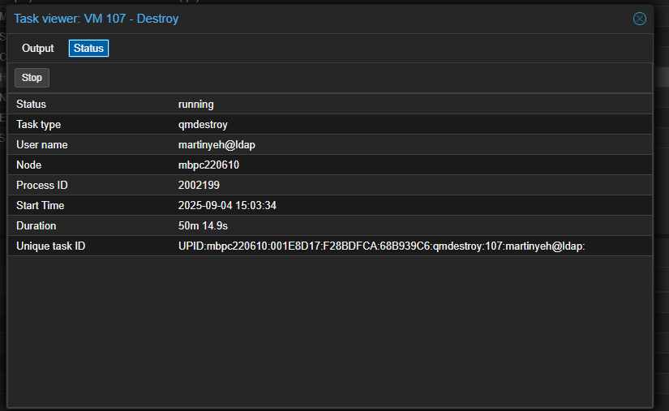
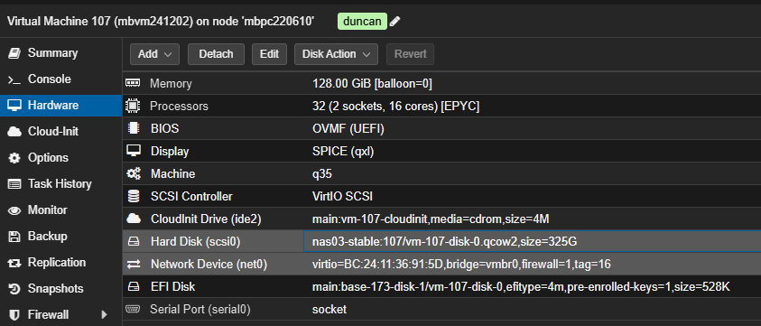
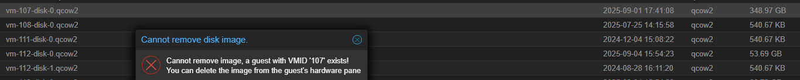
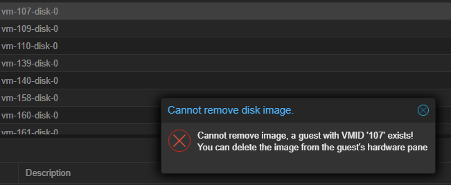
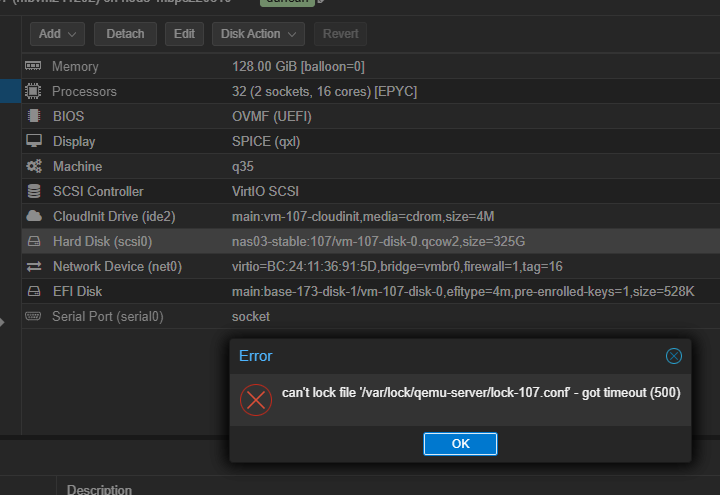
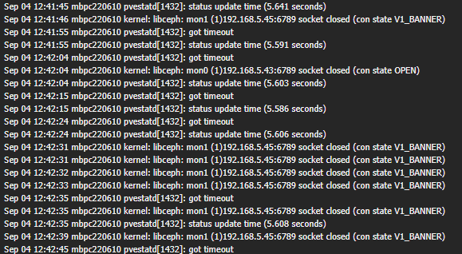
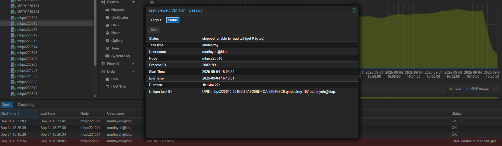
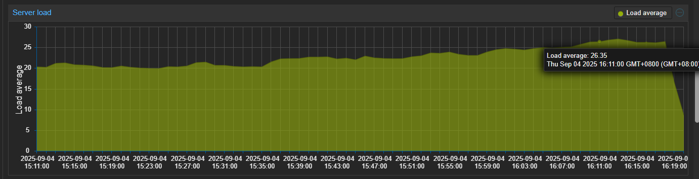
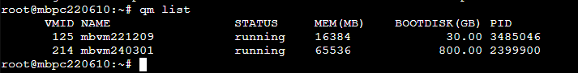

nas3  disk0



直接刪除


qm list config .. 有關107都卡死

``` sh

rbd snap purge -p main vm-107-disk-0
rbd rm -p main vm-107-disk-0

root@mbpc220610:~# ls /etc/pve/nodes/*/qemu-server/107.conf
/etc/pve/nodes/mbpc220610/qemu-server/107.conf
root@mbpc220610:~# mv /etc/pve/nodes/mbpc220610/qemu-server/107.conf /etc/pve/nodes/mbpc220610/qemu-server/107.conf.bak
root@mbpc220610:~# 
```



成功暫緩




list 正常
