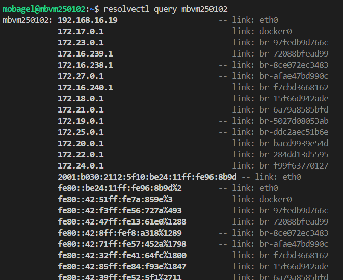

## resolvectl query mbvm250102



## ceph 

### ✅ 提案

- 持續使用現有 Ceph 架構，作為 PVE（Proxmox VE）運行平台的核心儲存層。

### 📌 提案緣由

雖然目前對 Ceph 還不夠熟悉，但經過chatget深入一點的了解與討論，認為其具備：

- 分散式架構的可擴展性

- 儲存與高可用性的長期優勢

因此建議先保留並在搬移命名中逐步熟悉 Ceph 架構，再評估是否進一步擴充或調整方向。

### 💡 備註
- 若後續測試或維運負擔過高，仍可保留轉向 NFS 或其他混合架構的彈性空間。

- 可在非正式區域（如 Dev/Test 節點）進行 Ceph 的功能性與風險評估。

### 可用

簡介
https://chatgpt.com/share/689a98b2-f8f0-800c-87f6-f98ced8539ea
ceph 策略 (倒數3rd chat 有速覽)
https://chatgpt.com/share/689a9891-a68c-800c-9432-9612709266f2

### 框架規劃

框架 v0

``` yaml
test_cluster:

  description: 測試環境，模擬 OSD 配置與容錯行為

  nodes:

    - name: host_a
      osd_count: 1

    - name: host_b
      osd_count: 1

    - name: host_c
      osd_count: 2
      disk_layout: "1 磁碟分割成 2 OSD"

    - name: host_d
      osd_count: 0
      purpose: "模擬 host 掛掉時 OSD 移動 / Ceph 回復"

prod_cluster:

  description: 正式環境，依應用需求區分節點功能

  node_types:

    - role: low_pool_node
      osd_per_node: "3~4"
      network: "10Gbps x1"
      scalable: true
      usage: "一般儲存池，中低 IOPS"

    - role: high_pool_node
      osd_per_node: "依磁碟數調整"
      network: "10Gbps x2"
      bonding: true
      usage: "高效能儲存池，如 DB、ML"

    - role: monitor_mgr_node
      osd_per_node: 0
      network: "1Gbps or 10Gbps"
      deploy_option: "可混合或獨立部署"
      usage: "監控與管理節點"
```
---

#### 🧪 測試環境規劃（Test Cluster）

| 主機類型   | OSD 數量 | 備註         |
| ------ | ------ | ---------- |
| Host A | 1      |            |
| Host B | 1      |            |
| Host C | 2      | OSD 分割1磁碟成2份osd做測試 |
| Host D | 0      | 用作測試host 掛掉時 osd 搬移、ceph 回復 |

✅ **總結：** 測試環境共 4 台主機，其中 3 台具有 OSD，合計 3 顆 OSD。


#### 🏗️ 正式環境規劃（Production Cluster）

| 節點類型         | OSD 數量 / 主機 | 網路規格             | 用途      | 備註                  |
| ------------ | ----------- | ---------------- | ------- | ------------------- |
| Low Pool 節點  | 3\~4 顆 OSD  | 單 10 Gbps        | 一般儲存池   | 支援橫向擴充（n 台）         |
| High Pool 節點 | 無特定 OSD 數量  | 雙 10 Gbps        | 高效能儲存池  | 高 IOPS 應用，如 DB / ML |
| Monitor/Mgr  | 無           | 1 Gbps / 10 Gbps | 管理/監控節點 | 可混合部署或獨立設節點         |

---

##### 1. **Low Pool 節點**

* 每台部署 **3\~4 顆 OSD**
* 網路為 **單 10 Gbps**，適合常規儲存需求
* 適用於大多數中低 IOPS 應用
* 架構設計支援 **彈性擴充（scale-out）**

##### 2. **High Pool 節點**

* 每台部署高效能儲存組態 server，OSD 數量依磁碟設計彈性配置
* 網路為 **雙 10 Gbps**（建議 Bonding / LACP）
* 適用於高 IOPS / 低延遲應用，如資料庫、機器學習等
* 可作為 Tiered Storage 中的 **高速層**

##### 3. **Monitor / Manager 節點**

* 提供 Cluster 的狀態管理與調度功能
* 可與其他節點共用資源，或獨立部署以提升穩定性
* 網路帶寬需求較低，但建議使用與叢集一致的高速連線以避免瓶頸

---

### 測試規劃

#### v0

短: osd 換機器重開起來、vm 批次搬移、模擬 host/osd 掛掉復原 

中: osd dead/out 的 效能/速率比較、可用性分析 

長: Prod / Test / Dev clusters 架設 (滾動規劃)  

無: 維運模組、備份、ceph 更新 & 監控整合(squid (19+) 後有 prometheus_stack)

#### v1

``` yml
test_plan:
  short_term:
    duration: "1~2 週"
    goals:
      - OSD 換機測試
      - VM 批次搬移
      - 模擬 host/osd 掛掉與回復
    exit_criteria:
      - 若 recovery 超過 1 小時仍未完成 → 停止深入
      - 若叢集健康在 30 分鐘內無法回穩 → 評估轉向 NFS 為備援層

  mid_term:
    duration: "2~4 週"
    goals:
      - OSD dead/out 效能測試
      - 可用性分析（多 OSD 失效）
    exit_criteria:
      - 若效能回復期間 VM 明顯卡頓 (>10%) → 評估替代方案補位
      - 若測試壓力造成真實運營風險 → 優先切分環境

  long_term:
    duration: "1~2 個月"
    goals:
      - 架設 Dev / Test / Prod cluster
      - 滾動更新、擴展模擬
    exit_criteria:
      - 若測試資源持續干擾 Prod VM/NFS → 優先拉新框架分離
      - 若實作維護成本過高/人力無法支撐 → 採 NFS + Ceph 混合架構並行
    
  infinite_term:
    duration: "inf"
    goals:
      - 維運模組規劃 (scripts kits...) / github prometheus tool
      - 備份 、 routine搬移 自動化排程
      - ceph 更新 & 監控整合 (prometheus + grafana + node_exporter)
    exit_criteria:
      - 維護成本開始暴增
    
```

### 維運模組評估?

- 腳本架構

